# Sơ Đồ Lớp (Data Model - Entity)

Dưới đây là sơ đồ lớp thể hiện kiến trúc dữ liệu (các Entity và mối quan hệ giữa chúng) trong dự án EasyMall.

> [!TIP]
> Sơ đồ dưới đây khá lớn. Để xem chi tiết, bạn có thể cuộn ngang hoặc mở to. Sơ đồ này tuân thủ cú pháp của MermaidJS, biểu diễn các quan hệ `1-N`, `N-1`, `1-1` và `N-N`.

```mermaid
classDiagram
    direction TB

    %% User & Role Domain
    class UserEntity {
        -Long userId
        -OffsetDateTime createdAt
        -OffsetDateTime updatedAt
        -Boolean isActive
        -String email
        -String password
        -String fullName
        -Short gender
        -String facebookAccountId
        -String googleAccountId
        -String phone
        -LocalDate dob
        -String avatar
        -OffsetDateTime emailVerifiedAt
        -OffsetDateTime lastLoginAt
        +RoleEntity role
    }

    class RoleEntity {
        -Long roleId
        -String roleName
        -String description
        -OffsetDateTime createdAt
        +Set~PermissionEntity~ permissions
    }

    class PermissionEntity {
        -Long permissionId
        -String permissionName
        -String description
        -OffsetDateTime createdAt
    }

    class UserStatsEntity {
        -Long userId
        -UserEntity user
        -Integer totalOrders
        -Integer returnedOrdersCount
        -Double reputationScore
        -Boolean isRestricted
        -Integer accountAgeDays
        -Integer failedPaymentAttempts10m
        -Integer totalDistinctDevices
        -OffsetDateTime updatedAt
    }
    
    class UserBehaviorEntity {
        -Long userBehaviorId
        -UserEntity user
        -String sessionId
        -ProductEntity product
        -CategoryEntity category
        -String actionType
        -String keyword
        -String contextData
        -Long variantId
        -Integer durationSeconds
        -String source
        -OffsetDateTime createdAt
    }

    class TokenEntity {
        -Long tokenId
        -String refreshToken
        -Boolean isRevoked
        -OffsetDateTime expiresAt
        -UserEntity user
    }

    class DeviceSessionEntity {
        -Long id
        -UserEntity user
        -String deviceId
        -String deviceType
        -String appVersion
        -String osName
        -String osVersion
        -String ipAddress
        -String fcmToken
        -Boolean isActive
        -OffsetDateTime lastActiveAt
        -OffsetDateTime createdAt
    }

    class AddressEntity {
        -Long addressId
        -UserEntity user
        -String fullName
        -String phone
        -String provinceCode
        -String districtCode
        -String wardCode
        -String provinceName
        -String districtName
        -String wardName
        -String addressDetail
        -Boolean isDefault
        -OffsetDateTime createdAt
        -OffsetDateTime updatedAt
    }

    %% Product & Category Domain
    class CategoryEntity {
        -Long categoryId
        -String categoryName
        -String categorySlug
        -String iconUrl
        -Integer displayOrder
        -Boolean isActive
        -Long parentId
        -OffsetDateTime createdAt
        -OffsetDateTime updatedAt
    }

    class ProductEntity {
        -Long productId
        -String productSlug
        -String productName
        -String productDescription
        -Boolean inPopular
        -Boolean inStock
        -Short targetGender
        -Integer maxOrderQuantity
        -String optionsConfig
        -String productTags
        -Long categoryId
        -BigDecimal weightKg
        -BigDecimal lengthM
        -BigDecimal widthM
        -BigDecimal heightM
        -OffsetDateTime createdAt
        -OffsetDateTime updatedAt
        -Integer viewCount
        -Integer soldCount
        -Integer ratingCount
        -String searchVector
        +List~ProductVariantEntity~ variants
        +List~ProductImageEntity~ images
    }

    class ProductVariantEntity {
        -Long variantId
        -ProductEntity product
        -BigDecimal price
        -BigDecimal costPrice
        -String skuCode
        -String variantImage
        -Integer stockQuantity
        -Boolean isActive
        -Integer lockedStock
        -OffsetDateTime updatedAt
        +List~InventoryTransactionEntity~ inventoryTransactions
        +List~OrderDetailEntity~ orderDetails
    }

    class ProductImageEntity {
        -Long imageId
        -ProductEntity product
        -String imageUrl
        -Boolean isThumbnail
        -Integer displayOrder
    }
    
    class ProductAssociationEntity {
        -ProductAssociationId id
        -ProductEntity product
        -ProductEntity relatedProduct
        -Double confidence
        -Double lift
    }
    
    class ProductSimilarityEntity {
        -ProductSimilarityId id
        -ProductEntity product
        -ProductEntity similarProduct
        -Double score
    }

    %% Order & Cart Domain
    class CartEntity {
        -Long cartId
        -UserEntity user
        -String sessionId
        -OffsetDateTime updatedAt
        +List~CartItemEntity~ items
    }

    class CartItemEntity {
        -Long cartItemId
        -CartEntity cart
        -ProductVariantEntity variant
        -Integer quantity
        -OffsetDateTime addedAt
    }

    class OrderEntity {
        -Long orderId
        -OffsetDateTime orderDate
        -OffsetDateTime shippingDate
        -PaymentMethod paymentMethod
        -ShippingMethod shippingMethod
        -String deliveryOrderId
        -String deliveryStatus
        -String trackingNumber
        -String note
        -AddressEntity address
        -UserEntity user
        -OrderStatus orderStatus
        -BigDecimal totalProductMoney
        -BigDecimal originalShippingFee
        -BigDecimal shopDiscountAmount
        -BigDecimal shippingDiscountAmount
        -BigDecimal paymentDiscountAmount
        -BigDecimal finalPaymentMoney
        -OffsetDateTime updatedAt
        +List~OrderDetailEntity~ orderDetails
    }

    class OrderDetailEntity {
        -Long orderDetailId
        -Integer numOfProduct
        -BigDecimal orderDetailPrice
        -BigDecimal totalMoney
        -String itemStatus
        -String productName
        -String skuCode
        -String variantImage
        -OrderEntity order
        -ProductVariantEntity variant
    }

    class InventoryTransactionEntity {
        -Long transactionId
        -ProductVariantEntity variant
        -String transactionType
        -Integer quantity
        -String referenceId
        -String reason
        -OffsetDateTime createdAt
    }

    %% Marketing & Reviews & Support
    class CouponEntity {
        -Long couponId
        -String code
        -String description
        -DiscountType discountType
        -BigDecimal discountValue
        -BigDecimal maxDiscountAmount
        -BigDecimal minOrderValue
        -OffsetDateTime startDate
        -OffsetDateTime endDate
        -Integer usageLimit
        -Integer usageCount
        -Boolean isActive
        -OffsetDateTime createdAt
    }

    class CouponUsageEntity {
        -Long usageId
        -CouponEntity coupon
        -UserEntity user
        -OrderEntity order
        -BigDecimal discountApplied
        -OffsetDateTime usedAt
    }

    class ReviewEntity {
        -Long reviewId
        -OrderEntity order
        -UserEntity user
        -ProductEntity product
        -Integer rating
        -String comment
        -ReviewStatus reviewStatus
        -OffsetDateTime replyAt
        -OffsetDateTime createdAt
        -OffsetDateTime updatedAt
        +List~ReviewImageEntity~ images
    }

    class ReviewImageEntity {
        -Long reviewImageId
        -ReviewEntity review
        -String imageUrl
    }

    class NotificationEntity {
        -Long notificationId
        -UserEntity user
        -String title
        -String content
        -String notificationType
        -Boolean isRead
        -OffsetDateTime createdAt
    }

    class ContactMessageEntity {
        -Long contactId
        -UserEntity user
        -String fullName
        -String email
        -String phone
        -String subject
        -String message
        -String status
        -OffsetDateTime createdAt
        -OffsetDateTime repliedAt
    }

    class SliderEntity {
        -Long sliderId
        -String imageUrl
        -String targetUrl
        -Boolean isActive
        -Integer displayOrder
    }
    
    class WishlistEntity {
        -Long wishlistId
        -UserEntity user
        -ProductEntity product
        -OffsetDateTime createdAt
        -OffsetDateTime updatedAt
    }

    %% Risk & Recommendations
    class RiskAlertEntity {
        -Long alertId
        -UserEntity user
        -OrderEntity order
        -RiskRuleConfigEntity ruleConfig
        -String description
        -RiskAlertStatus status
        -OffsetDateTime createdAt
    }

    class RiskRuleConfigEntity {
        -String ruleCode
        -String ruleName
        -String riskLevel
        -BigDecimal thresholdValue
        -Integer timeWindowMinutes
        -Boolean isActive
        -OffsetDateTime updatedAt
    }

    class UserRecommendationEntity {
        -UserRecommendationId id
        -UserEntity user
        -ProductEntity product
        -Double recommendationScore
        -OffsetDateTime createdAt
    }

    %% ==========================================
    %% RELATIONSHIPS (Tổ chức theo luồng Top-Bottom)
    %% ==========================================
    
    %% 1. Core Users & Roles
    RoleEntity "1" <-- "N" UserEntity : belongs to
    RoleEntity "N" --> "N" PermissionEntity : has
    
    %% 2. User Profiles & Sessions
    UserEntity "1" <-- "N" AddressEntity : has
    UserEntity "1" <-- "N" TokenEntity : owns
    UserEntity "1" <-- "N" DeviceSessionEntity : connects
    UserEntity "1" <-- "N" NotificationEntity : receives
    UserEntity "1" <-- "N" ContactMessageEntity : submits
    UserEntity "1" <-- "1" UserStatsEntity : tracks

    %% 3. Core Products & Categories
    CategoryEntity "1" <-- "N" ProductEntity : categorized in
    ProductEntity "1" <-- "N" ProductVariantEntity : has
    ProductEntity "1" <-- "N" ProductImageEntity : has
    ProductEntity "1" <-- "N" ProductAssociationEntity : product
    ProductEntity "1" <-- "N" ProductSimilarityEntity : product
    
    %% 4. User-Product Interactions
    UserEntity "1" <-- "N" WishlistEntity : saves
    ProductEntity "1" <-- "N" WishlistEntity : references
    
    UserEntity "1" <-- "N" UserRecommendationEntity : targets
    ProductEntity "1" <-- "N" UserRecommendationEntity : suggests
    
    UserEntity "1" <-- "N" UserBehaviorEntity : logs
    ProductEntity "1" <-- "N" UserBehaviorEntity : tracks
    CategoryEntity "1" <-- "N" UserBehaviorEntity : tracks

    %% 5. Cart
    UserEntity "1" <-- "N" CartEntity : belongs to
    CartEntity "1" <-- "N" CartItemEntity : contains
    ProductVariantEntity "1" <-- "N" CartItemEntity : maps to
    
    %% 6. Order
    UserEntity "1" <-- "N" OrderEntity : placed by
    AddressEntity "1" <-- "N" OrderEntity : ships to
    OrderEntity "1" <-- "N" OrderDetailEntity : contains
    ProductVariantEntity "1" <-- "N" OrderDetailEntity : includes
    
    %% 7. Inventory
    ProductVariantEntity "1" <-- "N" InventoryTransactionEntity : updates
    
    %% 8. Coupons
    CouponEntity "1" <-- "N" CouponUsageEntity : applies
    UserEntity "1" <-- "N" CouponUsageEntity : used by
    OrderEntity "1" <-- "1" CouponUsageEntity : affects
    
    %% 9. Reviews
    UserEntity "1" <-- "N" ReviewEntity : written by
    ProductEntity "1" <-- "N" ReviewEntity : rates
    OrderEntity "1" <-- "N" ReviewEntity : evaluates
    ReviewEntity "1" <-- "N" ReviewImageEntity : includes
    
    %% 10. Risk Management
    UserEntity "1" <-- "N" RiskAlertEntity : alerts for
    OrderEntity "1" <-- "N" RiskAlertEntity : flags
    RiskRuleConfigEntity "1" <-- "N" RiskAlertEntity : triggered by

```

