# 🔐 Auth Business — Luồng hoạt động Authentication & Authorization

**Project**: EasyMall  
**Last Updated**: 2026-06-21  
**Base URL**: `/api/v1/auth`

---

## 1. Tổng quan kiến trúc

### 1.1 Service Layer (Package-by-Feature)

```
service/auth/
├── RegistrationService         → Đăng ký + kích hoạt tài khoản + gửi lại OTP
├── AuthenticationService       → Đăng nhập + Đăng xuất
├── TokenService                → Sinh AT/RT, refresh token, introspect
├── PasswordResetService        → Quên mật khẩu + đặt lại mật khẩu
service/user/
├── UserService                 → Lấy thông tin user hiện tại (/me)
service/email/
├── EmailService                → Gửi email OTP (ACTIVATION / FORGOT_PASSWORD)
```

### 1.2 Component Diagram

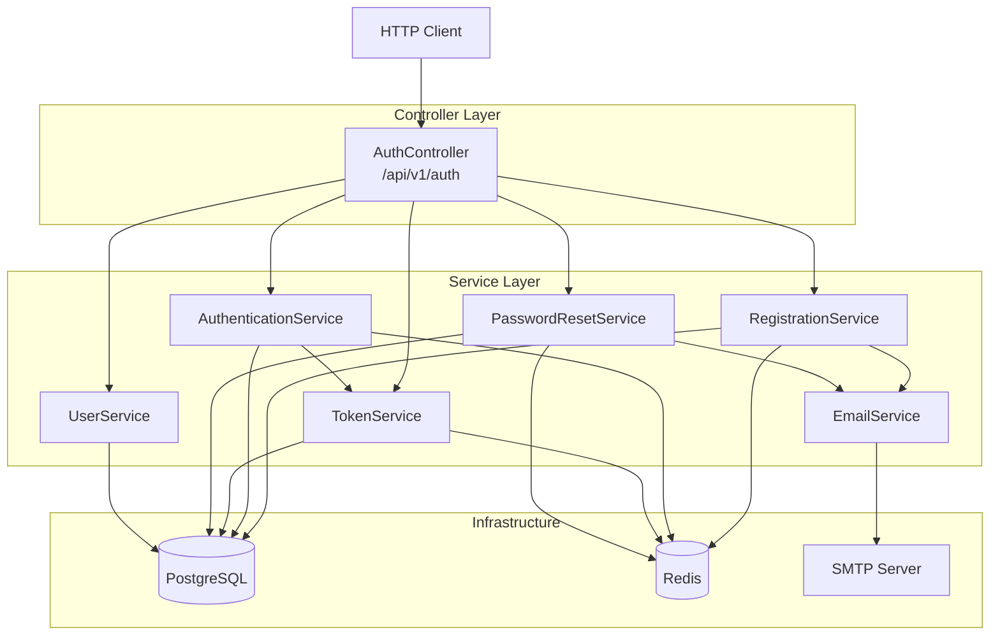

### 1.3 Security Architecture

| Component | Vai trò |
|:--|:--|
| `SecurityConfig` | Cấu hình Spring Security, CSRF disabled, Stateless session |
| `JwtAuthenticationFilter` | `OncePerRequestFilter` — extract Bearer token, validate, set SecurityContext |
| `JwtUtil` | Sinh/parse JWT (HMAC-SHA256 via Nimbus JOSE) |
| `JwtConfig` | `@ConfigurationProperties(prefix = "jwt")` — signerKey, validDuration, refreshableDuration |
| `ApplicationInitConfig` | `ApplicationRunner` — seed ROLE_ADMIN, ROLE_USER + admin account on startup |

**Public endpoints** (không cần token):
```
POST /api/v1/auth/register
POST /api/v1/auth/active
POST /api/v1/auth/resend-otp
POST /api/v1/auth/login
POST /api/v1/auth/logout
POST /api/v1/auth/refresh
POST /api/v1/auth/introspect
POST /api/v1/auth/forgot-password
POST /api/v1/auth/reset-password
```

**Protected endpoints**: Tất cả endpoint khác yêu cầu `Authorization: Bearer <access_token>`.

---

## 2. Luồng hoạt động chi tiết

### 2.1 Registration Flow (2-step)

> **Đặc điểm**: Không ghi DB cho đến khi OTP được xác thực → tránh tạo tài khoản rác.

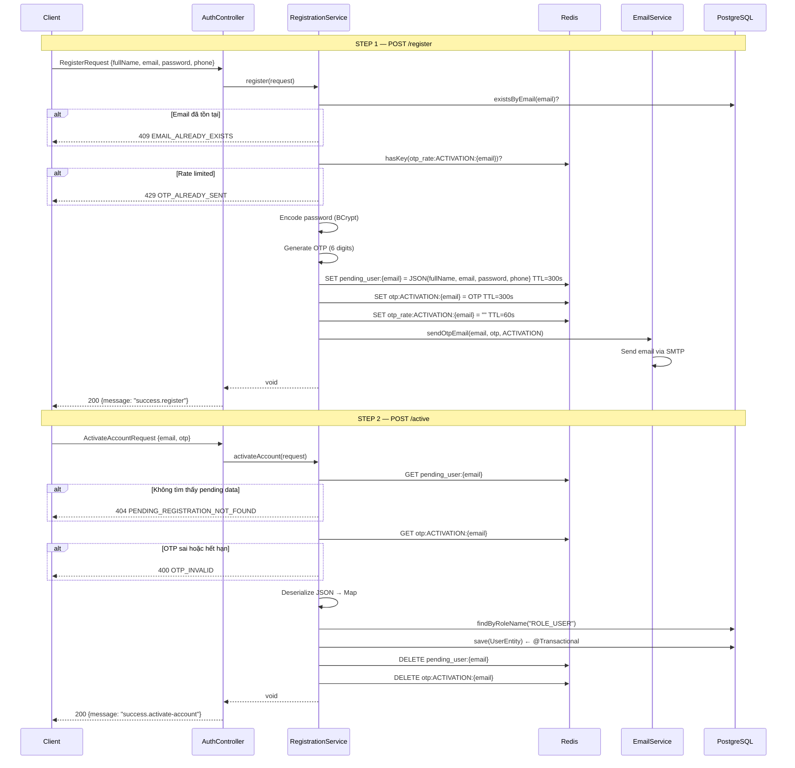

#### Redis Keys sử dụng

| Key Pattern | TTL | Mục đích |
|:--|:--|:--|
| `pending_user:{email}` | 300s | Lưu trữ tạm thông tin user chưa xác thực |
| `otp:ACTIVATION:{email}` | 300s | Mã OTP 6 chữ số |
| `otp_rate:ACTIVATION:{email}` | 60s | Rate-limit sentinel — 1 OTP / 60s / email |

---

### 2.2 Login Flow

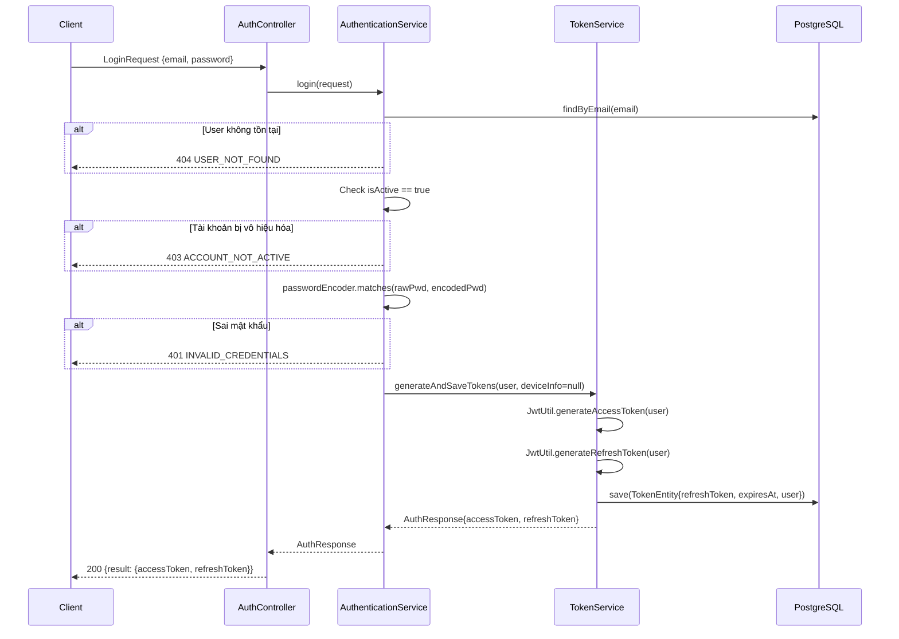

#### JWT Claims Structure

**Access Token:**
```json
{
  "sub": "user@email.com",
  "jti": "uuid",
  "iss": "easymall",
  "iat": 1719000000,
  "exp": 1719000900,
  "scope": "ROLE_USER",
  "type": "ACCESS"
}
```

**Refresh Token:**
```json
{
  "sub": "user@email.com",
  "jti": "uuid",
  "iss": "easymall",
  "iat": 1719000000,
  "exp": 1719604800,
  "type": "REFRESH"
}
```

---

### 2.3 Logout Flow

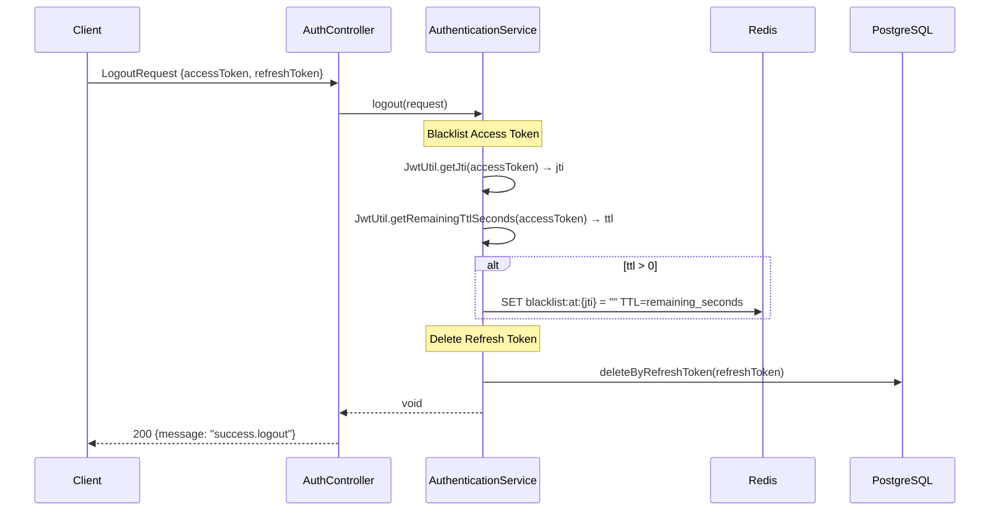

> **Chiến lược**: AT bị blacklist trong Redis (auto-expire khi AT hết hạn). RT bị xóa row khỏi DB → không thể refresh.

---

### 2.4 Refresh Token Flow

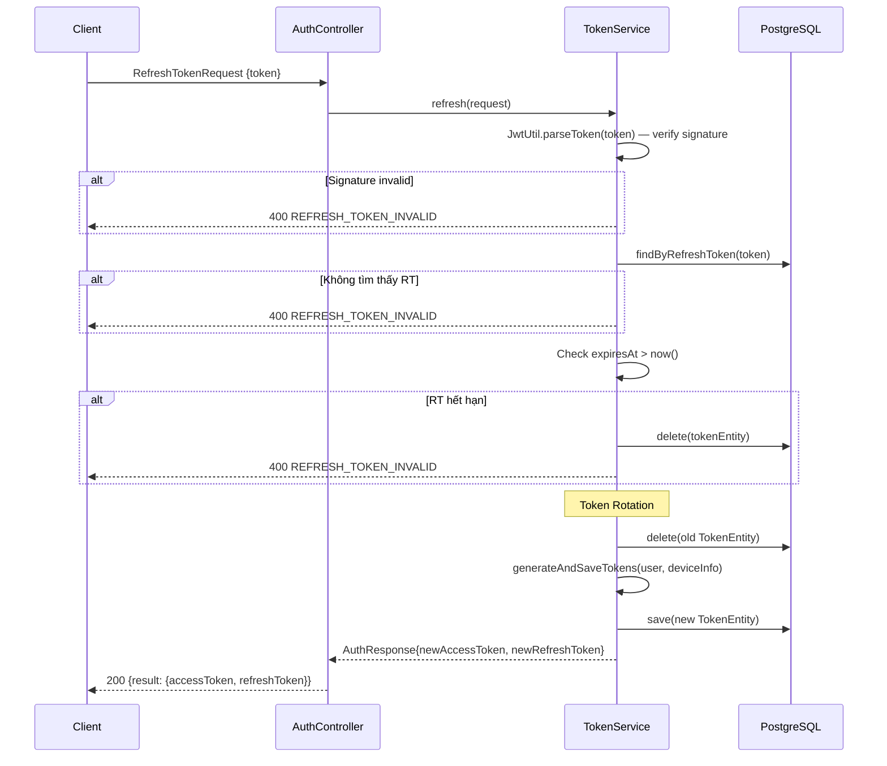

> **Token Rotation**: Mỗi lần refresh → RT cũ bị xóa, RT mới được tạo. Ngăn chặn replay attack.

---

### 2.5 Token Introspect

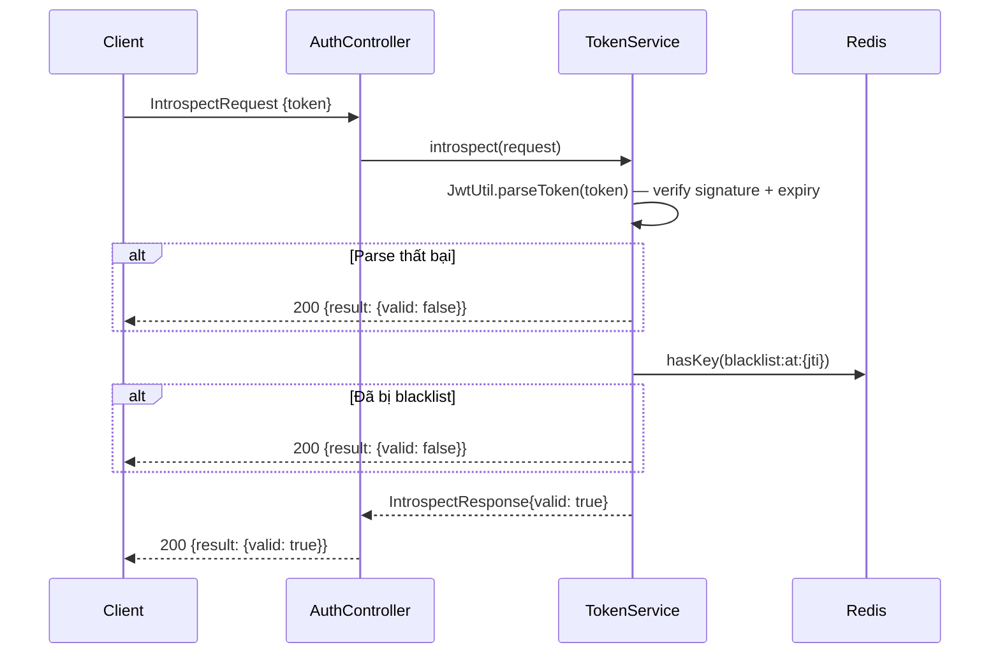

---

### 2.6 Password Reset Flow (2-step)

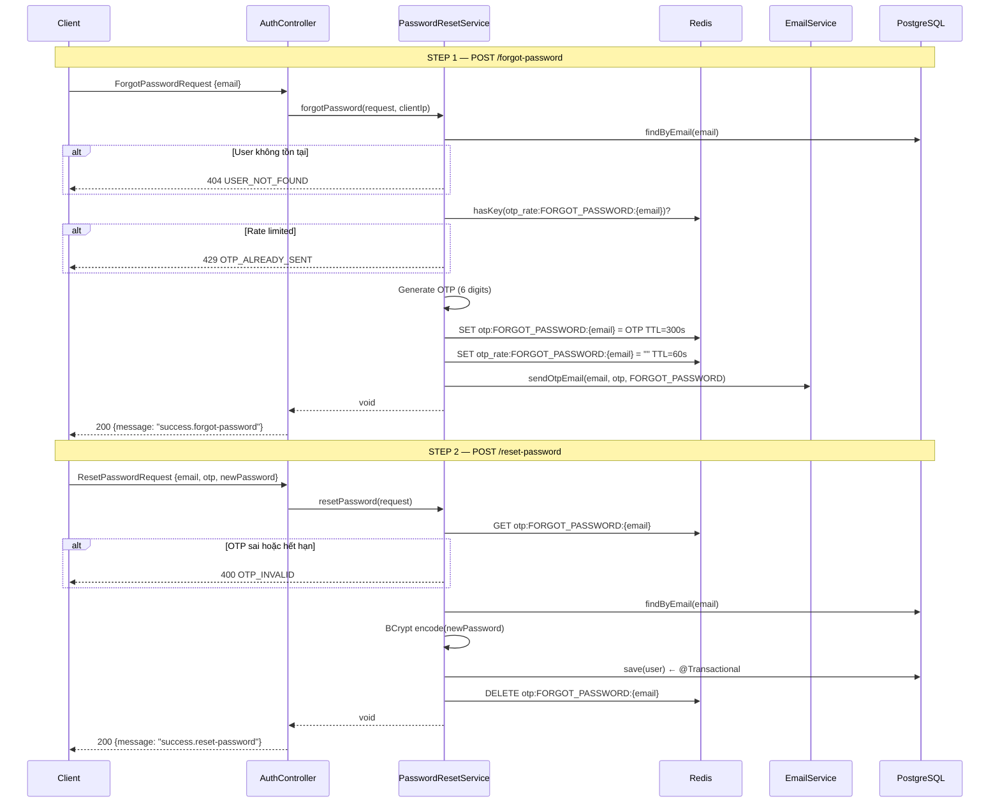

---

### 2.7 Resend OTP Flow

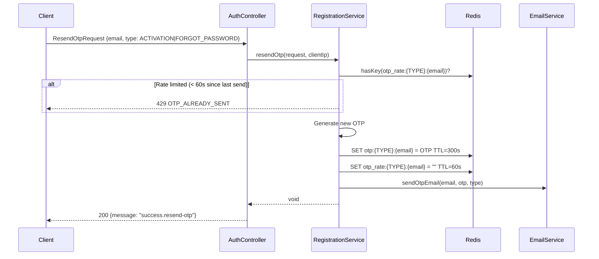

---

### 2.8 Get Current User (/me)

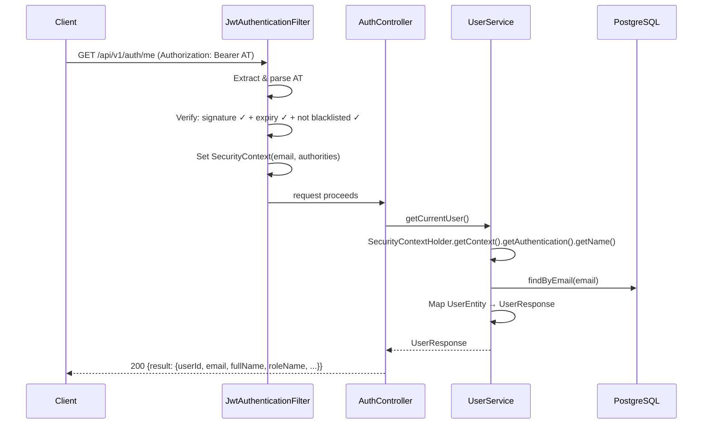

---

## 3. JWT Authentication Pipeline

### 3.1 Request Lifecycle

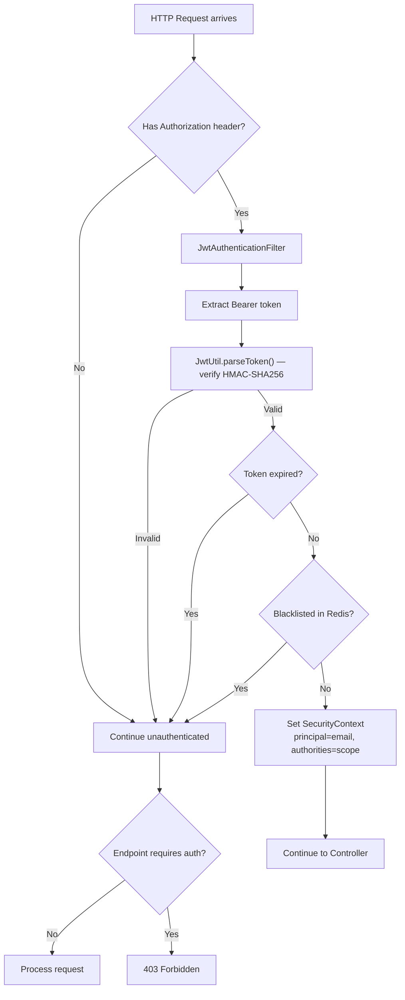

### 3.2 Token Storage Strategy

| Token | Storage | Revocation |
|:------|:--------|:-----------|
| **Access Token (AT)** | Client-side only (không lưu DB) | Blacklist JTI trong Redis, TTL = remaining lifetime |
| **Refresh Token (RT)** | DB table `tokens` (full JWT string) | Delete row from DB |

---

## 4. Redis Key Map

| Key Pattern | TTL | Type | Mô tả |
|:--|:--|:--|:--|
| `pending_user:{email}` | 300s | String (JSON) | Pending registration data — chưa verify OTP |
| `otp:ACTIVATION:{email}` | 300s | String | OTP 6 chữ số cho đăng ký |
| `otp:FORGOT_PASSWORD:{email}` | 300s | String | OTP 6 chữ số cho quên mật khẩu |
| `otp_rate:ACTIVATION:{email}` | 60s | String (empty) | Rate-limit sentinel cho register/resend |
| `otp_rate:FORGOT_PASSWORD:{email}` | 60s | String (empty) | Rate-limit sentinel cho forgot-password |
| `blacklist:at:{jti}` | AT remaining TTL | String (empty) | Blacklisted Access Token (sau logout) |

---

## 5. API Endpoints Summary

| Method | Endpoint | Request DTO | Response DTO | Service | Auth |
|:-------|:---------|:------------|:-------------|:--------|:-----|
| `POST` | `/register` | `RegisterRequest` | `Void` | RegistrationService | ❌ |
| `POST` | `/active` | `ActivateAccountRequest` | `Void` | RegistrationService | ❌ |
| `POST` | `/resend-otp` | `ResendOtpRequest` | `Void` | RegistrationService | ❌ |
| `POST` | `/login` | `LoginRequest` | `AuthResponse` | AuthenticationService | ❌ |
| `POST` | `/logout` | `LogoutRequest` | `Void` | AuthenticationService | ❌ |
| `POST` | `/refresh` | `RefreshTokenRequest` | `AuthResponse` | TokenService | ❌ |
| `POST` | `/introspect` | `IntrospectRequest` | `IntrospectResponse` | TokenService | ❌ |
| `POST` | `/forgot-password` | `ForgotPasswordRequest` | `Void` | PasswordResetService | ❌ |
| `POST` | `/reset-password` | `ResetPasswordRequest` | `Void` | PasswordResetService | ❌ |
| `GET` | `/me` | — | `UserResponse` | UserService | ✅ |

> Tất cả response đều wrapped trong `ApiResponse<T>` với format: `{code, message, result}`.

---

## 6. Data Model

### 6.1 Entity Relationship

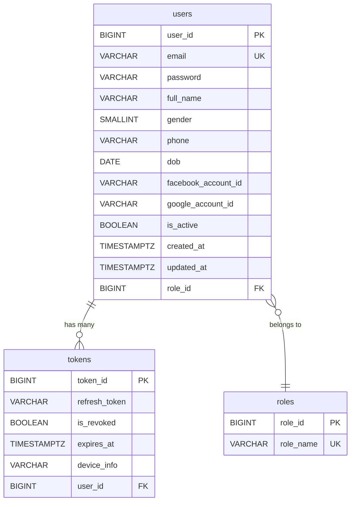

### 6.2 Default Data (ApplicationInitConfig)

| Entity | Data | Tạo bởi |
|:-------|:-----|:--------|
| Role | `ROLE_ADMIN` | `ApplicationRunner` on startup |
| Role | `ROLE_USER` | `ApplicationRunner` on startup |
| User | `admin@easymall.com` / `admin@123` / ROLE_ADMIN | `ApplicationRunner` on startup |

---

## 7. Configuration

### 7.1 JWT Config (`application.yaml`)

```yaml
jwt:
  signer-key: ${JWT_SIGNER_KEY}        # HMAC-SHA256 secret key
  valid-duration: 900000               # Access Token TTL: 15 minutes (ms)
  refreshable-duration: 604800000      # Refresh Token TTL: 7 days (ms)
```

### 7.2 OTP Constants

| Constant | Value | Mô tả |
|:---------|:------|:------|
| `OTP_TTL_SECONDS` | 300 (5 min) | Thời gian sống của OTP |
| `OTP_RATE_TTL_SECONDS` | 60 (1 min) | Cooldown giữa các lần gửi OTP |
| `RT_TTL_DAYS` | 7 | Refresh Token lifetime (days) |

---

## 8. Error Codes (Auth-related)

| ErrorCode | HTTP Status | Mô tả |
|:----------|:------------|:------|
| `EMAIL_ALREADY_EXISTS` | 409 | Email đã được đăng ký |
| `OTP_ALREADY_SENT` | 429 | Rate-limited — chờ 60s |
| `PENDING_REGISTRATION_NOT_FOUND` | 404 | Hết hạn hoặc chưa đăng ký |
| `OTP_INVALID` | 400 | OTP sai hoặc hết hạn |
| `USER_NOT_FOUND` | 404 | Không tìm thấy user |
| `ACCOUNT_NOT_ACTIVE` | 403 | Tài khoản bị vô hiệu hóa |
| `INVALID_CREDENTIALS` | 401 | Sai mật khẩu |
| `REFRESH_TOKEN_INVALID` | 400 | RT không hợp lệ hoặc hết hạn |
| `RESOURCE_NOT_FOUND` | 404 | Role không tồn tại |

---

## 9. Internationalization (i18n)

Tất cả message trả về qua `Translator.toLocale(key)` → đọc từ `messages.properties`:

```properties
# Success messages
success.register=Registration OTP sent successfully
success.activate-account=Account activated successfully
success.resend-otp=OTP resent successfully
success.logout=Logged out successfully
success.forgot-password=Password reset OTP sent successfully
success.reset-password=Password reset successfully

# Email templates
email.activation.subject=EasyMall — Activate your account
email.activation.body=Your activation code is: {0}
email.forgot-password.subject=EasyMall — Reset your password
email.forgot-password.body=Your password reset code is: {0}
```

---

## 10. Security Considerations

| Concern | Implementation |
|:--------|:--------------|
| **Password Storage** | BCrypt (via `PasswordEncoder`) |
| **Token Signing** | HMAC-SHA256 (Nimbus JOSE) |
| **CSRF** | Disabled (stateless API) |
| **Session** | Stateless (`SessionCreationPolicy.STATELESS`) |
| **AT Revocation** | Redis blacklist with auto-expiring TTL |
| **RT Revocation** | Row deletion from DB |
| **Token Rotation** | Old RT deleted, new pair generated on refresh |
| **OTP Spam Prevention** | Rate-limit sentinel in Redis (60s cooldown) |
| **No DB Pollution** | Pending users stored in Redis, not DB |
| **Admin Seed** | Idempotent — only creates if not exists |
