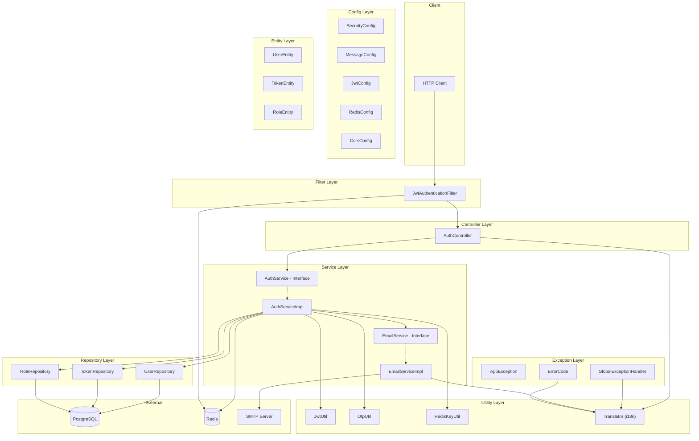
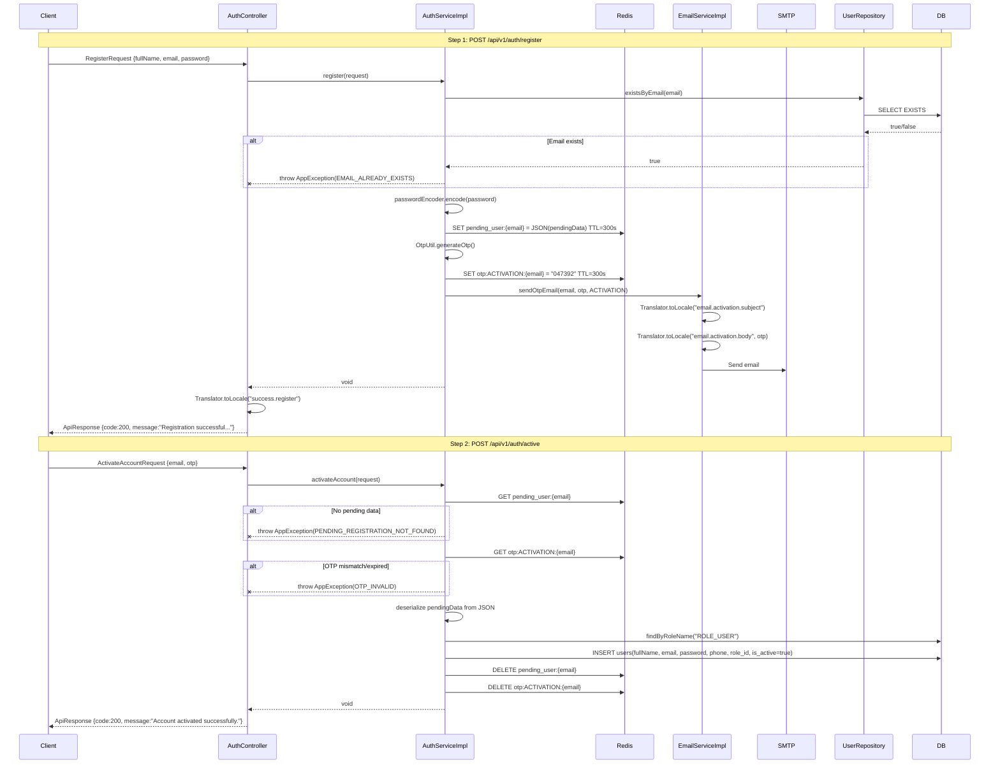
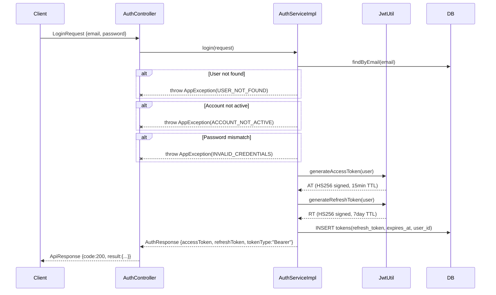
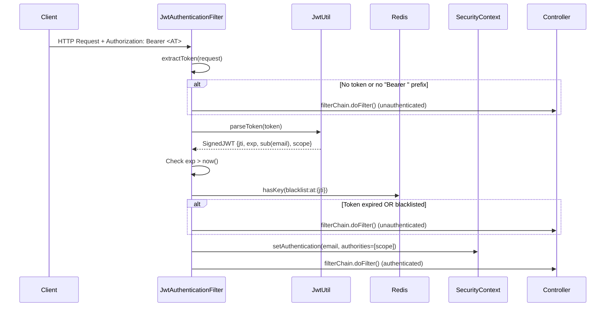
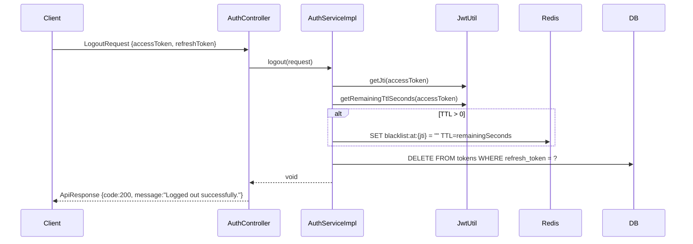
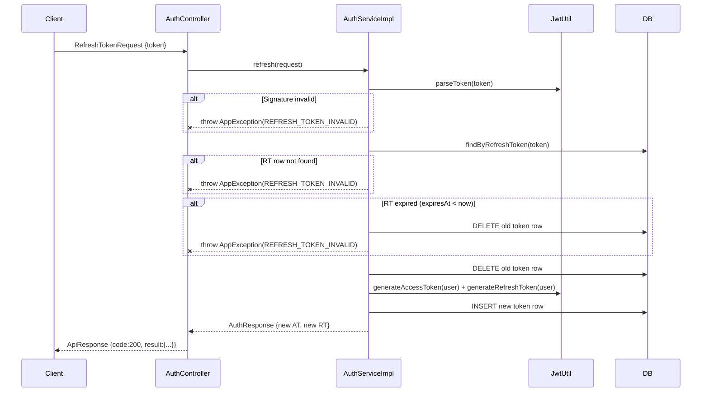
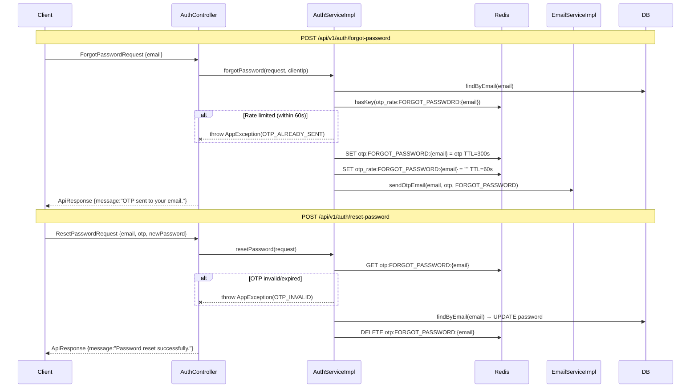
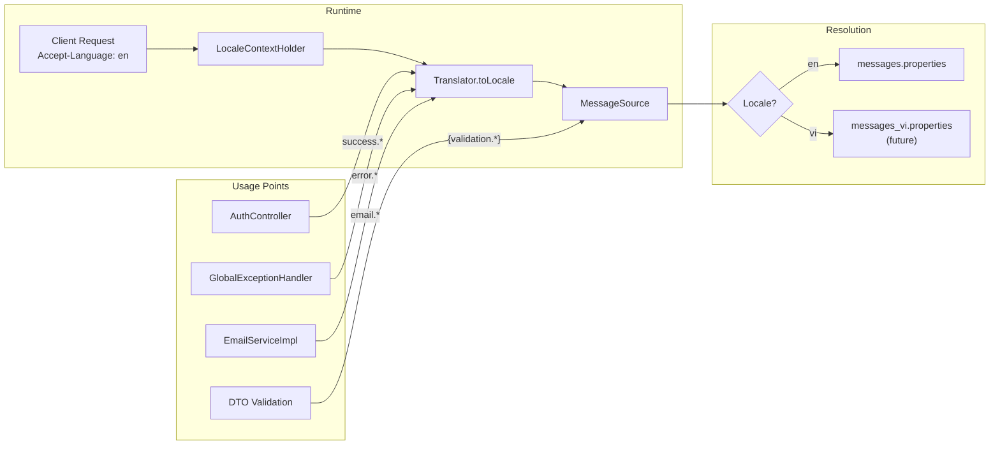
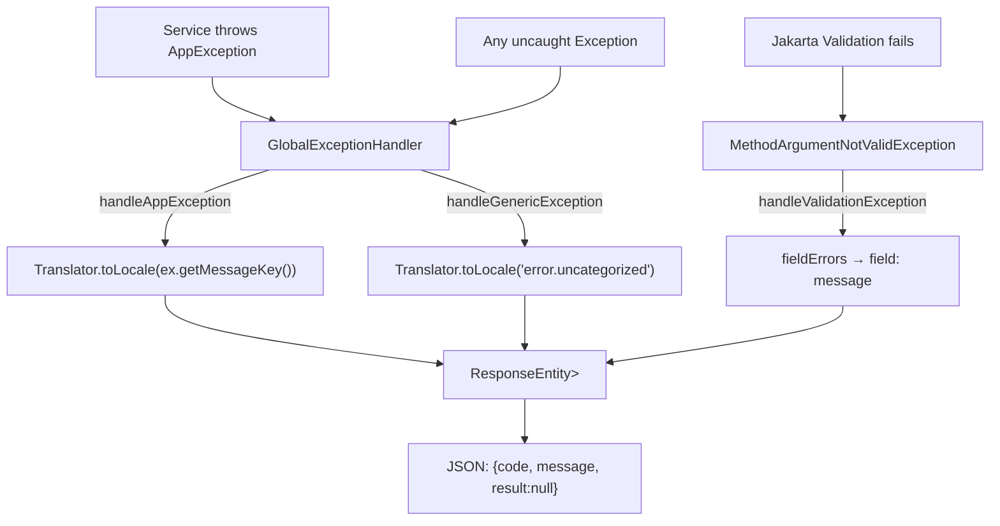

# 📊 Session Analysis Report — EasyMall

**Generated**: 2026-06-20T15:51:00+07:00
**Conversations Analyzed**: 1
**Session ID**: `70cd0152-56a2-4f0a-be95-d35d679944a0`

---

## Executive Summary

| Metric | Value | Rating |
|:---|:---|:---|
| First-Shot Success Rate | 100% | 🟢 |
| Completion Rate | 100% | 🟢 |
| Avg Scope Growth | ~5% (email templates added) | 🟢 |
| Replan Rate | 0% | 🟢 |
| Median Duration | ~13 min (plan → compile success) | — |
| Session Severity | 8 | 🟢 Low |
| High-Severity Sessions | 0 / 1 | 🟢 |

**Narrative:** Session 1 was a well-scoped DELIVERY session covering 3 tasks: Postman collection creation, duplicate DTO cleanup, and i18n implementation. The plan was approved with minor scope adjustments (email templates migration added, duplicate DTO cleanup added based on user feedback). All 21 task items completed, project compiles successfully.

---

## 1. Kiến trúc tổng quan — Package by Layer



---

## 2. Cấu trúc file hiện tại — 21+ files chính

| Package | File | Lines | Vai trò |
|:--------|:-----|:------|:--------|
| `config/` | [SecurityConfig.java](file:///d:/Study/DoAn/DATN/easymall/src/main/java/com/quocnva/easymall/config/SecurityConfig.java) | 65 | Spring Security filter chain, public endpoints |
| `config/` | [JwtConfig.java](file:///d:/Study/DoAn/DATN/easymall/src/main/java/com/quocnva/easymall/config/JwtConfig.java) | 23 | JWT signing key + TTL config |
| `config/` | [MessageConfig.java](file:///d:/Study/DoAn/DATN/easymall/src/main/java/com/quocnva/easymall/config/MessageConfig.java) | 23 | 🆕 Bridge Jakarta Validation ↔ MessageSource |
| `config/` | [RedisConfig.java](file:///d:/Study/DoAn/DATN/easymall/src/main/java/com/quocnva/easymall/config/RedisConfig.java) | — | Redis template config |
| `config/` | [CorsConfig.java](file:///d:/Study/DoAn/DATN/easymall/src/main/java/com/quocnva/easymall/config/CorsConfig.java) | — | CORS settings |
| `config/filter/` | [JwtAuthenticationFilter.java](file:///d:/Study/DoAn/DATN/easymall/src/main/java/com/quocnva/easymall/config/filter/JwtAuthenticationFilter.java) | 83 | Intercepts Bearer token, populates SecurityContext |
| `controller/` | [AuthController.java](file:///d:/Study/DoAn/DATN/easymall/src/main/java/com/quocnva/easymall/controller/AuthController.java) | 137 | 10 endpoints, uses `Translator.toLocale()` |
| `service/` | [AuthService.java](file:///d:/Study/DoAn/DATN/easymall/src/main/java/com/quocnva/easymall/service/AuthService.java) | 30 | Interface — 10 methods |
| `service/impl/` | [AuthServiceImpl.java](file:///d:/Study/DoAn/DATN/easymall/src/main/java/com/quocnva/easymall/service/impl/AuthServiceImpl.java) | 341 | Business logic — heaviest file |
| `service/` | [EmailService.java](file:///d:/Study/DoAn/DATN/easymall/src/main/java/com/quocnva/easymall/service/EmailService.java) | 15 | Interface — `sendOtpEmail()` |
| `service/impl/` | [EmailServiceImpl.java](file:///d:/Study/DoAn/DATN/easymall/src/main/java/com/quocnva/easymall/service/impl/EmailServiceImpl.java) | 45 | Email sending via `Translator.toLocale()` |
| `entity/` | [UserEntity.java](file:///d:/Study/DoAn/DATN/easymall/src/main/java/com/quocnva/easymall/entity/UserEntity.java) | 66 | Users table mapping |
| `entity/` | [TokenEntity.java](file:///d:/Study/DoAn/DATN/easymall/src/main/java/com/quocnva/easymall/entity/TokenEntity.java) | 46 | Refresh Token storage |
| `entity/` | [RoleEntity.java](file:///d:/Study/DoAn/DATN/easymall/src/main/java/com/quocnva/easymall/entity/RoleEntity.java) | 23 | Role definitions |
| `repository/` | [UserRepository.java](file:///d:/Study/DoAn/DATN/easymall/src/main/java/com/quocnva/easymall/repository/UserRepository.java) | 16 | `findByEmail`, `existsByEmail` |
| `repository/` | [TokenRepository.java](file:///d:/Study/DoAn/DATN/easymall/src/main/java/com/quocnva/easymall/repository/TokenRepository.java) | 18 | `findByRefreshToken`, `deleteByRefreshToken` |
| `exception/` | [ErrorCode.java](file:///d:/Study/DoAn/DATN/easymall/src/main/java/com/quocnva/easymall/exception/ErrorCode.java) | 47 | 🔄 14 error codes → message keys |
| `exception/` | [AppException.java](file:///d:/Study/DoAn/DATN/easymall/src/main/java/com/quocnva/easymall/exception/AppException.java) | 20 | 🔄 Carries `messageKey` |
| `exception/` | [GlobalExceptionHandler.java](file:///d:/Study/DoAn/DATN/easymall/src/main/java/com/quocnva/easymall/exception/GlobalExceptionHandler.java) | 50 | 🔄 Resolves messages via `Translator` |
| `util/` | [Translator.java](file:///d:/Study/DoAn/DATN/easymall/src/main/java/com/quocnva/easymall/util/Translator.java) | 37 | 🆕 i18n message resolver |
| `util/` | [JwtUtil.java](file:///d:/Study/DoAn/DATN/easymall/src/main/java/com/quocnva/easymall/util/JwtUtil.java) | 133 | JWT generate/parse/verify |
| `util/` | [OtpUtil.java](file:///d:/Study/DoAn/DATN/easymall/src/main/java/com/quocnva/easymall/util/OtpUtil.java) | 20 | SecureRandom 6-digit OTP |
| `util/` | [RedisKeyUtil.java](file:///d:/Study/DoAn/DATN/easymall/src/main/java/com/quocnva/easymall/util/RedisKeyUtil.java) | 34 | Redis key patterns |
| `resources/` | [messages.properties](file:///d:/Study/DoAn/DATN/easymall/src/main/resources/messages.properties) | 49 | 🆕 46 message keys |
| `resources/` | [application.yaml](file:///d:/Study/DoAn/DATN/easymall/src/main/resources/application.yaml) | 67 | App config + i18n config |

> 🆕 = File mới tạo trong session này | 🔄 = File đã sửa đổi

---

## 3. Luồng xử lý chi tiết — 10 API Endpoints

### 3.1 Registration Flow (2-Step OTP)



---

### 3.2 Login Flow



---

### 3.3 JWT Filter — Request Authentication



---

### 3.4 Logout Flow



---

### 3.5 Refresh Token Rotation



---

### 3.6 Forgot Password + Reset Password



---

## 4. i18n Flow — Những thay đổi đã thực hiện

### 4.1 Trước vs Sau khi triển khai i18n

````carousel
```diff
# ErrorCode.java — TRƯỚC
 public enum ErrorCode {
-    UNCATEGORIZED_EXCEPTION(9999, "An unexpected error occurred", HttpStatus.INTERNAL_SERVER_ERROR),
-    INVALID_CREDENTIALS(1001, "Email or password is incorrect", HttpStatus.UNAUTHORIZED),
     // ... hardcoded messages
-    private final String message;
 }
```
<!-- slide -->
```diff
# ErrorCode.java — SAU
 public enum ErrorCode {
+    UNCATEGORIZED_EXCEPTION(9999, "error.uncategorized", HttpStatus.INTERNAL_SERVER_ERROR),
+    INVALID_CREDENTIALS(1001, "error.invalid-credentials", HttpStatus.UNAUTHORIZED),
     // ... message keys
+    private final String messageKey;
+    public String getMessage() {
+        return Translator.toLocale(messageKey);
+    }
 }
```
<!-- slide -->
```diff
# AuthController.java — TRƯỚC
-.message("Registration successful. Please check your email for the OTP.")
-.message("Account activated successfully.")
-.message("Logged out successfully.")
```
<!-- slide -->
```diff
# AuthController.java — SAU
+.message(Translator.toLocale("success.register"))
+.message(Translator.toLocale("success.activate-account"))
+.message(Translator.toLocale("success.logout"))
```
<!-- slide -->
```diff
# DTO Validation — TRƯỚC
-@NotBlank(message = "Email must not be blank")
-@Email(message = "Invalid email format")
-@Size(min = 8, message = "Password must be at least 8 characters")
```
<!-- slide -->
```diff
# DTO Validation — SAU
+@NotBlank(message = "{validation.email.not-blank}")
+@Email(message = "{validation.email.invalid}")
+@Size(min = 8, message = "{validation.password.size}")
```
````

### 4.2 i18n Message Resolution Flow



### 4.3 Message Keys Inventory — 46 keys total

| Category | Prefix | Count | Consumers |
|:---------|:-------|:------|:----------|
| Success | `success.*` | 6 | `AuthController` |
| Error | `error.*` | 15 | `ErrorCode` → `GlobalExceptionHandler` |
| Validation | `validation.*` | 12 | 9 DTO Request files via `{key}` syntax |
| Email | `email.*` | 4 | `EmailServiceImpl` |

---

## 5. Exception Handling Flow



---

## 6. Redis Key Pattern Map

| Key Pattern | TTL | Written by | Read by | Purpose |
|:------------|:----|:-----------|:--------|:--------|
| `pending_user:{email}` | 300s | `register()` | `activateAccount()` | Pending registration JSON |
| `otp:ACTIVATION:{email}` | 300s | `register()` | `activateAccount()` | 6-digit activation OTP |
| `otp:FORGOT_PASSWORD:{email}` | 300s | `forgotPassword()` | `resetPassword()` | 6-digit reset OTP |
| `otp_rate:ACTIVATION:{email}` | 60s | `resendOtp()` | `resendOtp()` | Rate-limit sentinel |
| `otp_rate:FORGOT_PASSWORD:{email}` | 60s | `forgotPassword()` / `resendOtp()` | `checkOtpRateLimit()` | Rate-limit sentinel |
| `blacklist:at:{jti}` | remaining AT TTL | `logout()` | `JwtAuthenticationFilter` | Revoked Access Token |

---

## 7. Root Cause Analysis

### Session Classification

| Field | Value |
|:------|:------|
| `session_intent` | DELIVERY |
| `session_intent_confidence` | High |
| `rework_shape` | Clean execution |
| `rework_shape_confidence` | High |
| `scope_change_type_primary` | Human-added scope |
| `scope_change_confidence` | High |
| `session_severity_score` | 8 |
| `severity_band` | Low (0–19) |

**Evidence:** Plan approved → Executed without replanning → All 21 tasks completed → Compile successful in single pass. Minor scope additions (email template migration, DTO cleanup) were explicitly requested by user in plan review comments.

---

## 8. Non-Obvious Findings

### Finding 1: AuthServiceImpl tập trung quá nhiều trách nhiệm
- **Observation**: [AuthServiceImpl.java](file:///d:/Study/DoAn/DATN/easymall/src/main/java/com/quocnva/easymall/service/impl/AuthServiceImpl.java) có 341 dòng, xử lý 10 methods từ registration → login → logout → token rotation → password reset → profile lookup
- **Why it matters**: Vi phạm Single Responsibility, khó test unit, khó maintain khi thêm tính năng mới (OAuth2, MFA...)
- **Evidence**: File chứa cả logic OTP, JWT, Redis, email orchestration, password encoding
- **Confidence**: High

### Finding 2: Không có rate-limit cho register()
- **Observation**: `forgotPassword()` và `resendOtp()` có `checkOtpRateLimit()`, nhưng `register()` thì không
- **Why it matters**: Attacker có thể spam register endpoint liên tục, gây tốn resource Redis + Email
- **Evidence**: [AuthServiceImpl.java:L55-L88](file:///d:/Study/DoAn/DATN/easymall/src/main/java/com/quocnva/easymall/service/impl/AuthServiceImpl.java#L55-L88) — không gọi `checkOtpRateLimit()`
- **Confidence**: High

### Finding 3: Thiếu Mapper layer cho getCurrentUser()
- **Observation**: `getCurrentUser()` build `UserResponse` bằng manual mapping (builder pattern) thay vì dùng Mapper
- **Why it matters**: Vi phạm project rule — nên dùng MapStruct/Mapper class, sẽ gây khó maintain khi thêm nhiều fields
- **Evidence**: [AuthServiceImpl.java:L300-L311](file:///d:/Study/DoAn/DATN/easymall/src/main/java/com/quocnva/easymall/service/impl/AuthServiceImpl.java#L300-L311)
- **Confidence**: High

### Finding 4: RuntimeException chưa được i18n hóa
- **Observation**: `JwtUtil` và `AuthServiceImpl` vẫn throw `RuntimeException` với hardcoded messages: `"Failed to serialize pending user data"`, `"Invalid JWT signature"`, etc.
- **Why it matters**: Nếu exception này leak lên client, sẽ trả về message tiếng Anh hardcoded, không đồng bộ với hệ thống i18n
- **Evidence**: [JwtUtil.java:L54,L74,L89,L93](file:///d:/Study/DoAn/DATN/easymall/src/main/java/com/quocnva/easymall/util/JwtUtil.java#L54) và [AuthServiceImpl.java:L78,L112](file:///d:/Study/DoAn/DATN/easymall/src/main/java/com/quocnva/easymall/service/impl/AuthServiceImpl.java#L78)
- **Confidence**: High

### Finding 5: TokenEntity.isRevoked là vestigial field
- **Observation**: `isRevoked` field tồn tại nhưng KHÔNG được sử dụng — revocation = row deletion
- **Why it matters**: Dead code gây confusion, field vẫn ở DB chiếm space, comment đã ghi nhận nhưng chưa xóa
- **Evidence**: [TokenEntity.java:L31-L32](file:///d:/Study/DoAn/DATN/easymall/src/main/java/com/quocnva/easymall/entity/TokenEntity.java#L31-L32) — field declared but never read/written in service layer
- **Confidence**: High

### Finding 6: Thiếu `@Transactional` cho `forgotPassword()` và `resendOtp()`
- **Observation**: 2 methods này chỉ write Redis, không write DB → `@Transactional` không cần thiết (và đúng là chưa có). Nhưng nếu tương lai thêm audit log vào DB thì sẽ cần
- **Why it matters**: Consistency tracing — tất cả write operations nên được annotate rõ ràng
- **Evidence**: [AuthServiceImpl.java:L226,L272](file:///d:/Study/DoAn/DATN/easymall/src/main/java/com/quocnva/easymall/service/impl/AuthServiceImpl.java#L226)
- **Confidence**: Medium

### Finding 7: Email templates trong messages.properties dùng `\n` thay vì actual newlines
- **Observation**: Email body keys dùng `\\n` (escaped newline), `MessageSource` trả về literal `\n` string thay vì actual newline character
- **Why it matters**: Email body sẽ hiển thị `\n` dạng text thay vì xuống dòng
- **Evidence**: [messages.properties:L46-L48](file:///d:/Study/DoAn/DATN/easymall/src/main/resources/messages.properties#L46-L48)
- **Confidence**: High — cần verify bằng cách gửi test email

---

## 9. Recommendations

### Recommendation 1: Tách AuthServiceImpl thành các Service nhỏ hơn
- **Observed pattern**: 341 LOC, 10 methods, quá nhiều concerns
- **Likely cause**: Feature tập trung vào auth nên mọi thứ đều đặt vào 1 file
- **Change to make**: Tách thành `RegistrationService`, `TokenService`, `PasswordResetService`
- **Expected benefit**: Dễ test, dễ maintain, tuân thủ SRP
- **Confidence**: High

### Recommendation 2: Fix email newline issue
- **Observed pattern**: `\\n` trong properties file
- **Likely cause**: Java properties file cần actual newlines hoặc sử dụng HTML email
- **Change to make**: Dùng multi-line properties syntax hoặc chuyển sang HTML template (Thymeleaf)
- **Expected benefit**: Email hiển thị đúng format
- **Confidence**: High

### Recommendation 3: Thêm rate-limit cho register endpoint
- **Observed pattern**: Thiếu rate limiting
- **Change to make**: Thêm `checkOtpRateLimit(OtpType.ACTIVATION, email)` vào `register()`
- **Expected benefit**: Chống spam registration
- **Confidence**: High

### Recommendation 4: Convert RuntimeException → AppException
- **Observed pattern**: Hardcoded RuntimeException messages chưa i18n
- **Change to make**: Thêm ErrorCode entries cho JWT/serialization failures, throw AppException thay thế
- **Expected benefit**: Đồng bộ 100% error handling qua i18n system
- **Confidence**: High

---

## 10. Per-Conversation Breakdown

| # | Title | Intent | Duration | Scope Δ | Plan Revs | Task Revs | Root Cause | Rework Shape | Severity | Complete? |
|:---|:---|:---|:---|:---|:---|:---|:---|:---|:---|:---|
| 1 | Postman Collection + i18n Implementation | DELIVERY | ~13 min | +5% (email templates, DTO cleanup) | 0 | 1 (initial → all done) | N/A (clean) | Clean execution | 8 (Low) | ✅ Yes |

---

## 11. Tổng kết các file đã implement trong session

### Files mới tạo (3)
| File | Dòng | Mục đích |
|:-----|:-----|:---------|
| [messages.properties](file:///d:/Study/DoAn/DATN/easymall/src/main/resources/messages.properties) | 49 | 46 message keys (success/error/validation/email) |
| [Translator.java](file:///d:/Study/DoAn/DATN/easymall/src/main/java/com/quocnva/easymall/util/Translator.java) | 37 | Static helper resolve i18n messages |
| [MessageConfig.java](file:///d:/Study/DoAn/DATN/easymall/src/main/java/com/quocnva/easymall/config/MessageConfig.java) | 23 | Jakarta Validation ↔ MessageSource bridge |

### Files đã sửa đổi (13)
| File | Thay đổi chính |
|:-----|:---------------|
| [ErrorCode.java](file:///d:/Study/DoAn/DATN/easymall/src/main/java/com/quocnva/easymall/exception/ErrorCode.java) | `message` → `messageKey` + `getMessage()` via Translator |
| [AppException.java](file:///d:/Study/DoAn/DATN/easymall/src/main/java/com/quocnva/easymall/exception/AppException.java) | Thêm `messageKey` field |
| [GlobalExceptionHandler.java](file:///d:/Study/DoAn/DATN/easymall/src/main/java/com/quocnva/easymall/exception/GlobalExceptionHandler.java) | `Translator.toLocale()` thay vì `ex.getMessage()` |
| [AuthController.java](file:///d:/Study/DoAn/DATN/easymall/src/main/java/com/quocnva/easymall/controller/AuthController.java) | 6 success messages → `Translator.toLocale("key")` |
| [EmailServiceImpl.java](file:///d:/Study/DoAn/DATN/easymall/src/main/java/com/quocnva/easymall/service/impl/EmailServiceImpl.java) | Email templates → `Translator.toLocale("key", otp)` |
| 9× DTO Request files | Validation annotations → `{key}` syntax |

### Files đã xóa (5)
Duplicate DTOs ở `dtos/request/` (không trong `auth/`):
`ActivateAccountRequest`, `IntrospectRequest`, `LoginRequest`, `RefreshTokenRequest`, `RegisterRequest`
