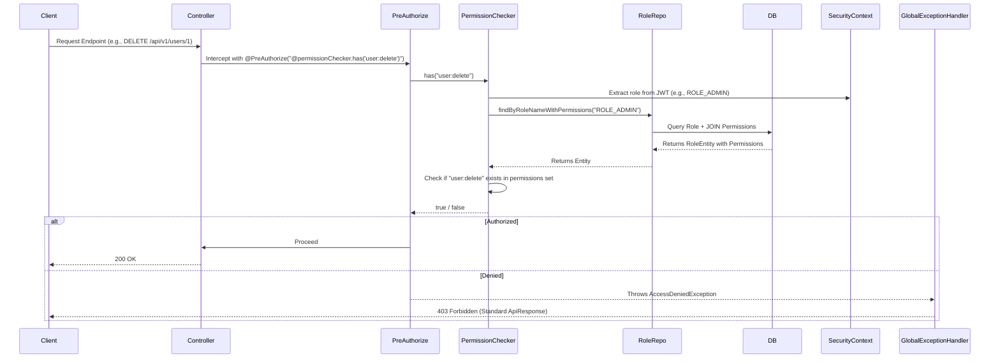

# Session Analysis Report 2: Authorization & User Management Implementation

## 1. Executive Summary

This report documents the implementation of a dynamic, permission-based authorization system and the corresponding CRUD operations for Roles, Permissions, and Users. The system transitioned from static, role-based checks (`hasRole`) to dynamic permission checks evaluated at runtime against the database. All seed data has been migrated to Flyway to ensure database consistency across environments.

**Key Achievements:**
- Transitioned to dynamic permission-based authorization using a custom `PermissionChecker`.
- Implemented full CRUD APIs for `Permission`, `Role`, and `User` with appropriate validation and DTOs.
- Replaced programmatic data seeding (`ApplicationInitConfig`) with Flyway SQL migrations.
- Established protected roles (`ROLE_ADMIN`, `ROLE_USER`) and soft-delete mechanisms for users.
- Standardized error handling for authorization failures and entity constraints.

---

## 2. Architecture & Design Changes

### 2.1 Dynamic Permission Evaluation Flow

The security flow was updated to evaluate permissions dynamically:

### 2.2 Database Schema Enhancements

*   **`RoleEntity`**: Expanded with `description`, `created_at`, and a `@ManyToMany` relationship to `PermissionEntity`.
*   **Flyway Migrations**:
    *   `V1.9__alter_roles_add_columns.sql`: Modified existing `roles` table.
    *   `V2.0__seed_permissions_roles_admin.sql`: Centralized seeding logic. Uses PostgreSQL's `pgcrypto` to hash passwords securely via SQL, establishing the initial `admin@easymall.com` account and 22 core permissions.

---

## 3. Implemented Components

### 3.1 Entities and Repositories

*   **`RoleEntity`**: Added `Set<PermissionEntity> permissions`.
*   **`RoleRepository`**: Added `@Query` methods with `LEFT JOIN FETCH r.permissions` to prevent N+1 select issues during permission resolution and role listing.
*   **`PermissionRepository`**: Added for checking existence and fetching permissions by IDs.

### 3.2 Services & Controllers

All modules follow strict Layered Architecture with DTO boundaries.

#### 3.2.1 Permission Module (`/api/v1/permissions`)
*   **CRUD**: Read all, Create, Update (description), Delete.
*   **Security**: Protected by `permission:read`, `permission:create`, etc.

#### 3.2.2 Role Module (`/api/v1/roles`)
*   **CRUD**: Read all, Read by ID, Create (with permissions), Update (sync permissions), Delete.
*   **Business Logic**:
    *   Ensures `ROLE_ADMIN` and `ROLE_USER` cannot be deleted (`ROLE_PROTECTED` error).
    *   Validates all assigned permission IDs exist before saving.

#### 3.2.3 User Management Module (`/api/v1/users`)
*   **CRUD**: Read all (Paginated), Read by ID, Create, Update, Delete.
*   **Business Logic**:
    *   `Create`: Assigns role, hashes password.
    *   `Update`: Partial update pattern (only updates non-null fields provided in the request).
    *   `Delete`: Implements **Soft Delete** by setting `isActive = false` instead of hard removal.

### 3.3 Security & Exception Handling

*   **`PermissionChecker`**: Custom bean interacting with Spring Security's `@PreAuthorize`. Extracts the single role (from the JWT `scope` claim) and queries the database for its current permissions.
*   **`GlobalExceptionHandler`**: Added handler for `AccessDeniedException` to intercept 403 errors and return the standardized `ApiResponse` structure instead of Spring's default HTML/JSON.
*   **`ErrorCode`**: Introduced specific codes for `ROLE_NOT_FOUND`, `ROLE_PROTECTED`, `PERMISSION_IN_USE`, etc.
*   **i18n (`messages.properties`)**: Added success and validation messages for all new CRUD operations.

---

## 4. Technical Debt Resolved

1.  **Hardcoded Data Seeding**: Removed `ApplicationInitConfig` which ran on every startup. Replaced with idempotent Flyway scripts (`V2.0`), adhering to database version control best practices.
2.  **Inflexible Authorization**: Moved away from hardcoded `@PreAuthorize("hasRole('ADMIN')")`. The system now supports dynamic permission assignment without requiring code changes or application restarts.
3.  **Inconsistent 403 Responses**: Standardized the response format for authorization failures via `GlobalExceptionHandler`.

---

## 5. Next Steps / Recommendations

*   **Cache Permissions**: Currently, `PermissionChecker` queries the database on *every* protected request. Implement Spring Cache (e.g., Redis or Caffeine) on `RoleRepository.findByRoleNameWithPermissions` to significantly reduce database load. Cache invalidation should occur when a role is updated.
*   **Audit Logging**: Implement `@EntityListeners` or Aspect-Oriented Programming (AOP) to track who created/modified roles, permissions, and users.
*   **Super Admin Bypass**: Consider implementing a fast-path in `PermissionChecker` where `ROLE_ADMIN` always returns `true` without checking the database, although the current model of assigning all permissions to `ROLE_ADMIN` via SQL is also valid and consistent.
