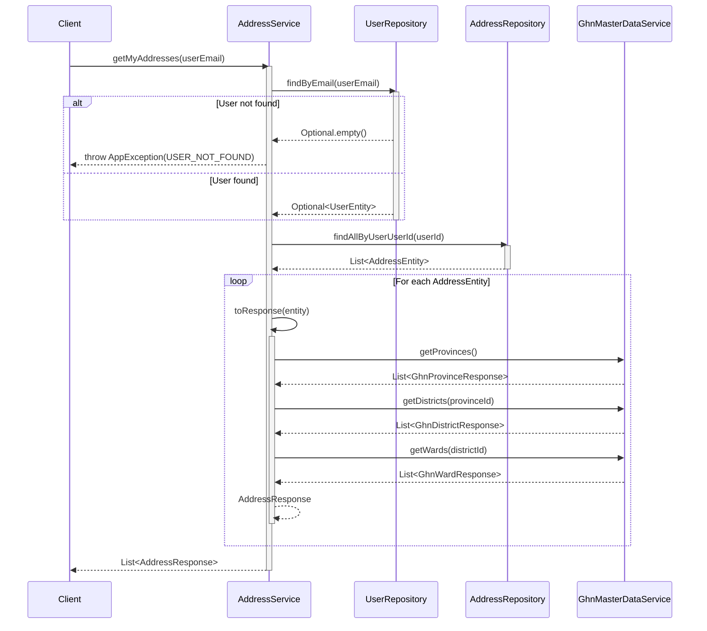
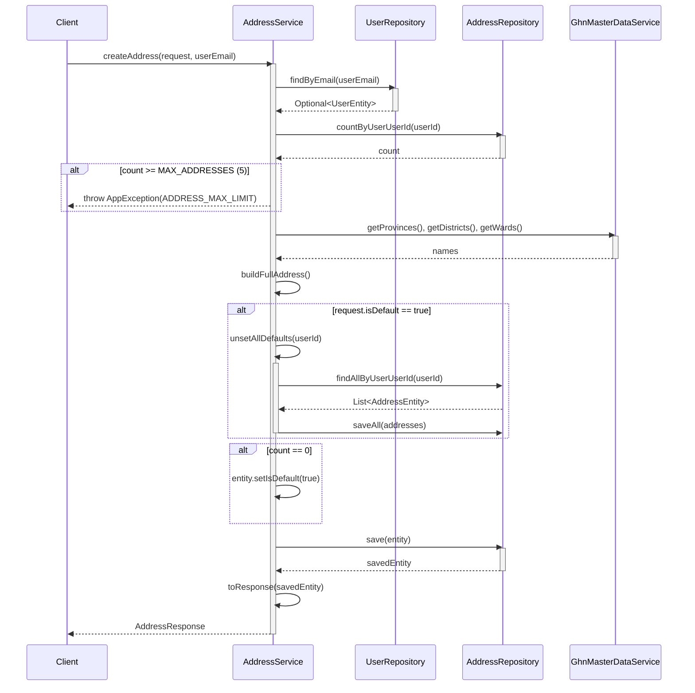
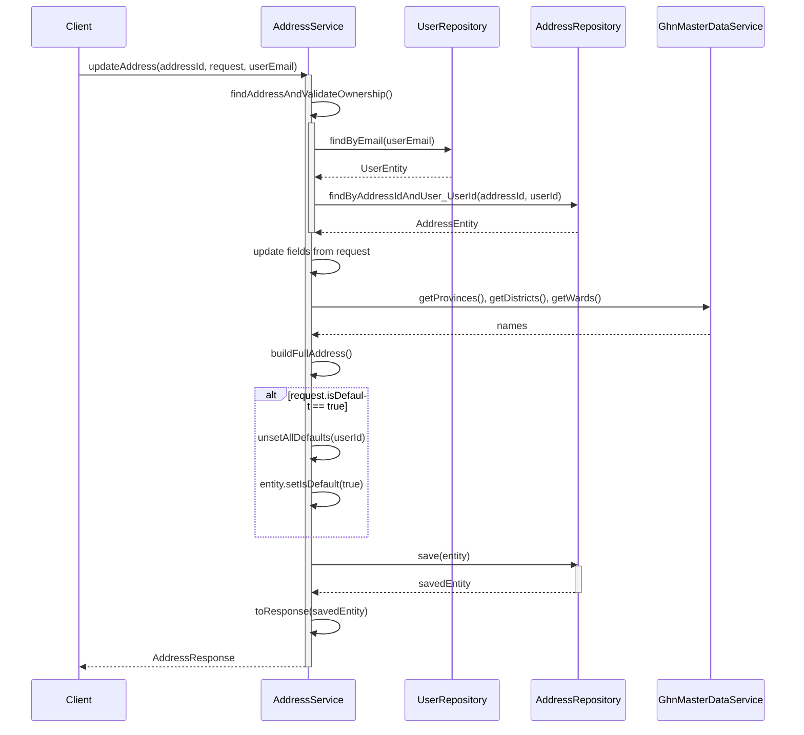
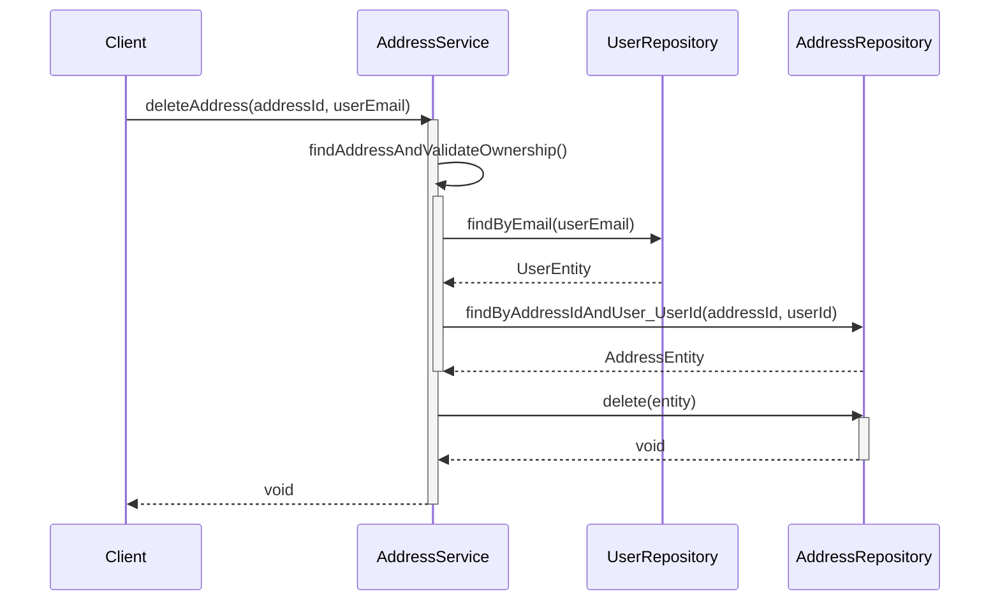
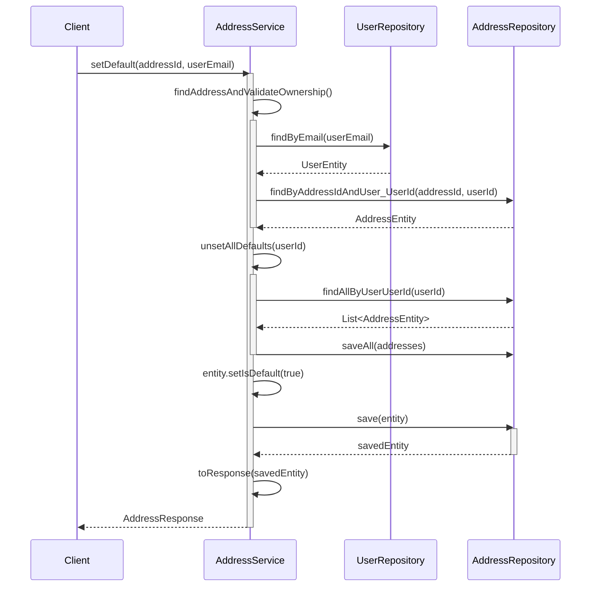

# Sequence Diagrams for Address Service

This document contains the sequence diagrams for all operations within `AddressServiceImpl`.

## 1. Get My Addresses (`getMyAddresses`)

## 2. Create Address (`createAddress`)

## 3. Update Address (`updateAddress`)

## 4. Delete Address (`deleteAddress`)

## 5. Set Default (`setDefault`)

