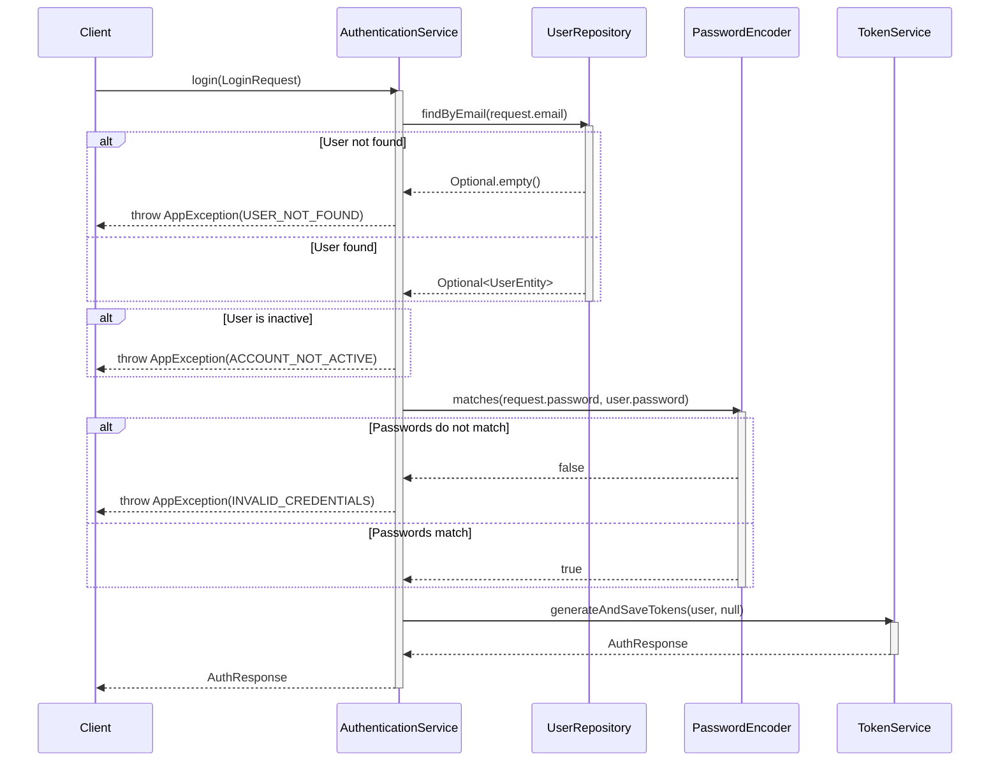
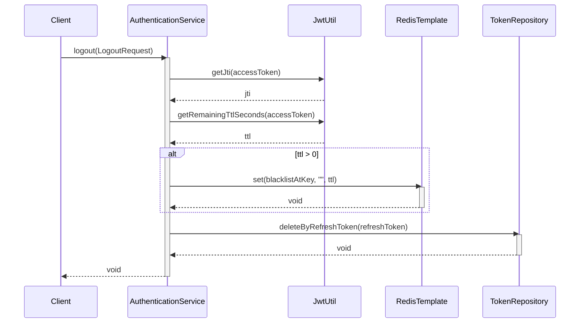
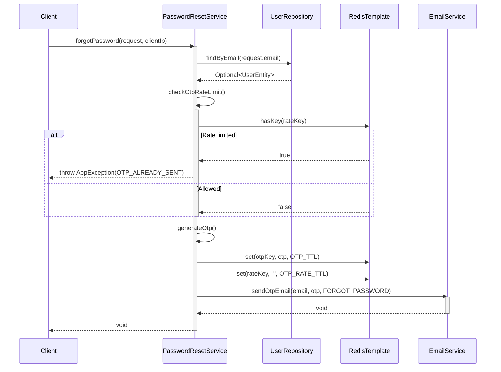
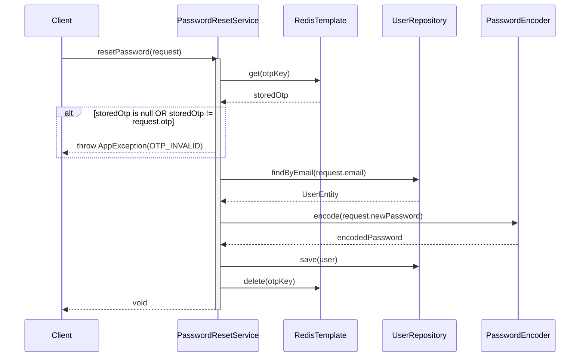
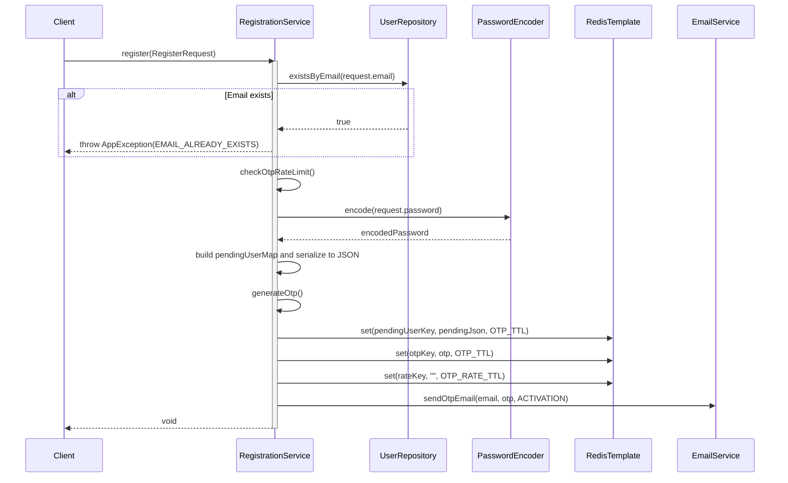
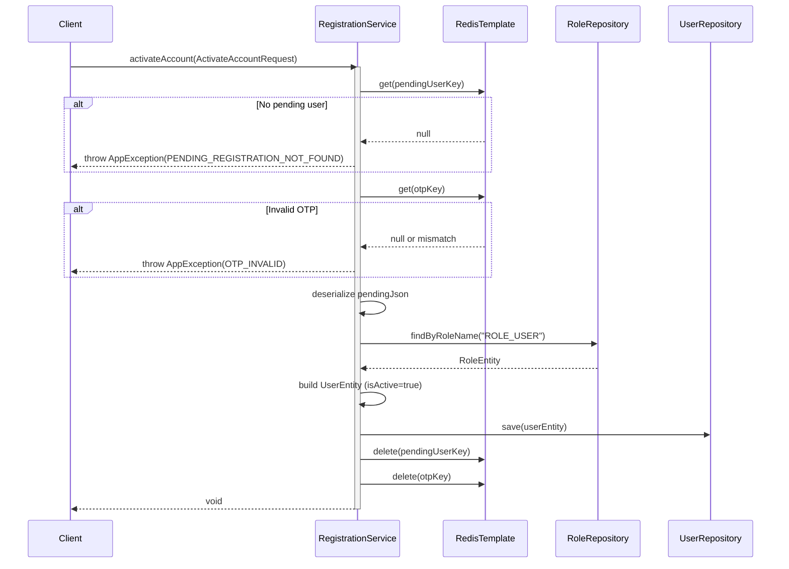
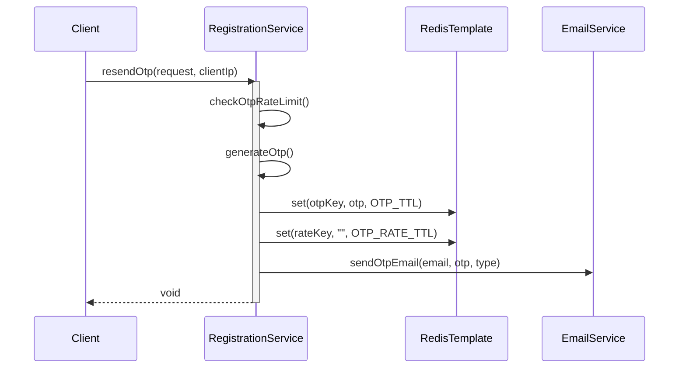
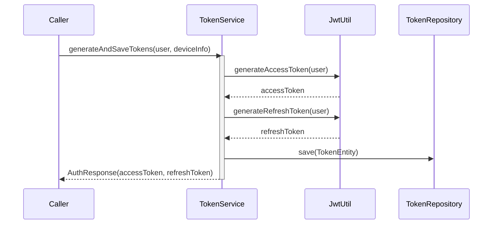
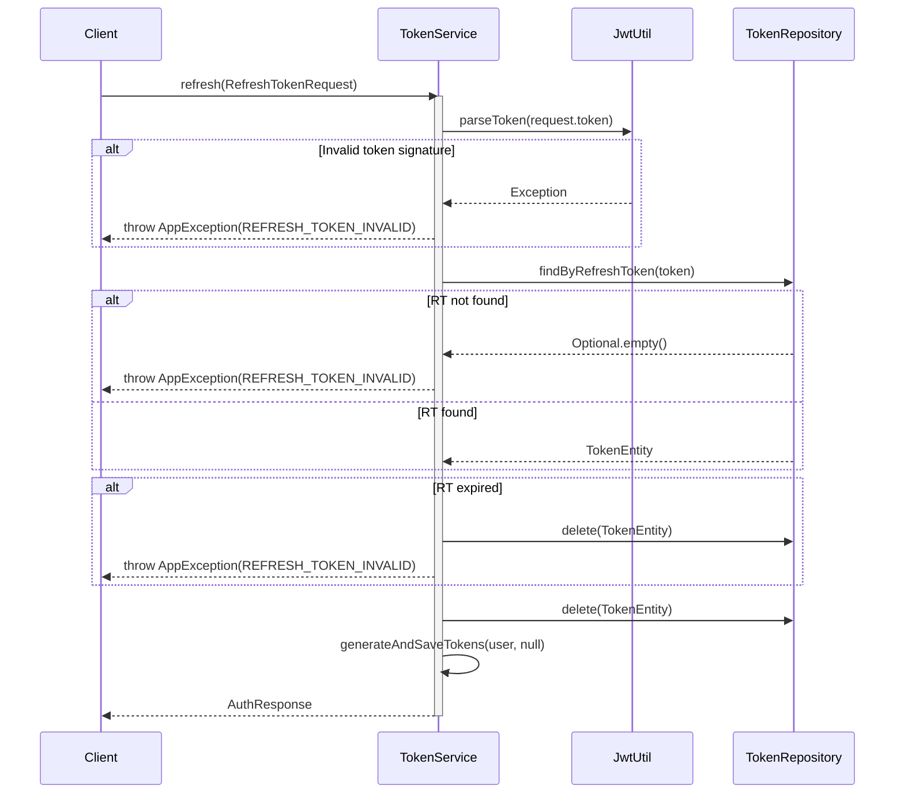
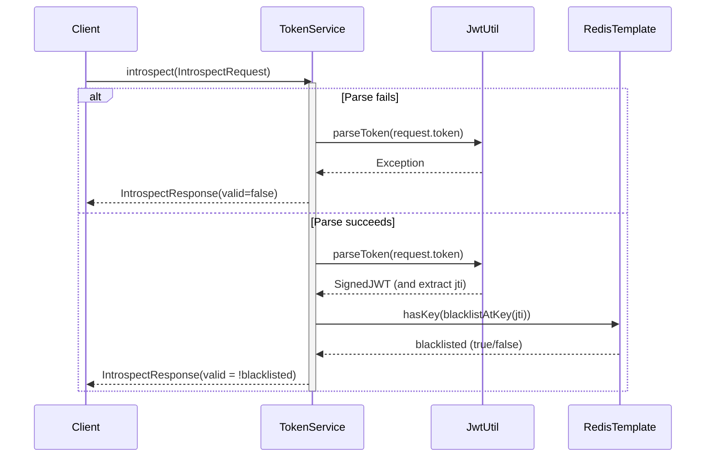

# Sequence Diagrams for Auth Services

This document contains sequence diagrams for the authentication and authorization services, including `AuthenticationServiceImpl`, `PasswordResetServiceImpl`, `RegistrationServiceImpl`, and `TokenServiceImpl`.

---

## 1. AuthenticationServiceImpl

### 1.1. Login (`login`)

### 1.2. Logout (`logout`)

---

## 2. PasswordResetServiceImpl

### 2.1. Forgot Password (`forgotPassword`)

### 2.2. Reset Password (`resetPassword`)

---

## 3. RegistrationServiceImpl

### 3.1. Register (`register`)

### 3.2. Activate Account (`activateAccount`)

### 3.3. Resend OTP (`resendOtp`)

---

## 4. TokenServiceImpl

### 4.1. Generate And Save Tokens (`generateAndSaveTokens`)

### 4.2. Refresh (`refresh`)

### 4.3. Introspect (`introspect`)

