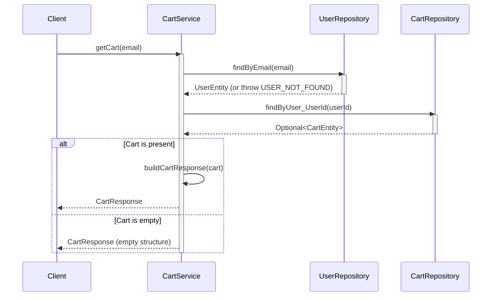
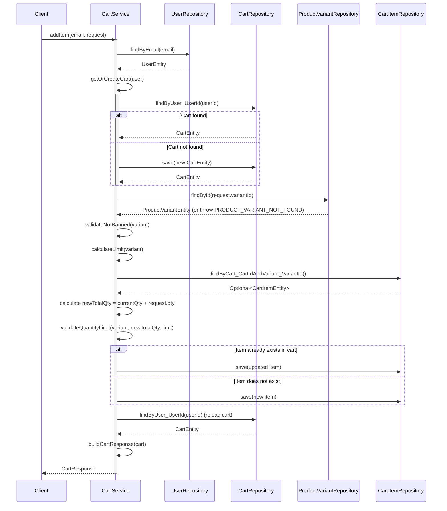
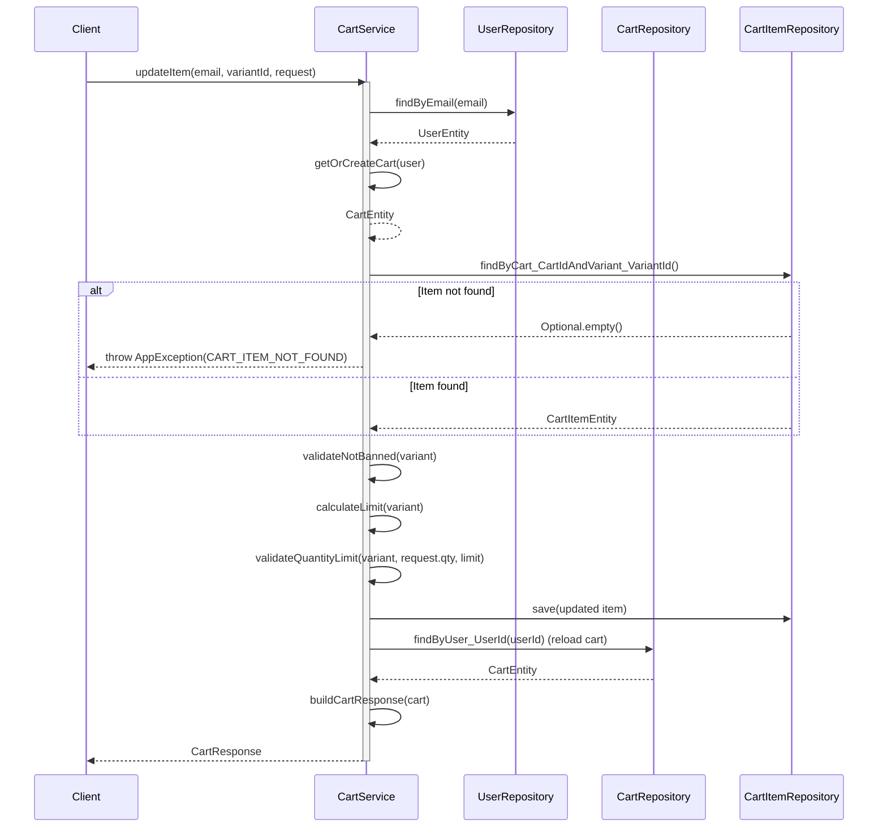
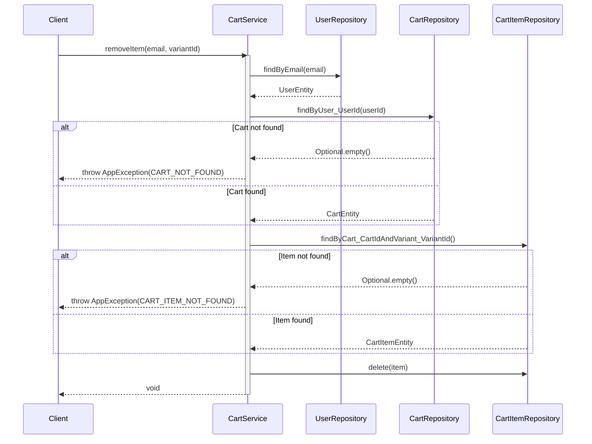

# Sequence Diagrams for Cart Service

This document contains the sequence diagrams for all operations within `CartServiceImpl`.

## 1. Get Cart (`getCart`)

## 2. Add Item to Cart (`addItem`)

## 3. Update Item in Cart (`updateItem`)

## 4. Remove Item from Cart (`removeItem`)

## 5. Clear Cart (`clearCart`)

