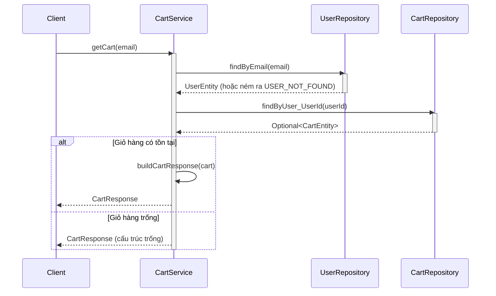
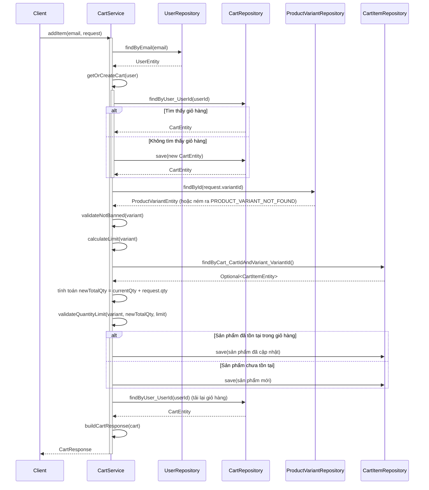
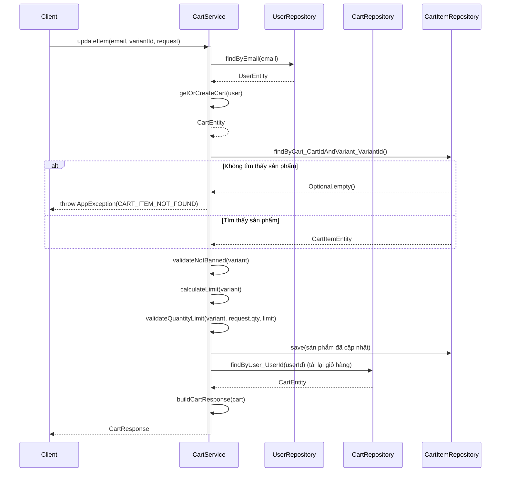
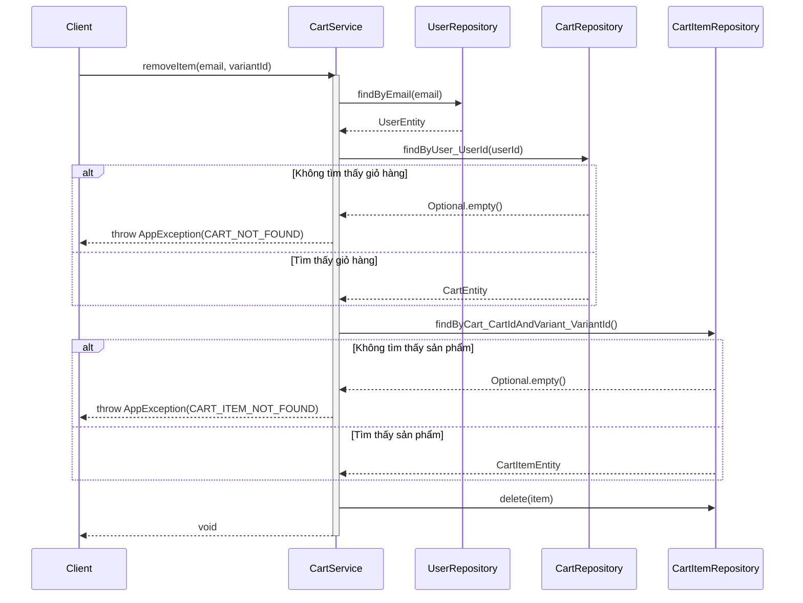
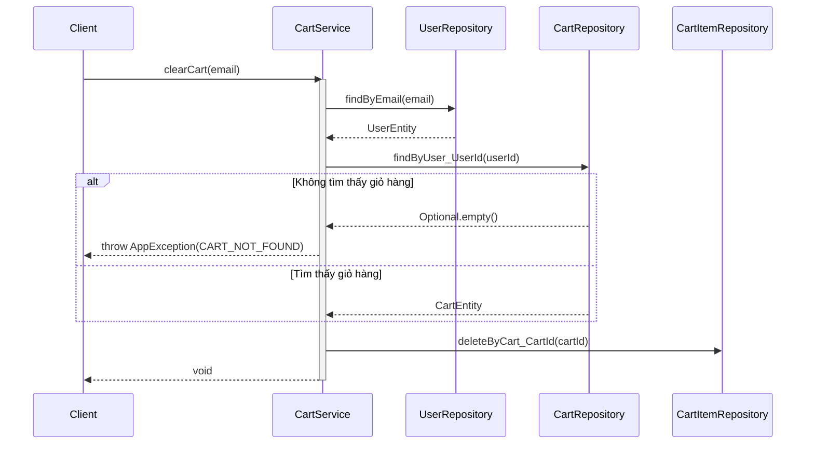

# Sequence Diagrams for Cart Service

Tài liệu này chứa các sơ đồ tuần tự cho tất cả các hoạt động trong `CartServiceImpl`.

## 1. Lấy Giỏ hàng (`getCart`)

## 2. Thêm Sản phẩm vào Giỏ hàng (`addItem`)

## 3. Cập nhật Sản phẩm trong Giỏ hàng (`updateItem`)

## 4. Xóa Sản phẩm khỏi Giỏ hàng (`removeItem`)

## 5. Xóa sạch Giỏ hàng (`clearCart`)

