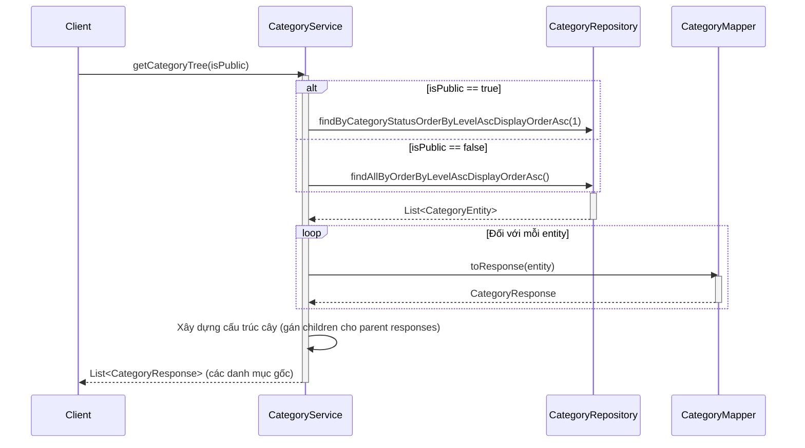
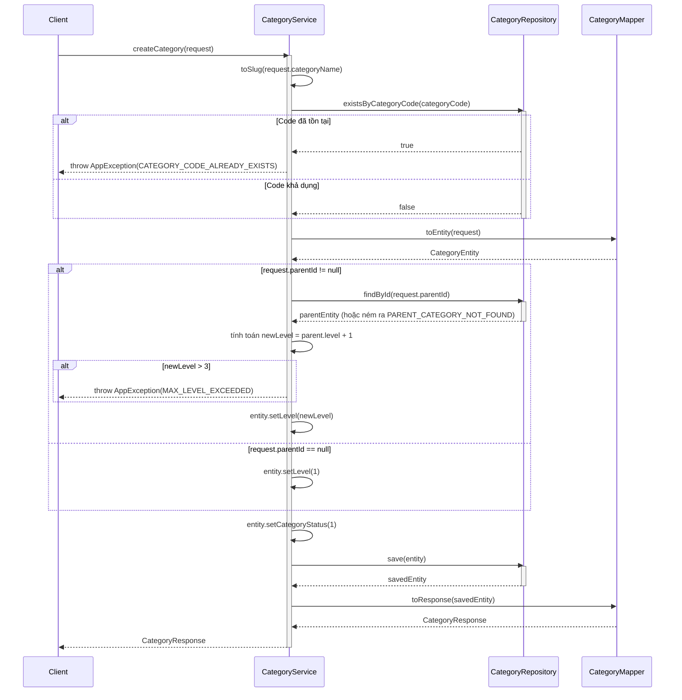
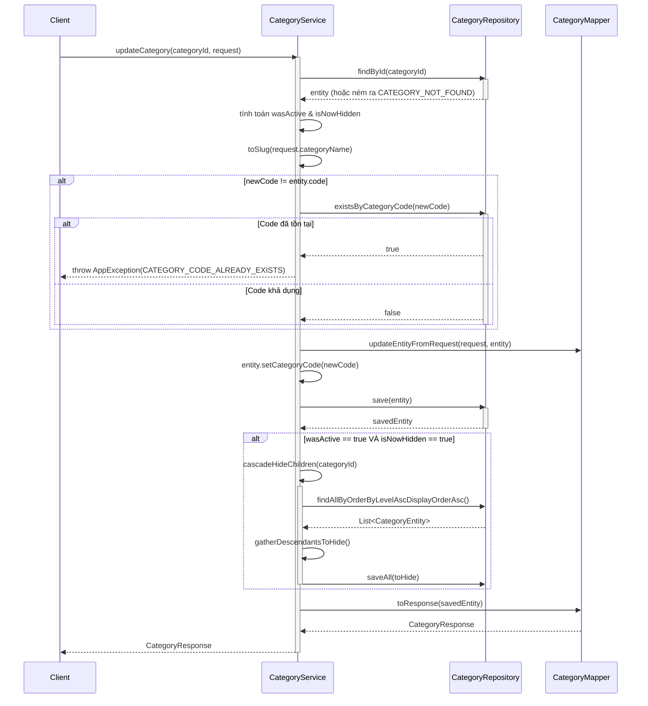
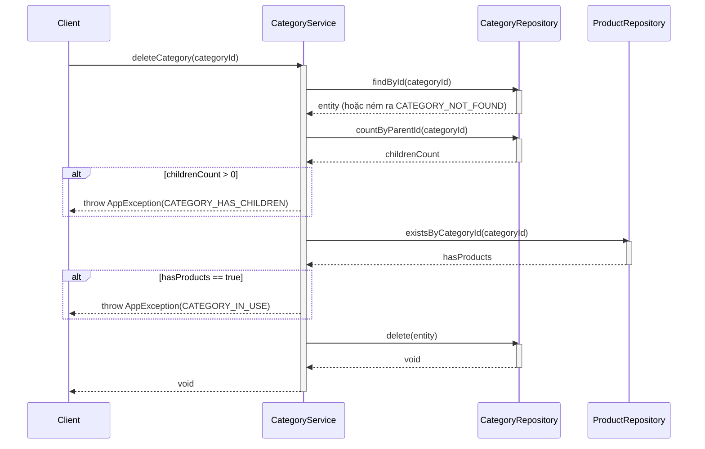

# Sequence Diagrams for Category Service

Tài liệu này chứa các sơ đồ tuần tự cho tất cả các hoạt động trong `CategoryServiceImpl`.

## 1. Lấy Cây Danh mục (`getCategoryTree`)

## 2. Tạo Danh mục (`createCategory`)

## 3. Cập nhật Danh mục (`updateCategory`)

## 4. Xóa Danh mục (`deleteCategory`)

