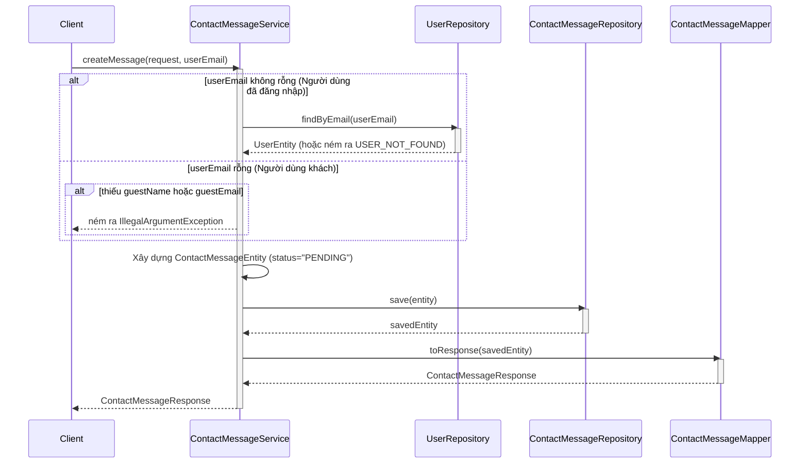
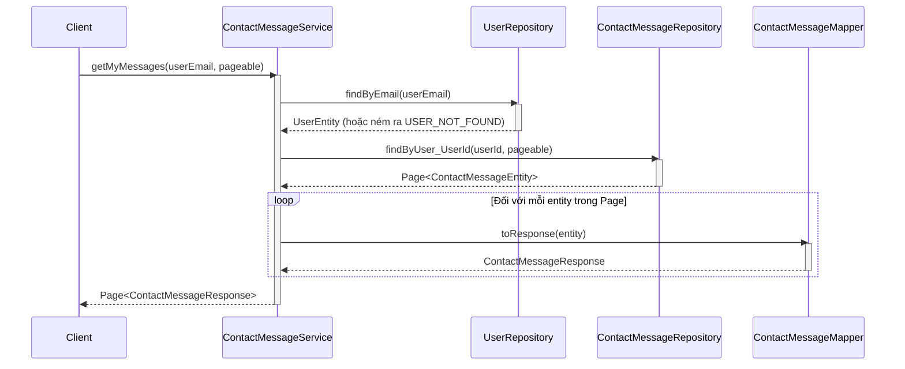
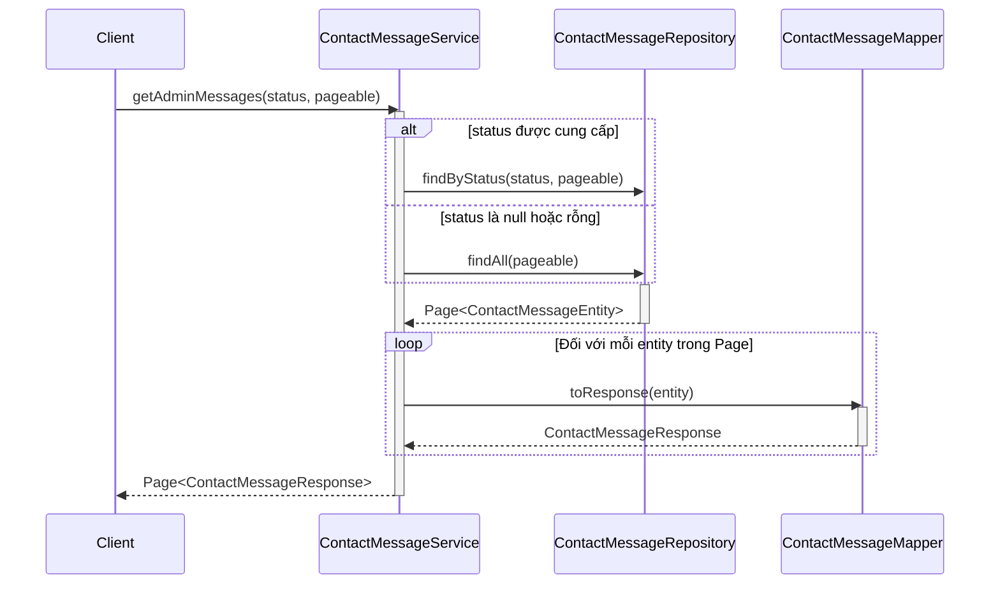
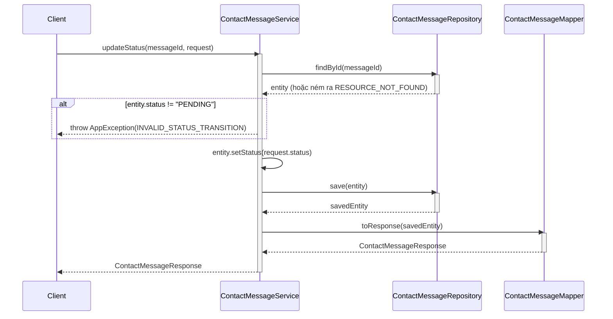

# Sequence Diagrams for Contact Message Service

Tài liệu này chứa các sơ đồ tuần tự cho tất cả các hoạt động trong `ContactMessageServiceImpl`.

## 1. Tạo tin nhắn (`createMessage`)

## 2. Lấy tin nhắn của tôi (`getMyMessages`)

## 3. Lấy tin nhắn của Admin (`getAdminMessages`)

## 4. Cập nhật trạng thái (`updateStatus`)

