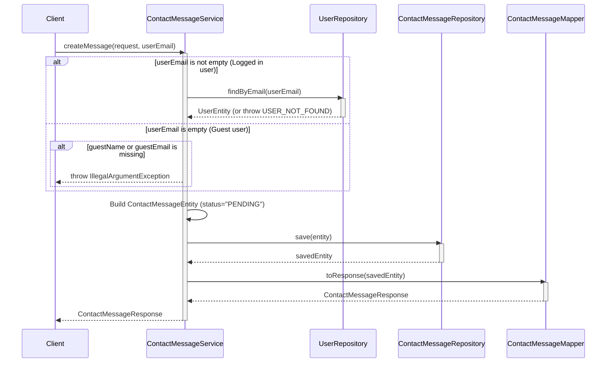
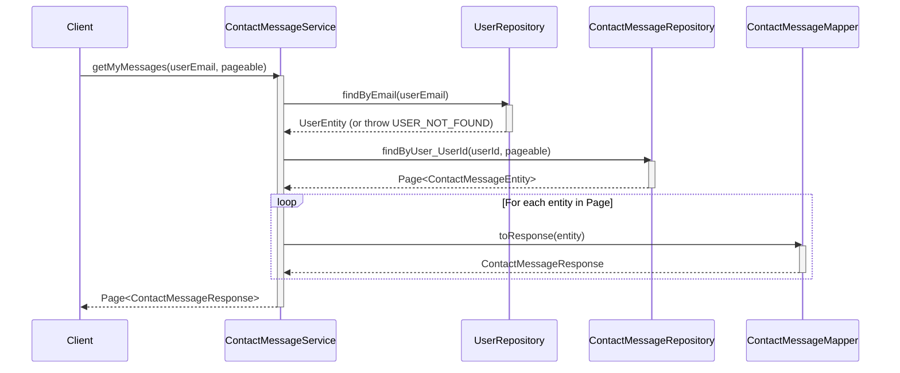
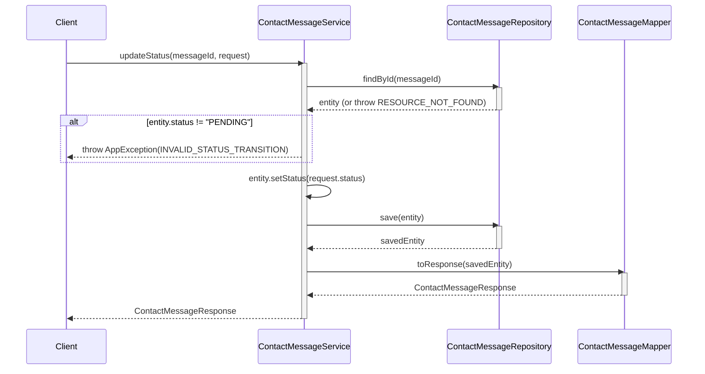

# Sequence Diagrams for Contact Message Service

This document contains the sequence diagrams for all operations within `ContactMessageServiceImpl`.

## 1. Create Message (`createMessage`)

## 2. Get My Messages (`getMyMessages`)

## 3. Get Admin Messages (`getAdminMessages`)

## 4. Update Status (`updateStatus`)

