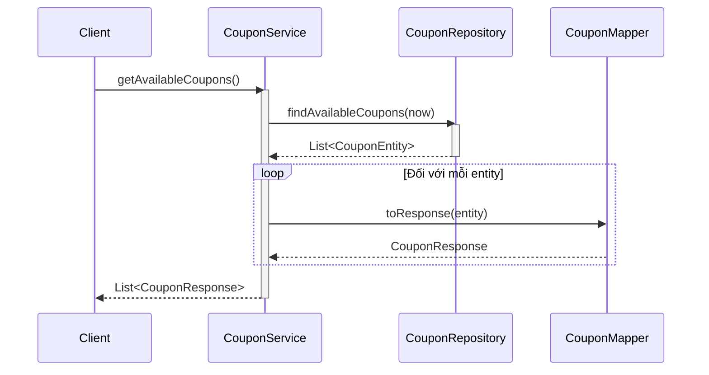

# Sequence Diagrams for Coupon Service

Tài liệu này chứa các sơ đồ tuần tự cho tất cả các hoạt động chính trong `CouponServiceImpl`.

## 1. Tạo Coupon (`createCoupon`)

## 2. Cập nhật Coupon (`updateCoupon`)

## 3. Xem trước áp dụng Coupon (`previewApply`)

## 4. Lấy các Coupon khả dụng (`getAvailableCoupons`)

