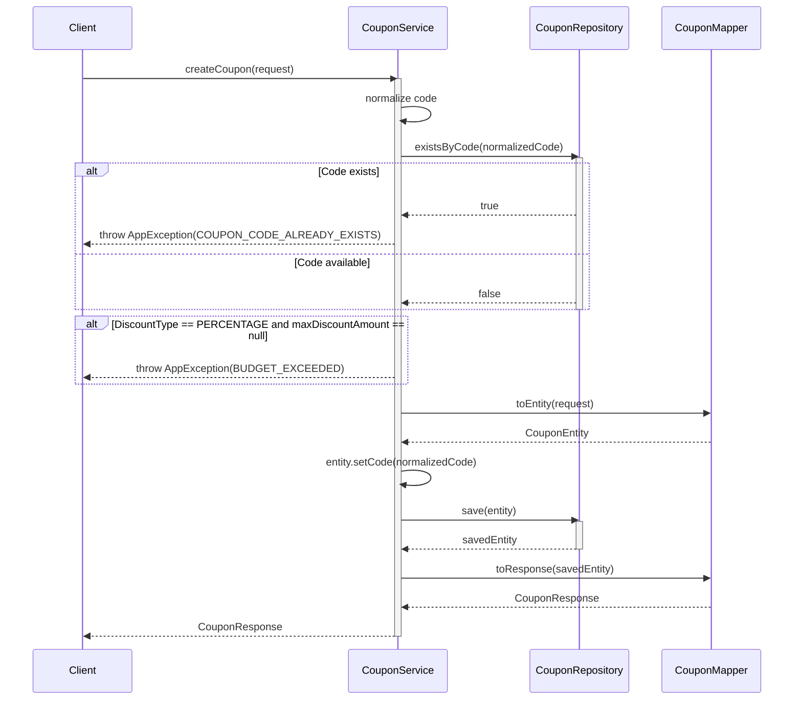
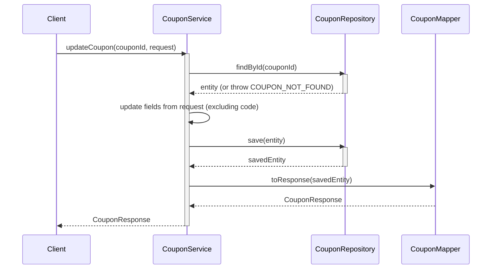
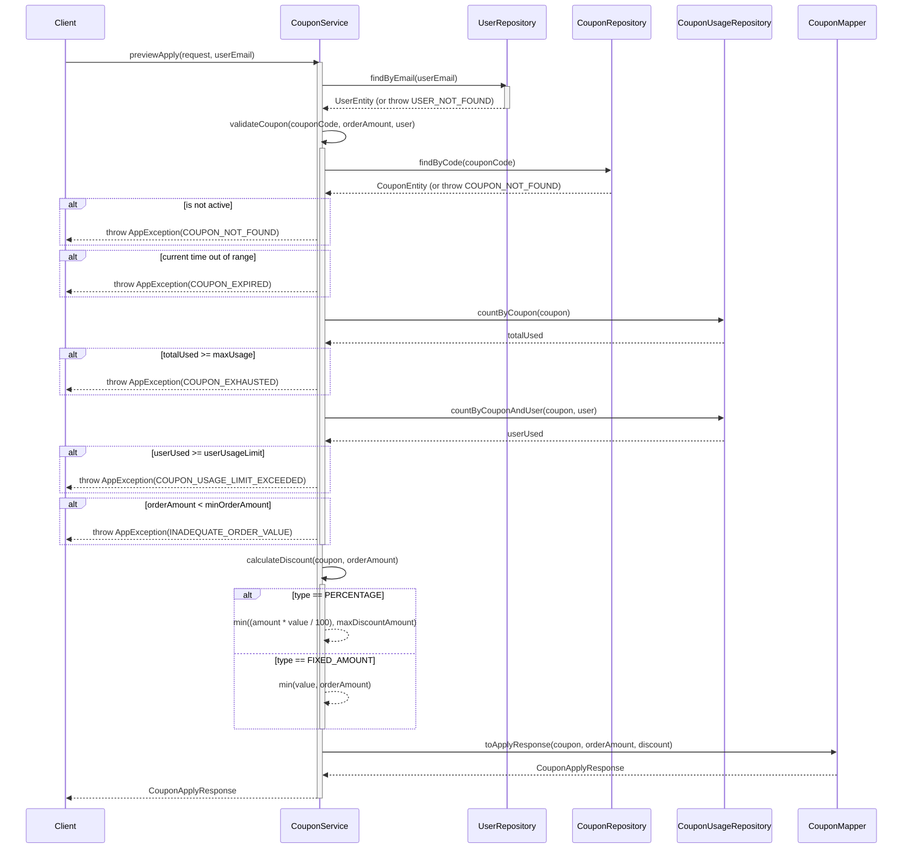

# Sequence Diagrams for Coupon Service

This document contains the sequence diagrams for all major operations within `CouponServiceImpl`.

## 1. Create Coupon (`createCoupon`)

## 2. Update Coupon (`updateCoupon`)

## 3. Preview Apply Coupon (`previewApply`)

## 4. Get Available Coupons (`getAvailableCoupons`)

