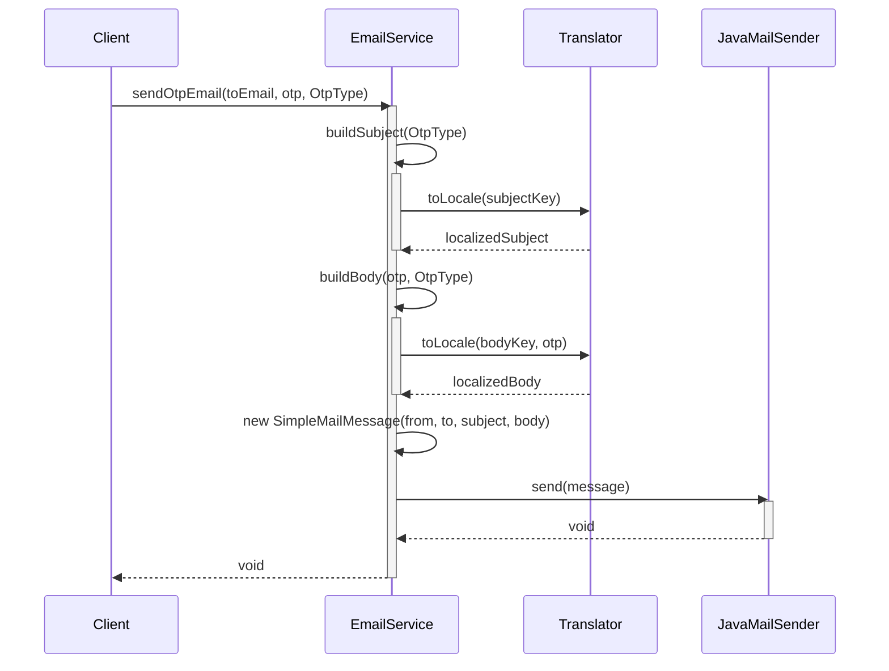

# Sequence Diagrams for Email Service

This document contains the sequence diagrams for operations within `EmailServiceImpl`.

## 1. Send OTP Email (`sendOtpEmail`)

```mermaid
sequenceDiagram
    participant Client
    participant EmailService
    participant Translator
    participant JavaMailSender

    Client->>EmailService: sendOtpEmail(toEmail, otp, OtpType)
    activate EmailService

    EmailService->>EmailService: buildSubject(OtpType)
    activate EmailService
    EmailService->>Translator: toLocale(subjectKey)
    Translator-->>EmailService: localizedSubject
    deactivate EmailService

    EmailService->>EmailService: buildBody(otp, OtpType)
    activate EmailService
    EmailService->>Translator: toLocale(bodyKey, otp)
    Translator-->>EmailService: localizedBody
    deactivate EmailService

    EmailService->>EmailService: new SimpleMailMessage(from, to, subject, body)

    EmailService->>JavaMailSender: send(message)
    activate JavaMailSender
    JavaMailSender-->>EmailService: void
    deactivate JavaMailSender

    EmailService-->>Client: void
    deactivate EmailService
```
