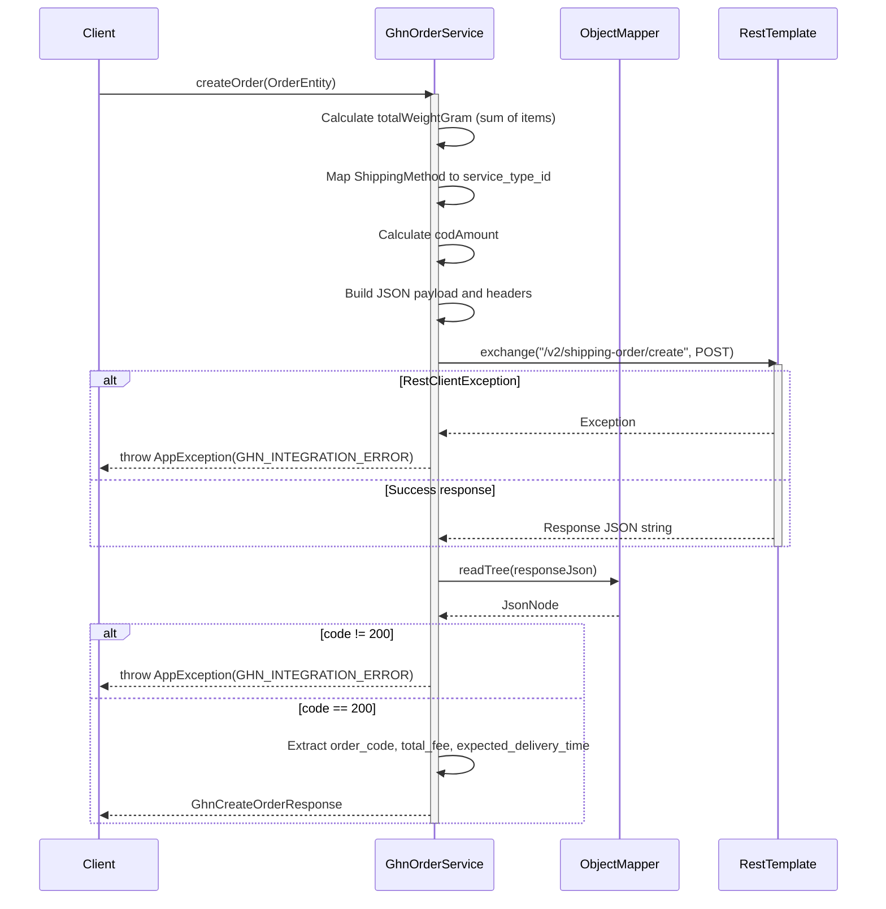
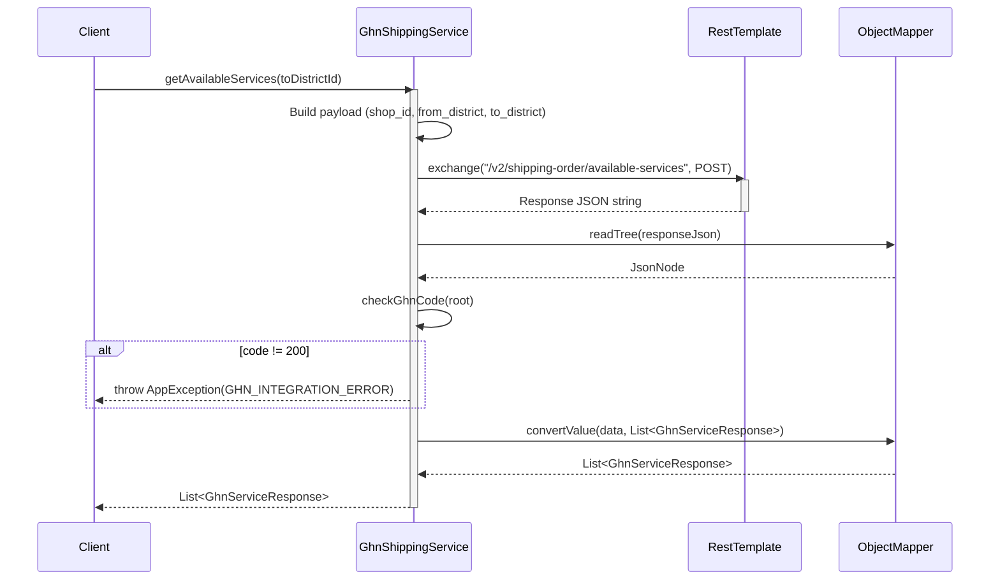
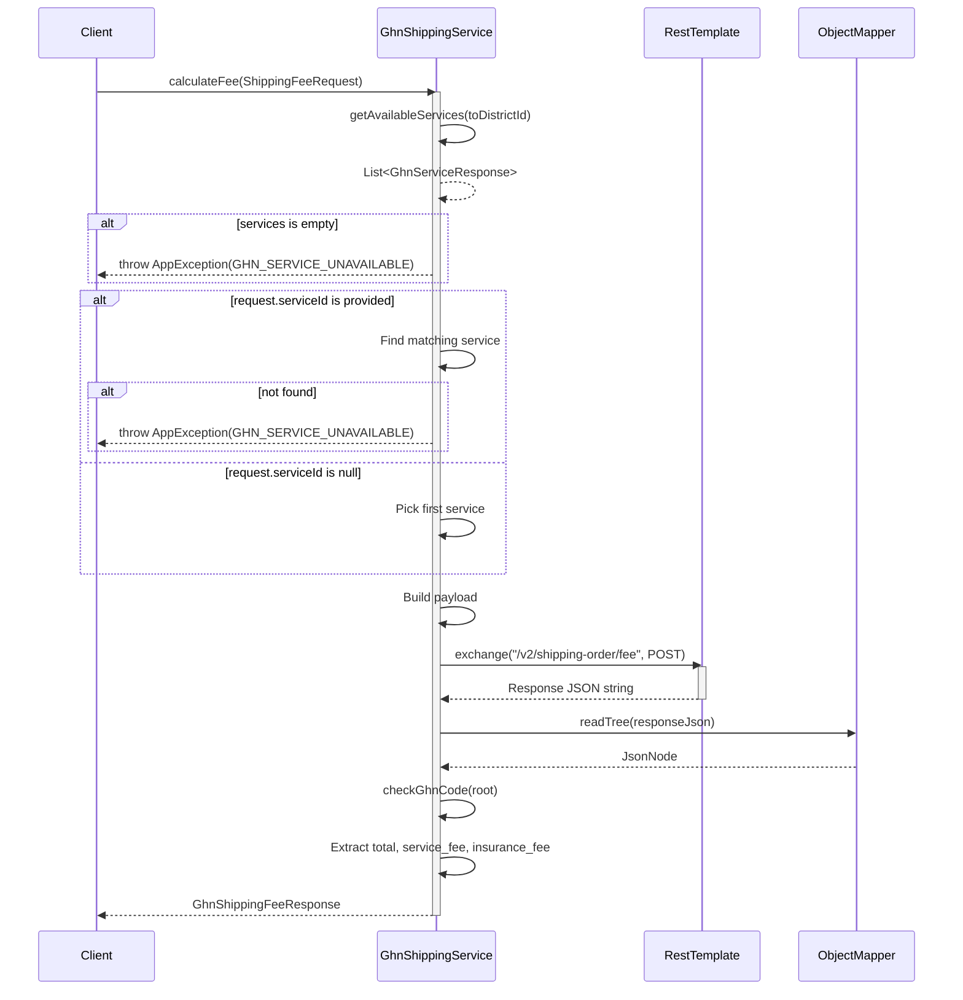
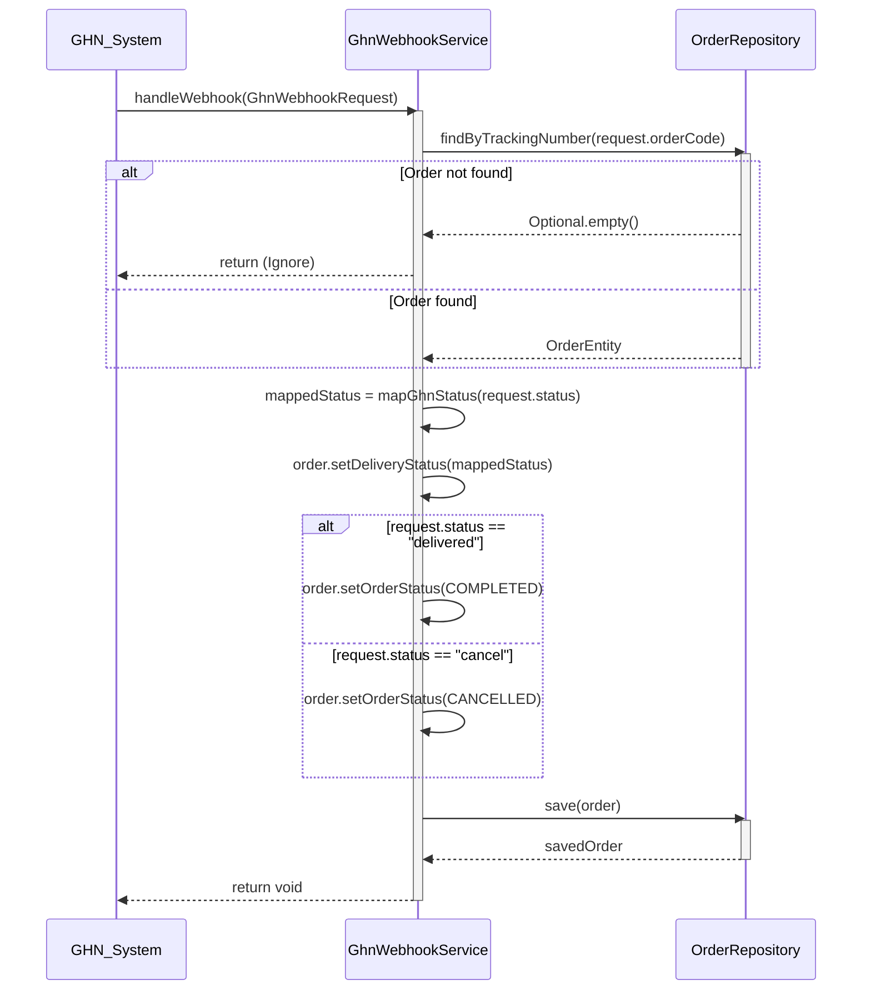

# Sequence Diagrams for GHN Services

This document contains the sequence diagrams for operations within `GhnOrderServiceImpl`, `GhnShippingServiceImpl`, and `GhnWebhookServiceImpl`.

## 1. GhnOrderServiceImpl

### 1.1. Create Order (`createOrder`)

---

## 2. GhnShippingServiceImpl

### 2.1. Get Available Services (`getAvailableServices`)

### 2.2. Calculate Fee (`calculateFee`)

---

## 3. GhnWebhookServiceImpl

### 3.1. Handle Webhook (`handleWebhook`)

