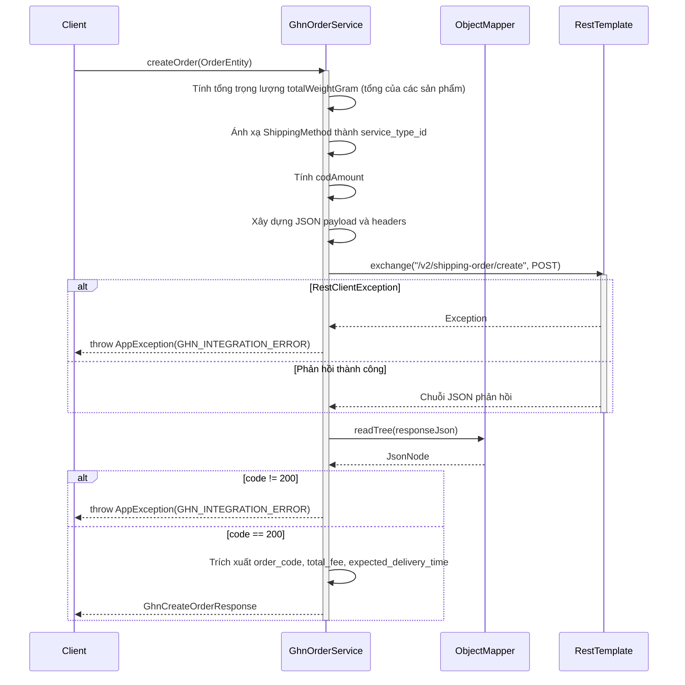
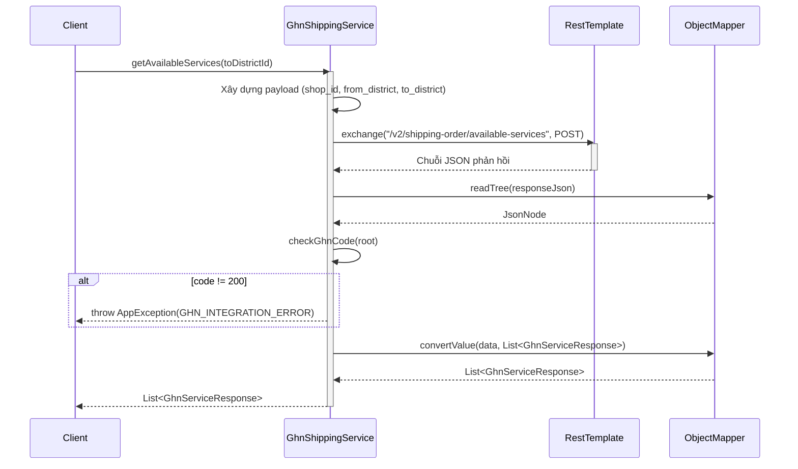
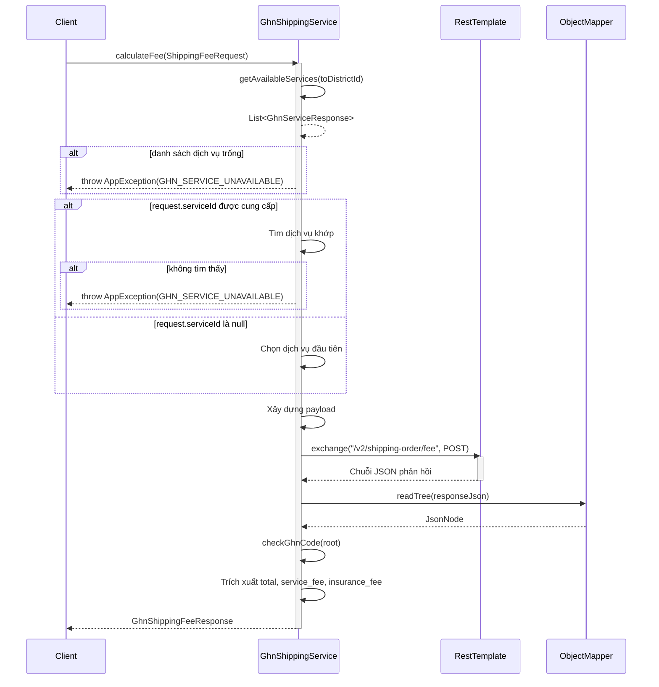
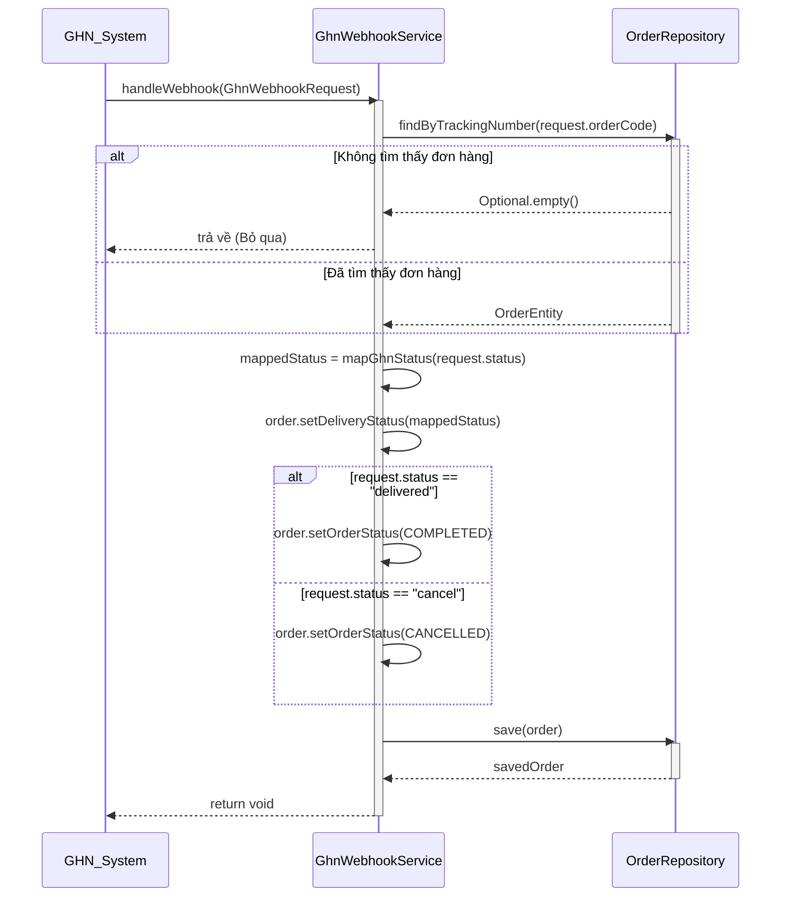

# Sequence Diagrams for GHN Services

Tài liệu này chứa các sơ đồ tuần tự cho các hoạt động trong `GhnOrderServiceImpl`, `GhnShippingServiceImpl`, và `GhnWebhookServiceImpl`.

## 1. GhnOrderServiceImpl

### 1.1. Tạo Đơn hàng (`createOrder`)

---

## 2. GhnShippingServiceImpl

### 2.1. Lấy các dịch vụ khả dụng (`getAvailableServices`)

### 2.2. Tính Phí (`calculateFee`)

---

## 3. GhnWebhookServiceImpl

### 3.1. Xử lý Webhook (`handleWebhook`)

