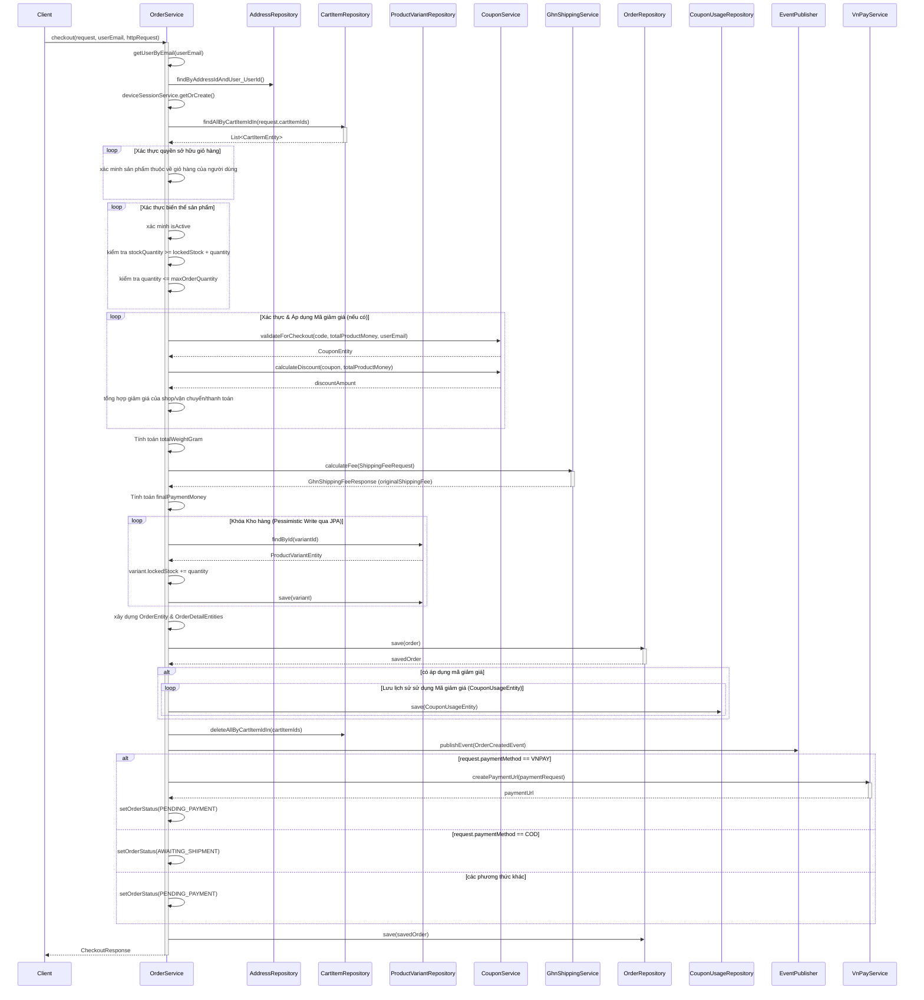
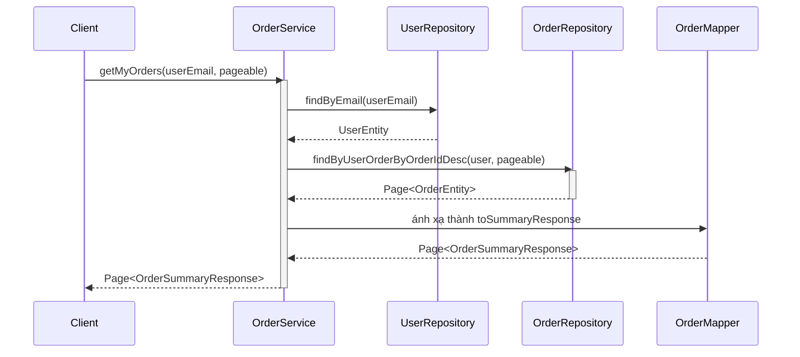
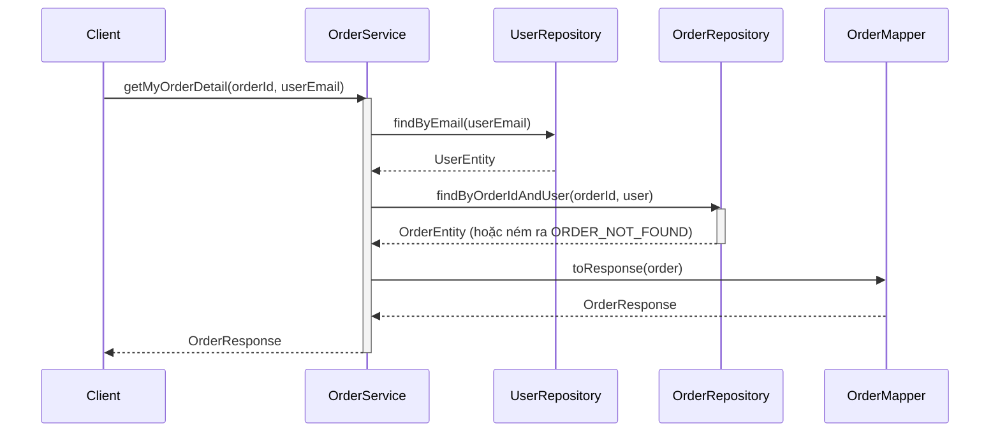
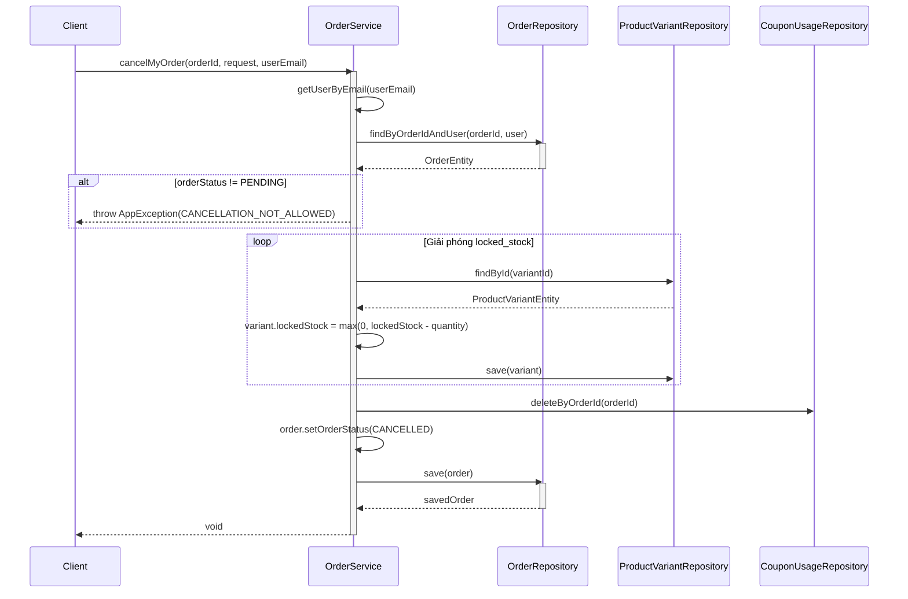
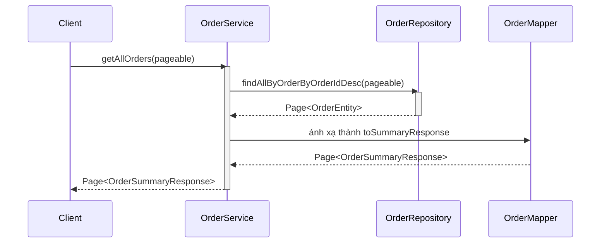
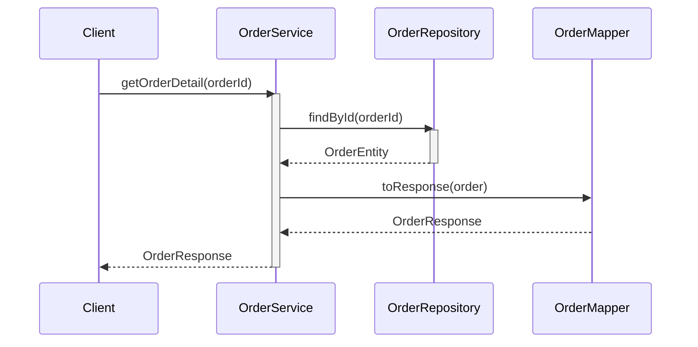
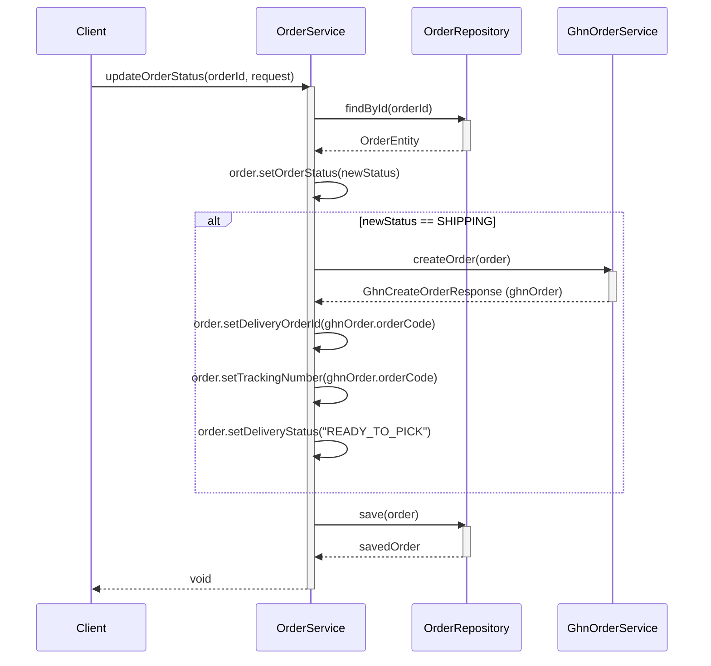

# Sequence Diagrams for Order Service

Tài liệu này chứa các sơ đồ tuần tự cho tất cả các hoạt động trong `OrderServiceImpl`.

## 1. Thanh toán (`checkout`)

## 2. Lấy Đơn hàng của tôi (`getMyOrders`)

## 3. Lấy Chi tiết Đơn hàng của tôi (`getMyOrderDetail`)

## 4. Hủy Đơn hàng của tôi (`cancelMyOrder`)

## 5. Lấy Tất cả Đơn hàng - Admin (`getAllOrders`)

## 6. Lấy Chi tiết Đơn hàng - Admin (`getOrderDetail`)

## 7. Cập nhật Trạng thái Đơn hàng - Admin (`updateOrderStatus`)

