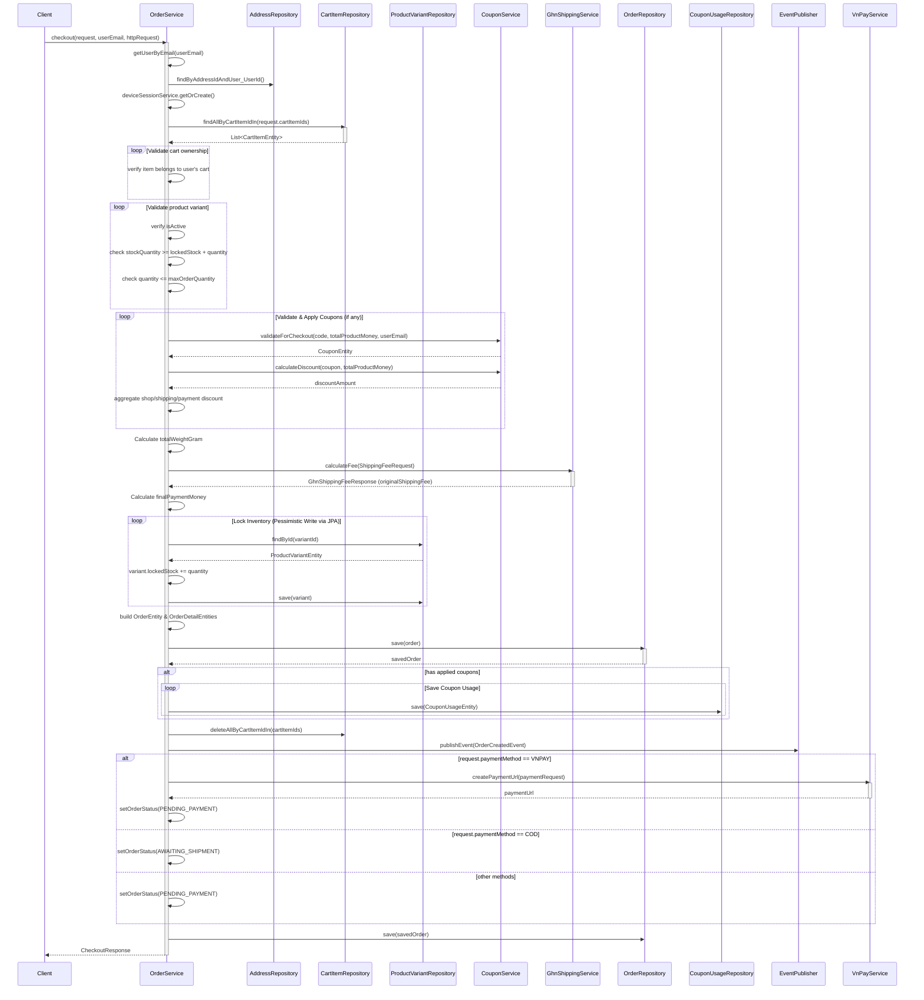
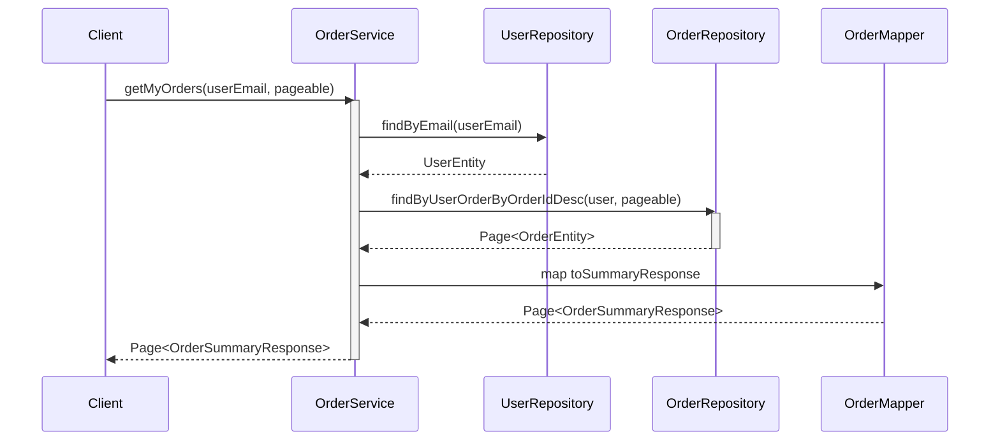
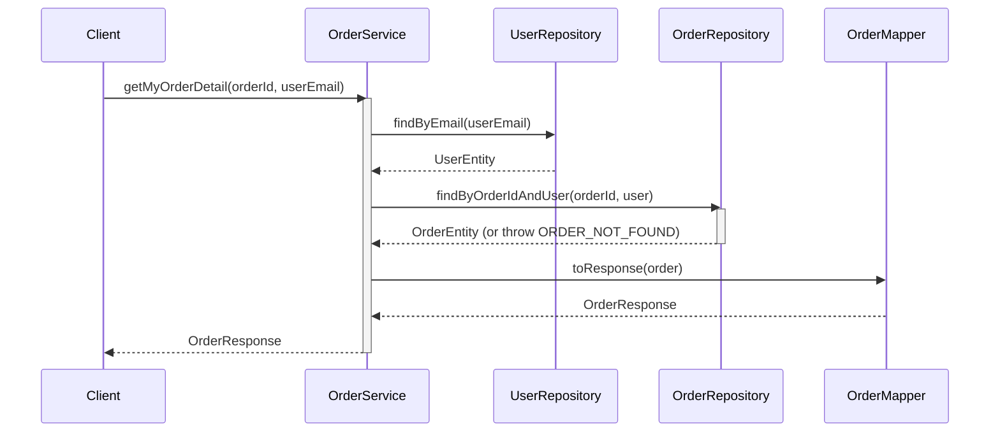
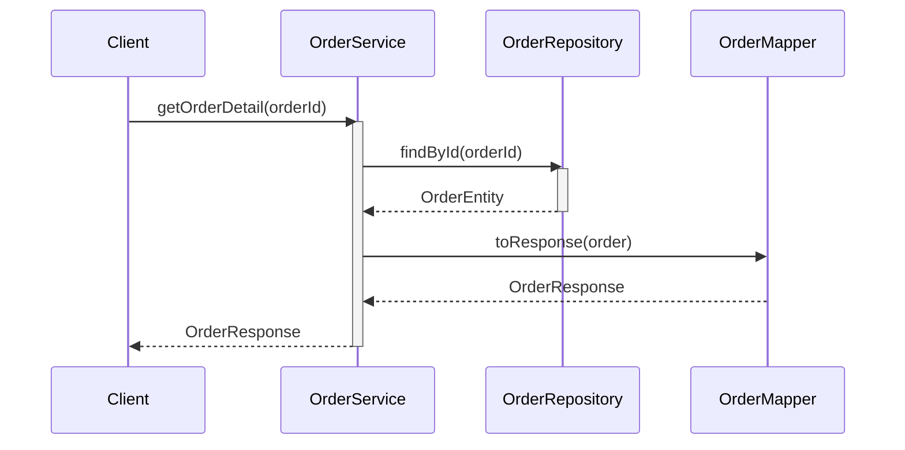
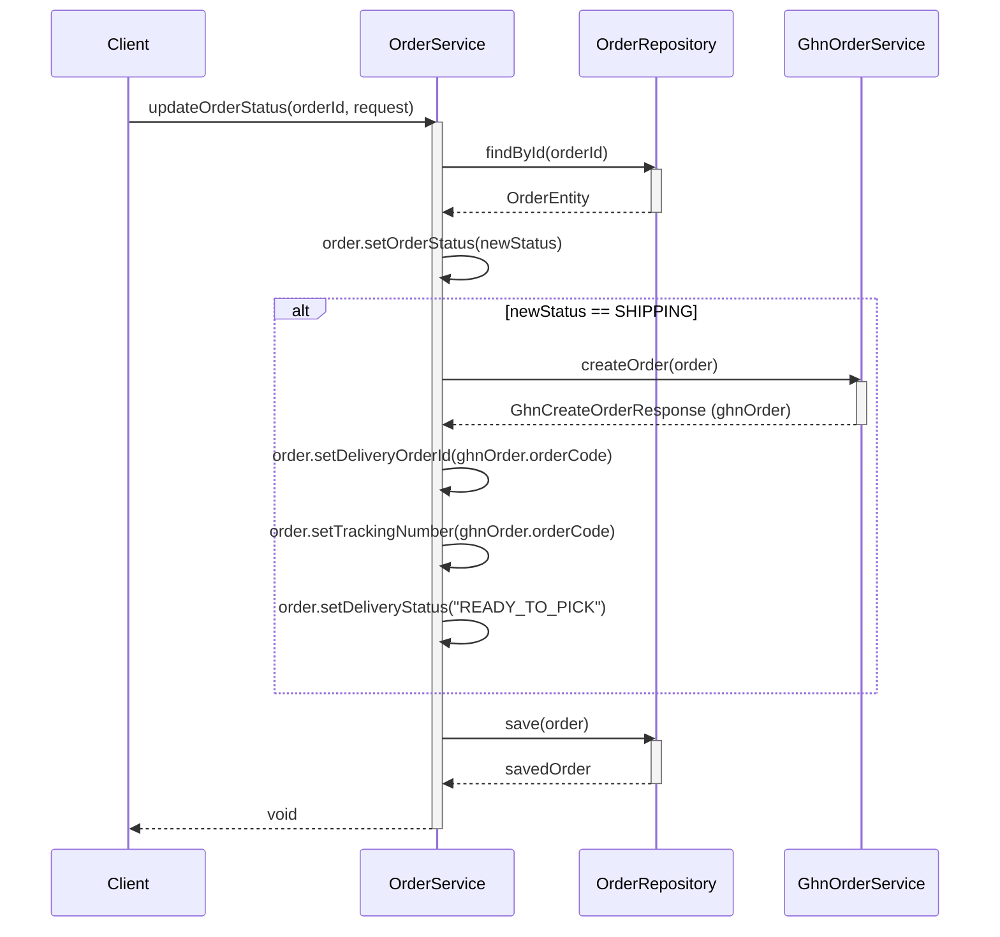

# Sequence Diagrams for Order Service

This document contains the sequence diagrams for all operations within `OrderServiceImpl`.

## 1. Checkout (`checkout`)

## 2. Get My Orders (`getMyOrders`)

## 3. Get My Order Detail (`getMyOrderDetail`)

## 4. Cancel My Order (`cancelMyOrder`)

## 5. Get All Orders - Admin (`getAllOrders`)

## 6. Get Order Detail - Admin (`getOrderDetail`)

## 7. Update Order Status - Admin (`updateOrderStatus`)

