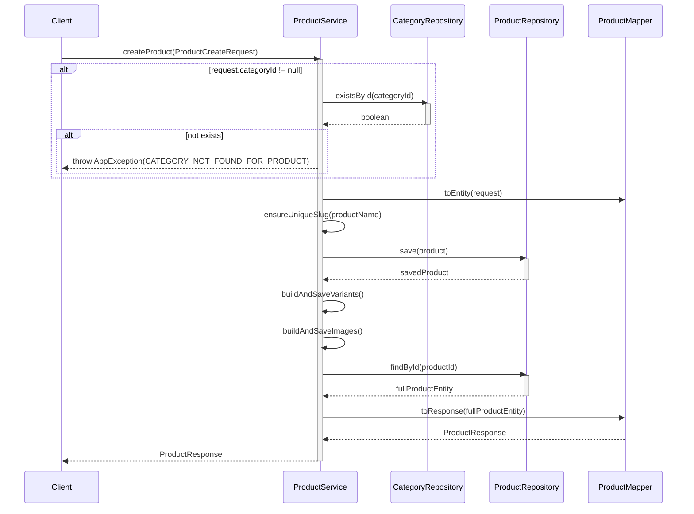
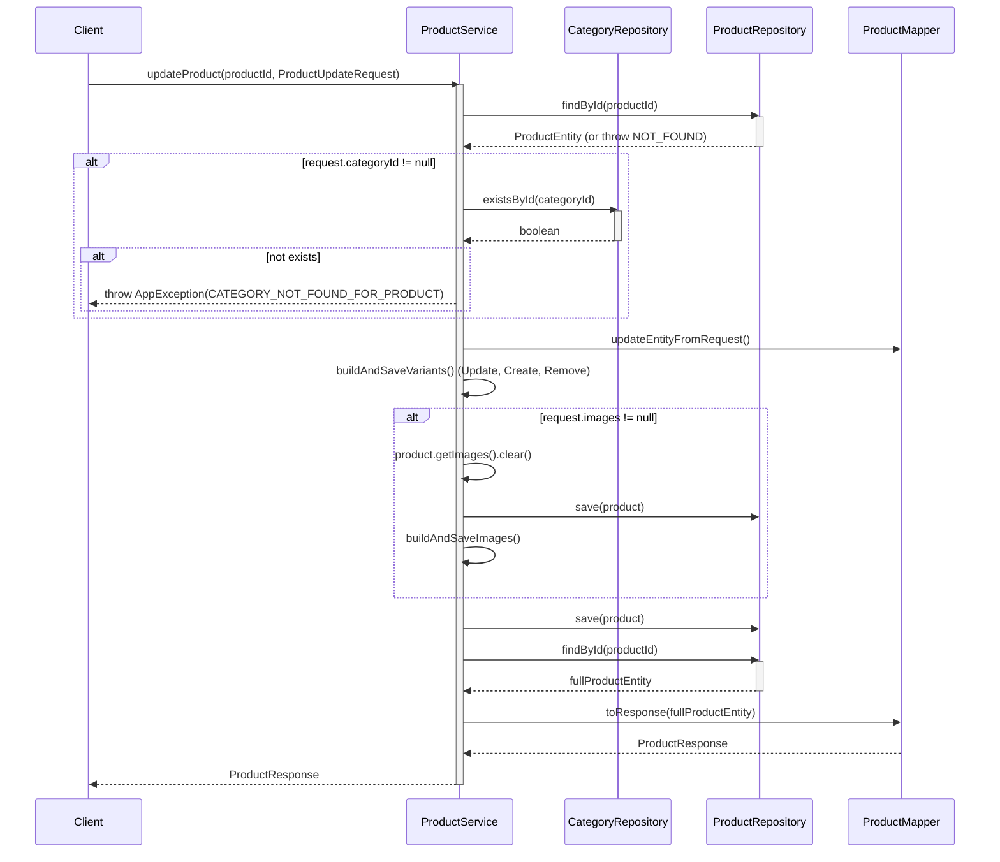
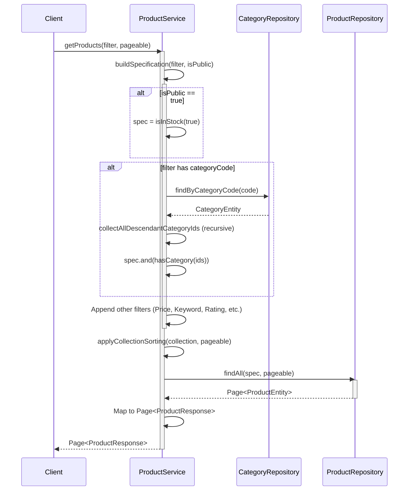
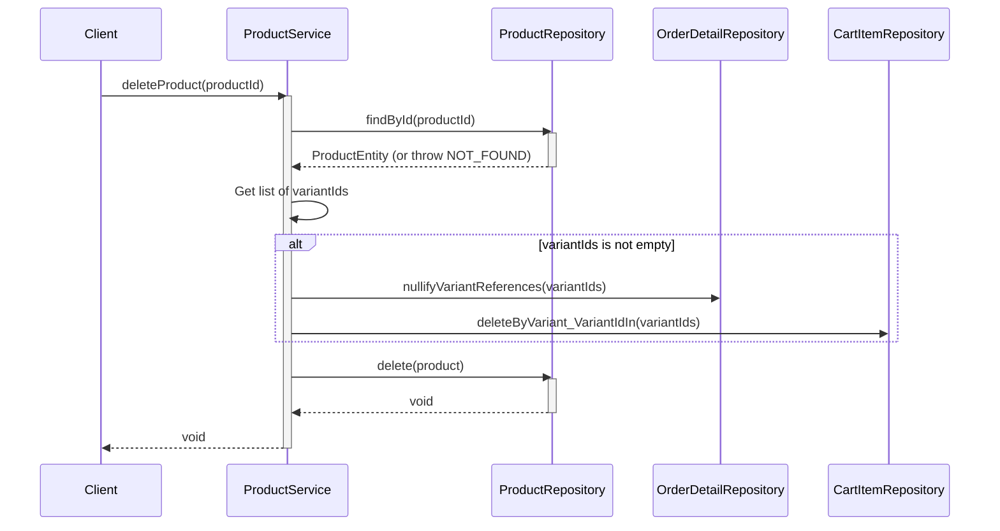

# Sequence Diagrams for Product Service

This document contains the sequence diagrams for operations within `ProductServiceImpl`.

## 1. Create Product (`createProduct`)

## 2. Update Product (`updateProduct`)

## 3. Get Products (Admin & Public)

Applies to both `getAllProducts` (Admin) and `getPublicProducts` (Public).

## 4. Delete Product (`deleteProduct`)

