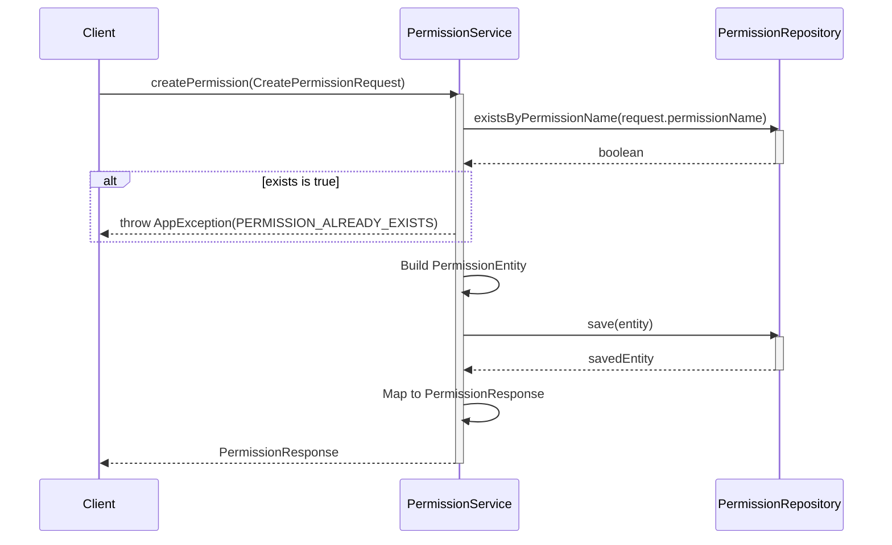
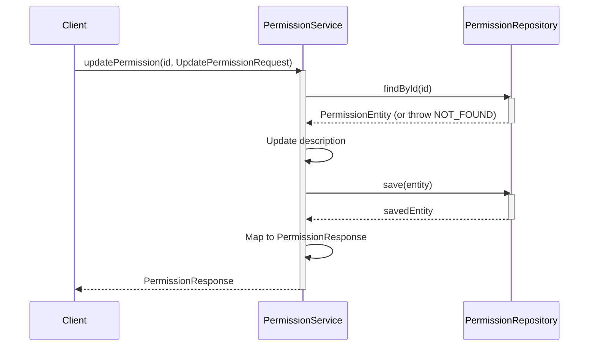
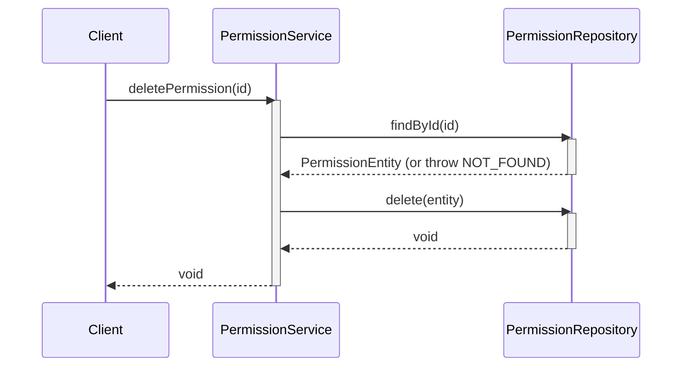
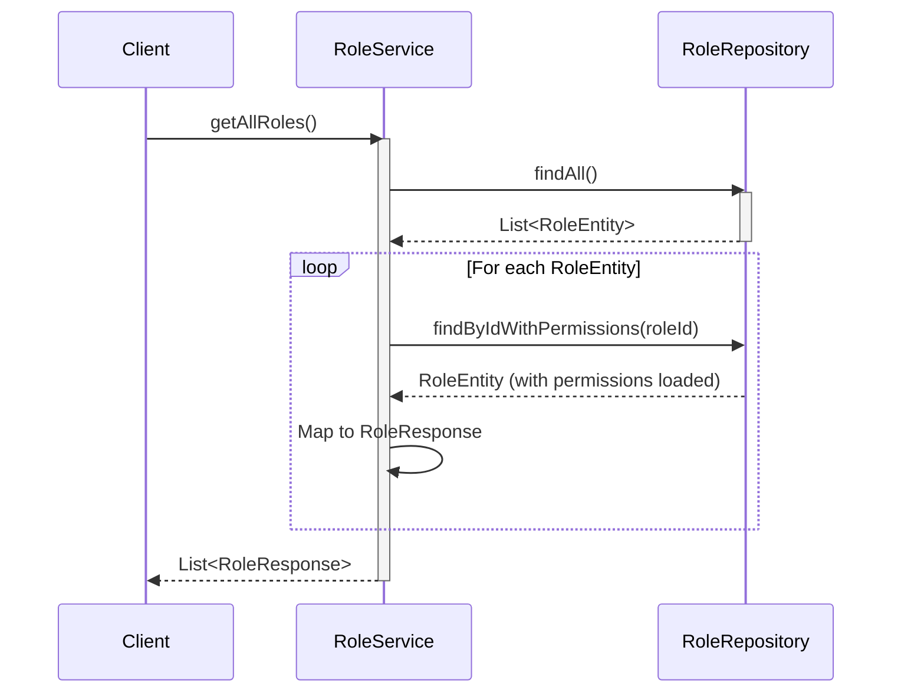
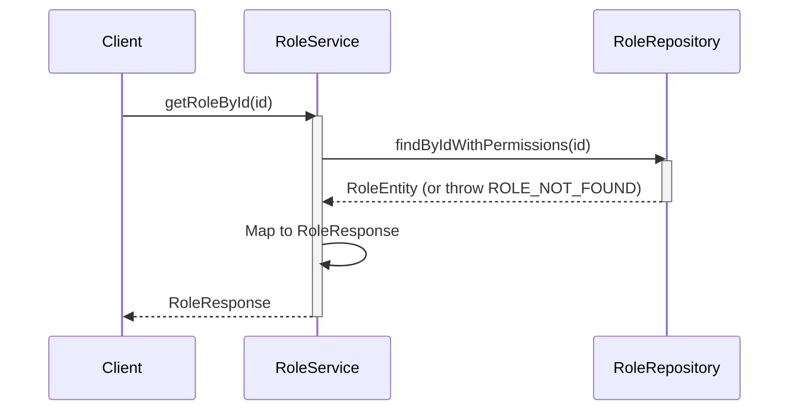
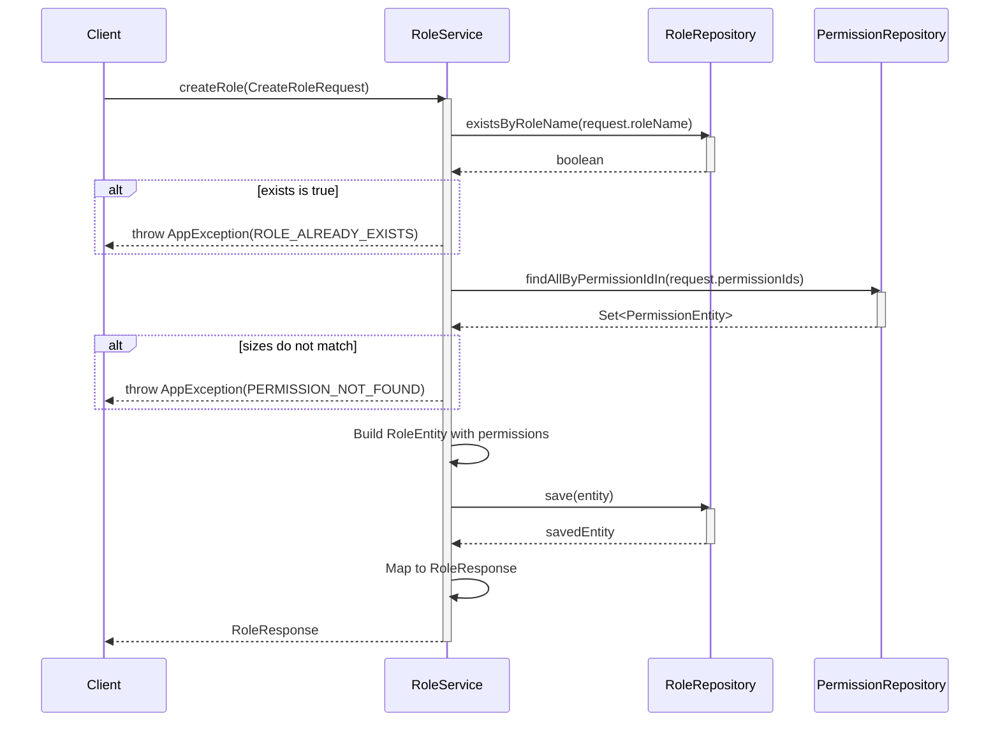
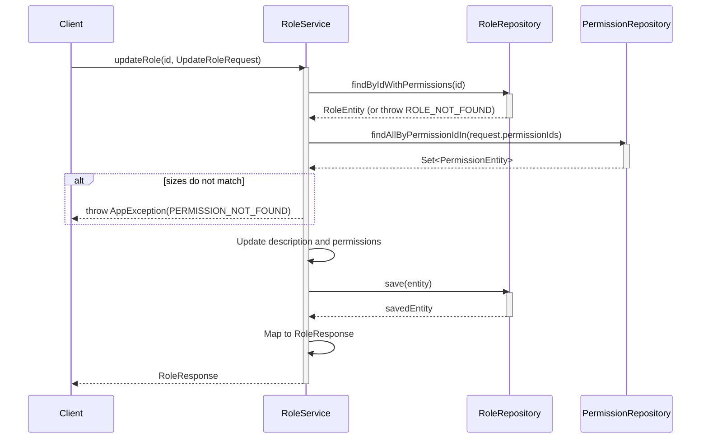
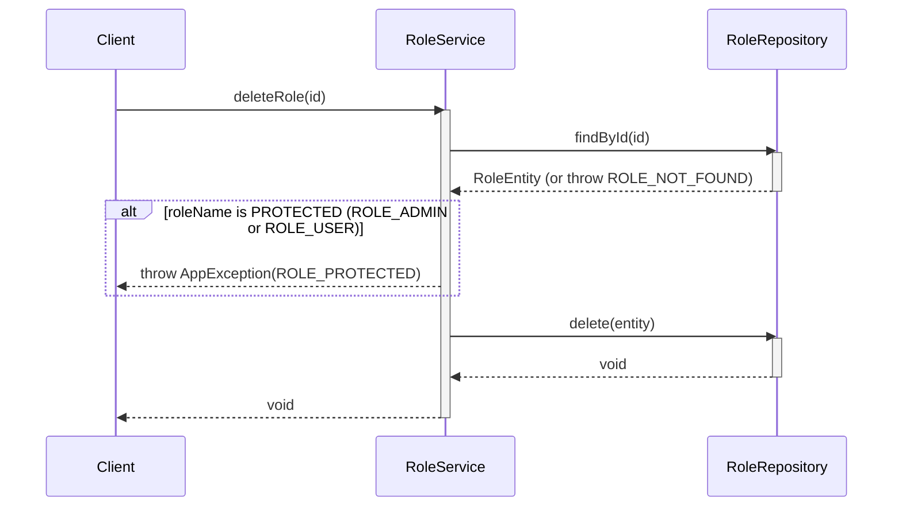

# Sequence Diagrams for RBAC (Role Based Access Control) Services

This document contains the sequence diagrams for operations within `PermissionServiceImpl` and `RoleServiceImpl`.

## 1. Permission Service

### 1.1. Get All Permissions (`getAllPermissions`)

### 1.2. Create Permission (`createPermission`)

### 1.3. Update Permission (`updatePermission`)

### 1.4. Delete Permission (`deletePermission`)

---

## 2. Role Service

### 2.1. Get All Roles (`getAllRoles`)

### 2.2. Get Role By ID (`getRoleById`)

### 2.3. Create Role (`createRole`)

### 2.4. Update Role (`updateRole`)

### 2.5. Delete Role (`deleteRole`)

