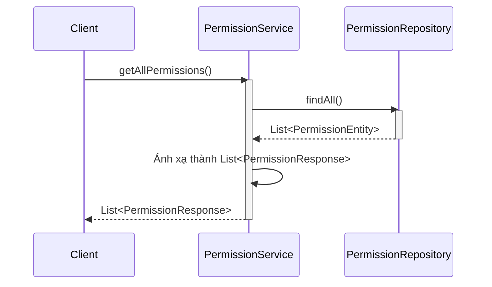
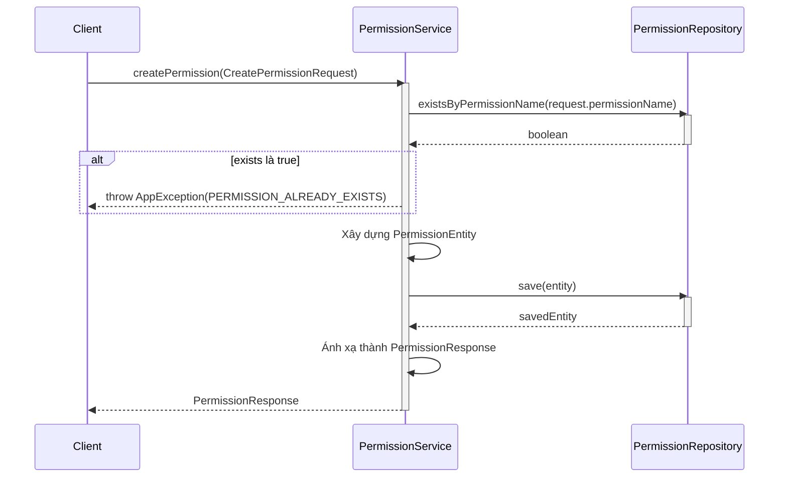
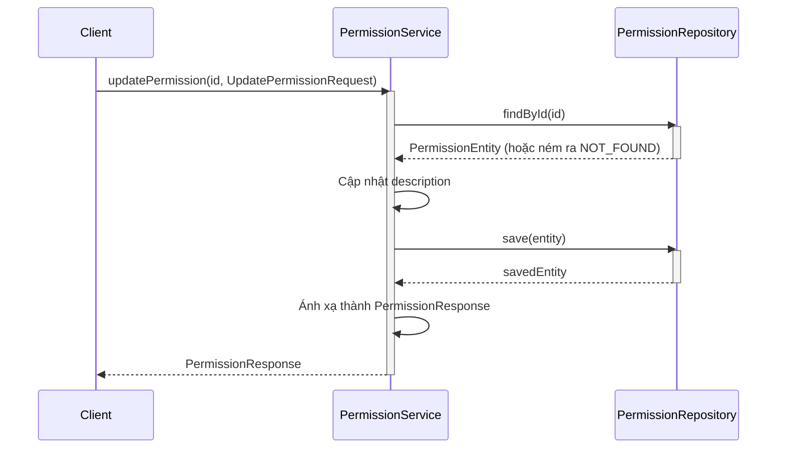
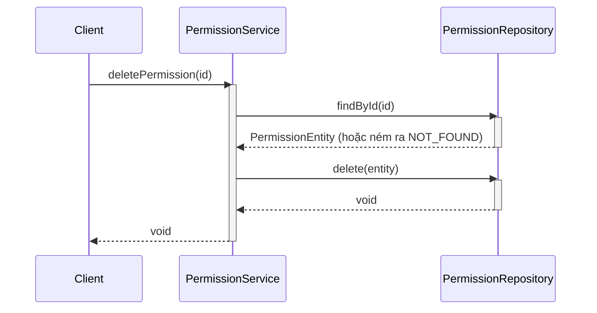
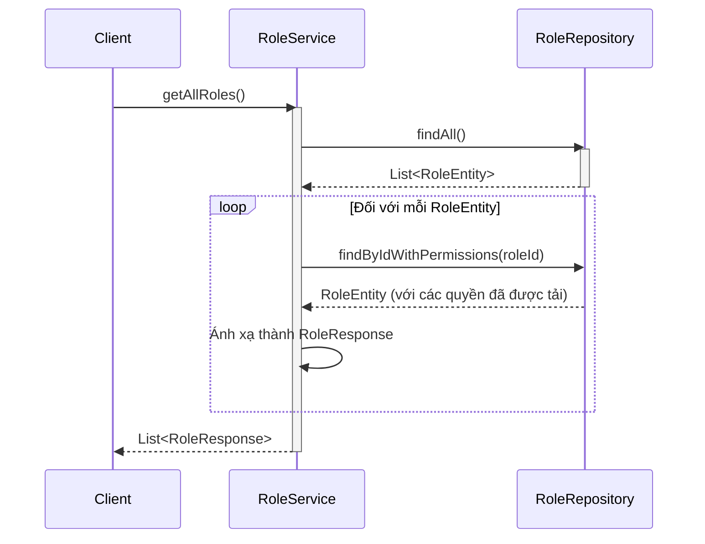
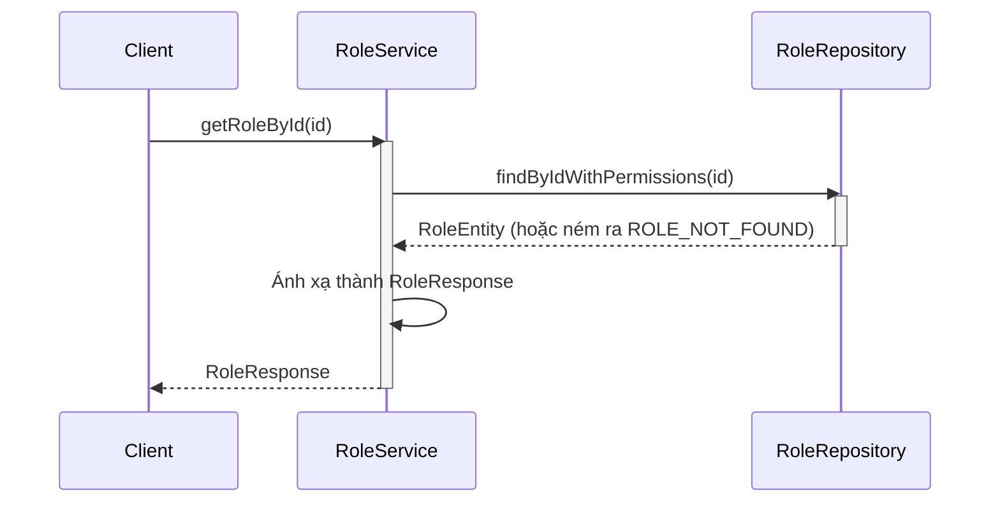
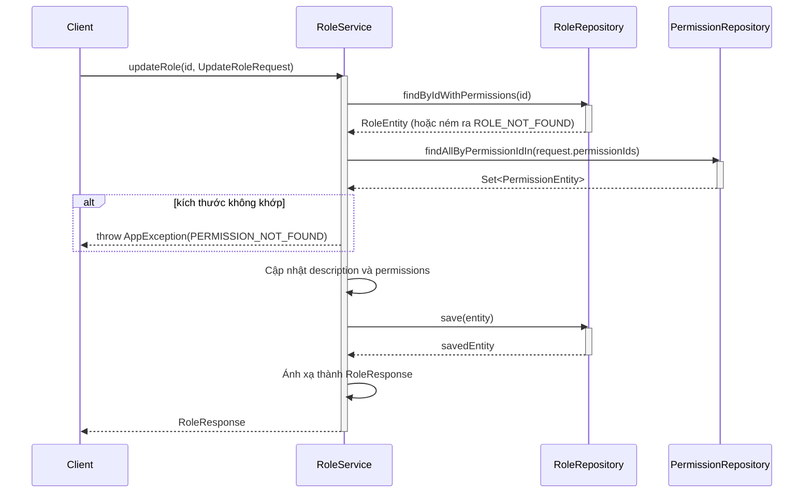
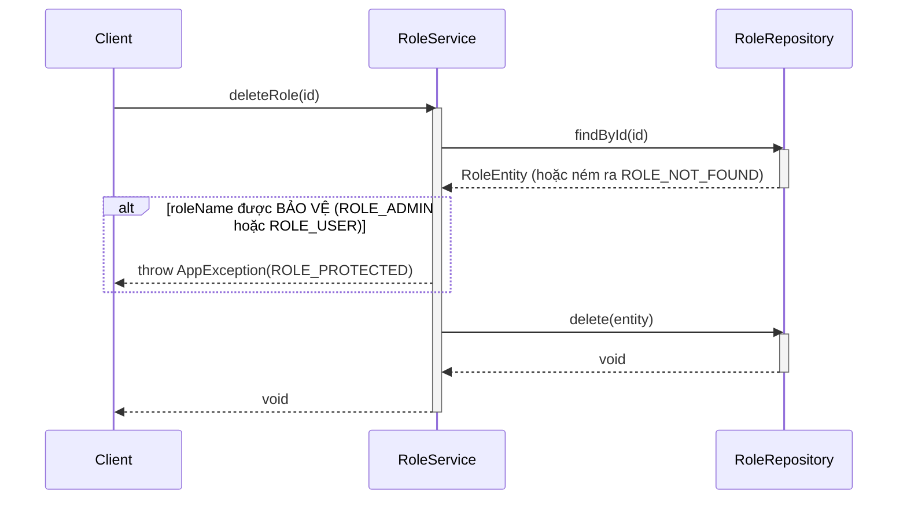

# Sequence Diagrams for RBAC (Role Based Access Control) Services

Tài liệu này chứa các sơ đồ tuần tự cho các hoạt động trong `PermissionServiceImpl` và `RoleServiceImpl`.

## 1. Dịch vụ Quyền (Permission Service)

### 1.1. Lấy Tất cả các Quyền (`getAllPermissions`)

### 1.2. Tạo Quyền (`createPermission`)

### 1.3. Cập nhật Quyền (`updatePermission`)

### 1.4. Xóa Quyền (`deletePermission`)

---

## 2. Dịch vụ Vai trò (Role Service)

### 2.1. Lấy Tất cả Vai trò (`getAllRoles`)

### 2.2. Lấy Vai trò theo ID (`getRoleById`)

### 2.3. Tạo Vai trò (`createRole`)

### 2.4. Cập nhật Vai trò (`updateRole`)

### 2.5. Xóa Vai trò (`deleteRole`)

