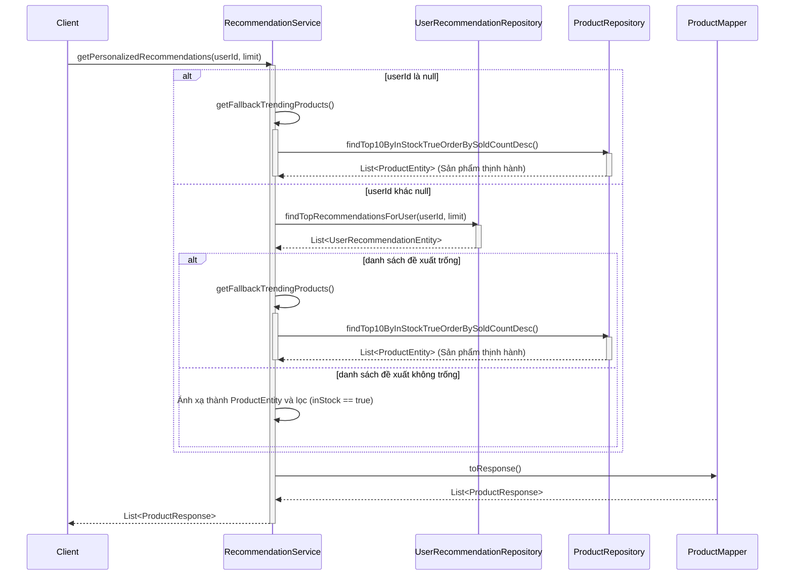
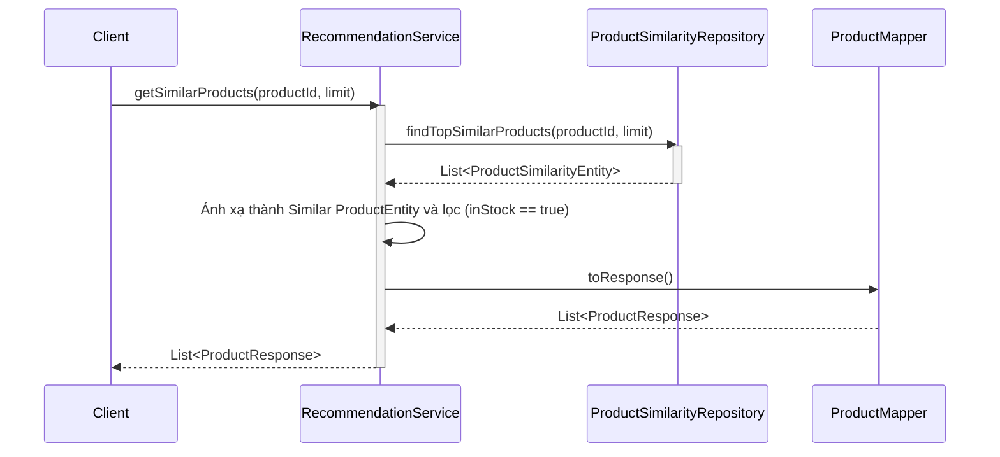
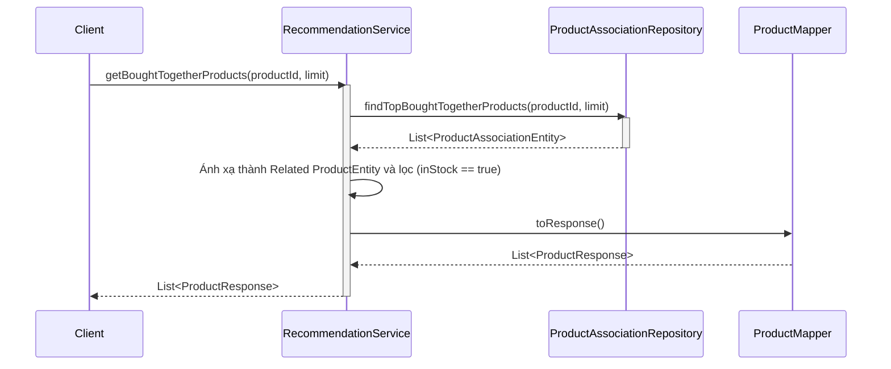

# Sequence Diagrams for Recommendation Service

Tài liệu này chứa các sơ đồ tuần tự cho các hoạt động trong `RecommendationServiceImpl`.

## 1. Lấy đề xuất được cá nhân hóa (`getPersonalizedRecommendations`)

## 2. Lấy các sản phẩm tương tự (`getSimilarProducts`)

## 3. Lấy các sản phẩm được mua cùng nhau (`getBoughtTogetherProducts`)

