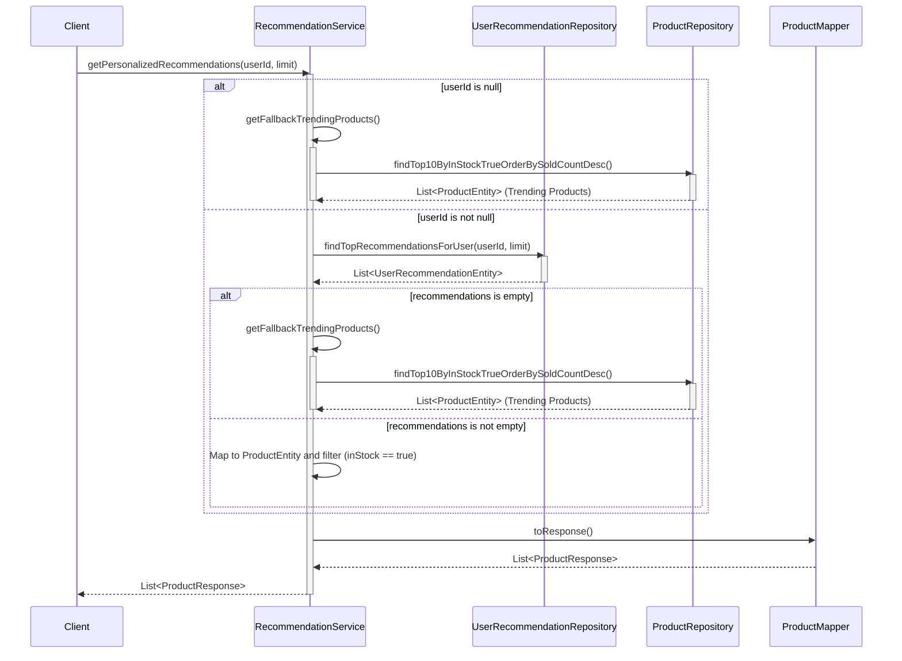
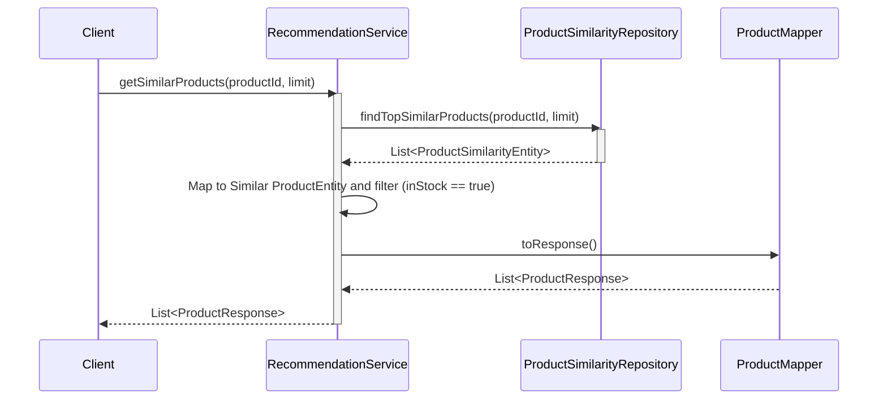
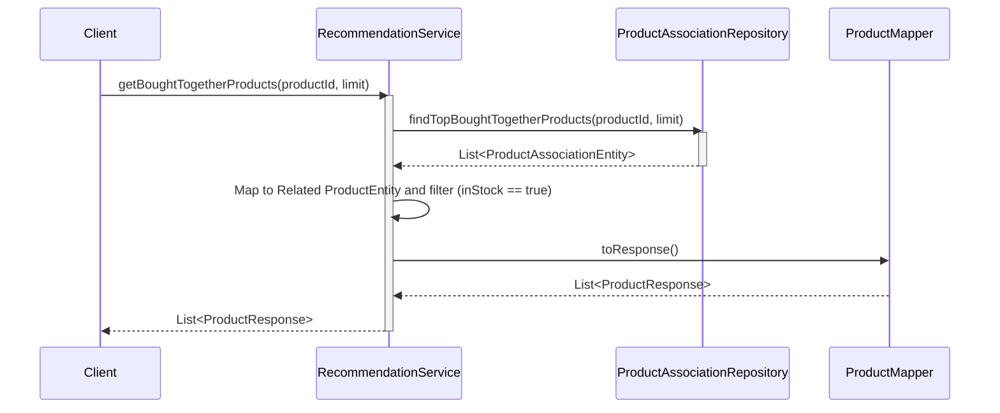

# Sequence Diagrams for Recommendation Service

This document contains the sequence diagrams for operations within `RecommendationServiceImpl`.

## 1. Get Personalized Recommendations (`getPersonalizedRecommendations`)

## 2. Get Similar Products (`getSimilarProducts`)

## 3. Get Bought Together Products (`getBoughtTogetherProducts`)

