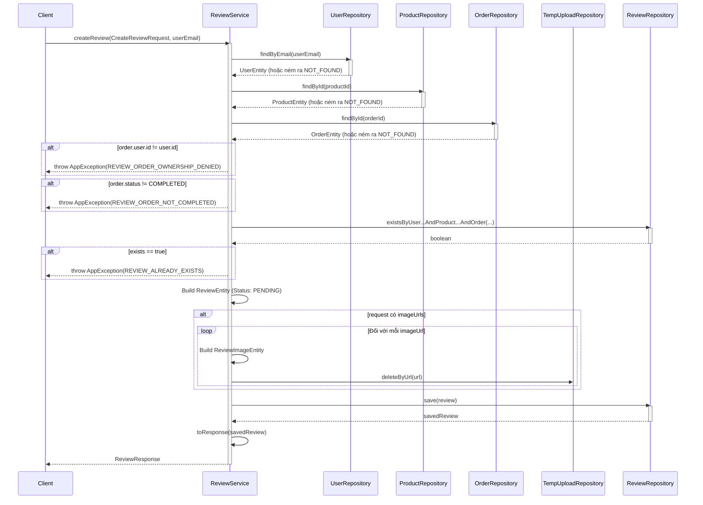
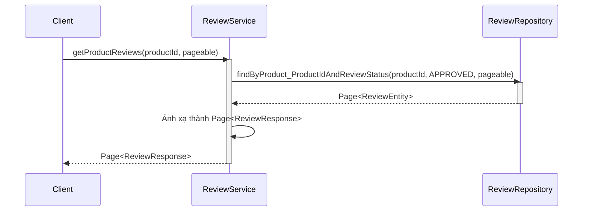
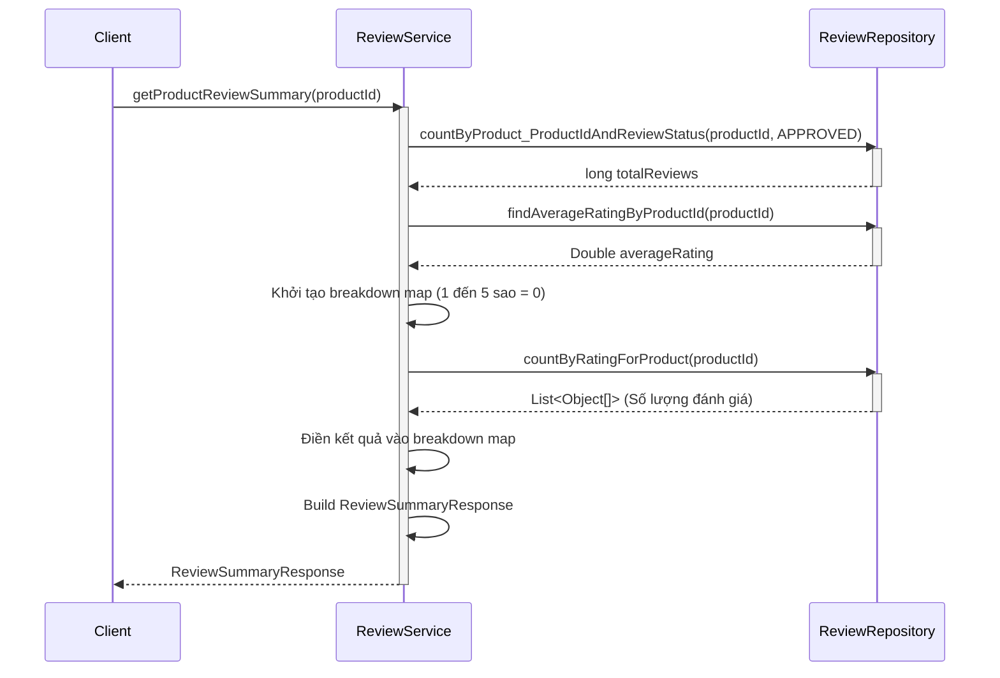
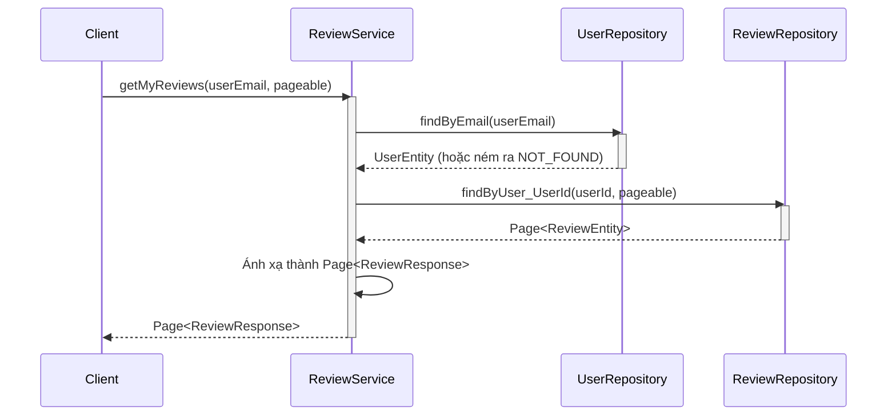
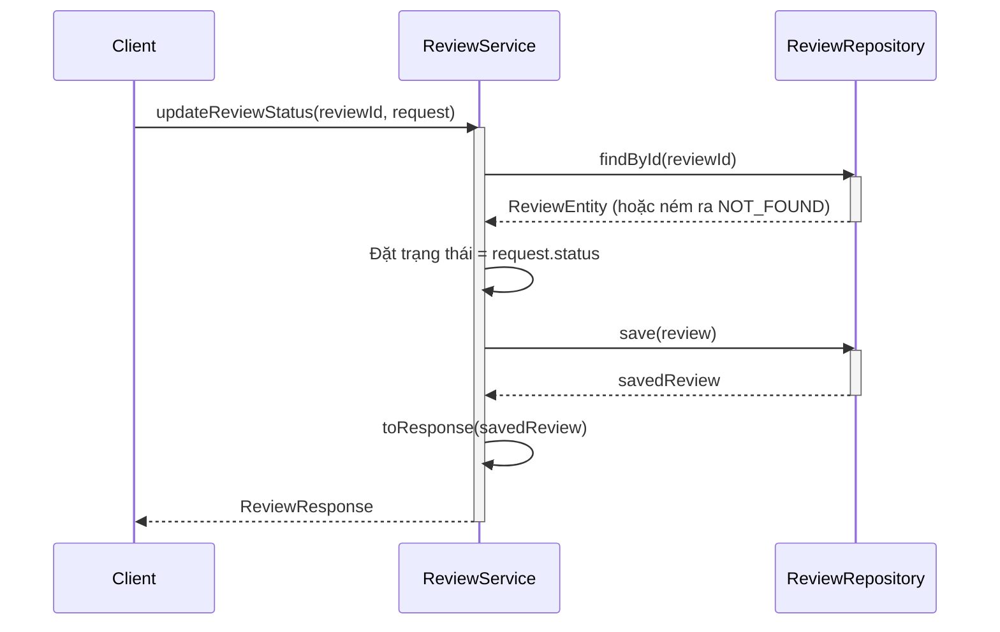
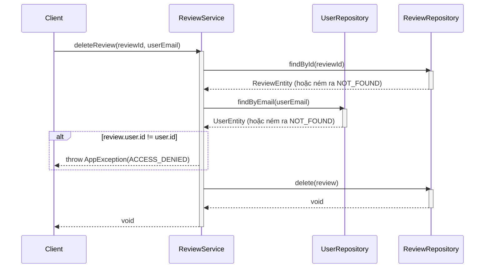

# Sequence Diagrams for Review Service

Tài liệu này chứa các sơ đồ tuần tự cho các hoạt động trong `ReviewServiceImpl`.

## 1. Tạo Đánh giá (`createReview`)

## 2. Lấy Đánh giá Sản phẩm (`getProductReviews`)

## 3. Lấy Tóm tắt Đánh giá Sản phẩm (`getProductReviewSummary`)

## 4. Lấy Đánh giá của tôi (`getMyReviews`)

## 5. Cập nhật Trạng thái Đánh giá - Admin (`updateReviewStatus`)

## 6. Xóa Đánh giá (`deleteReview`)

