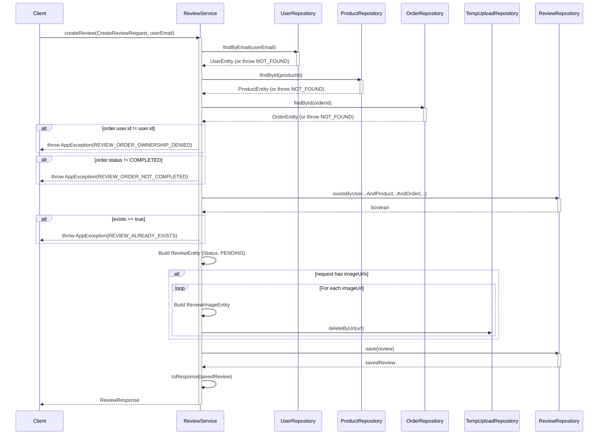
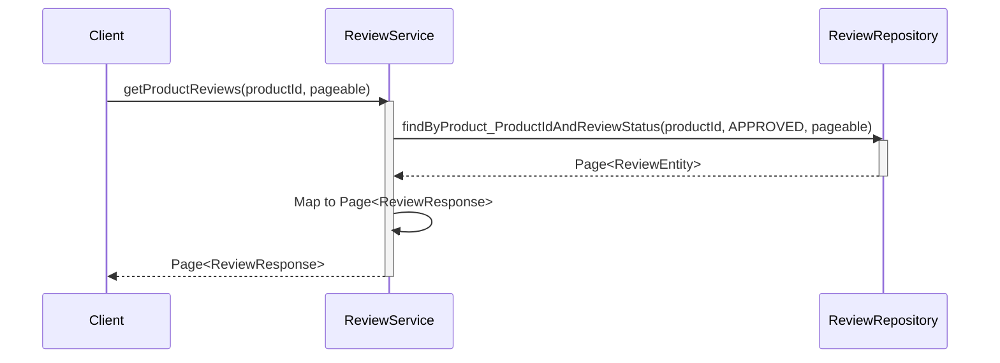
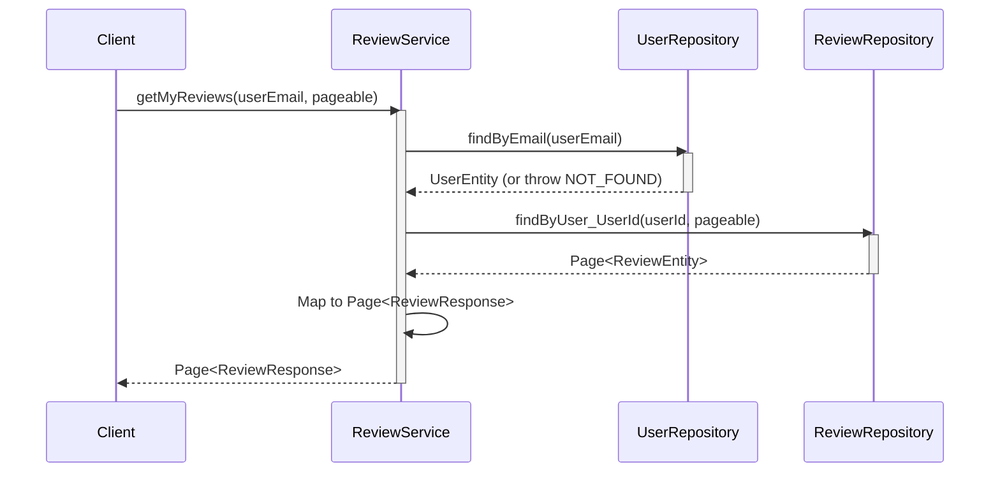
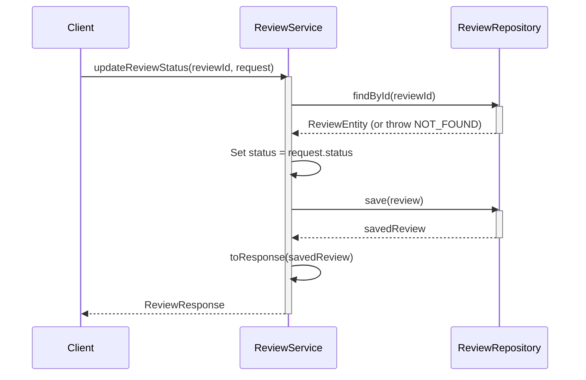
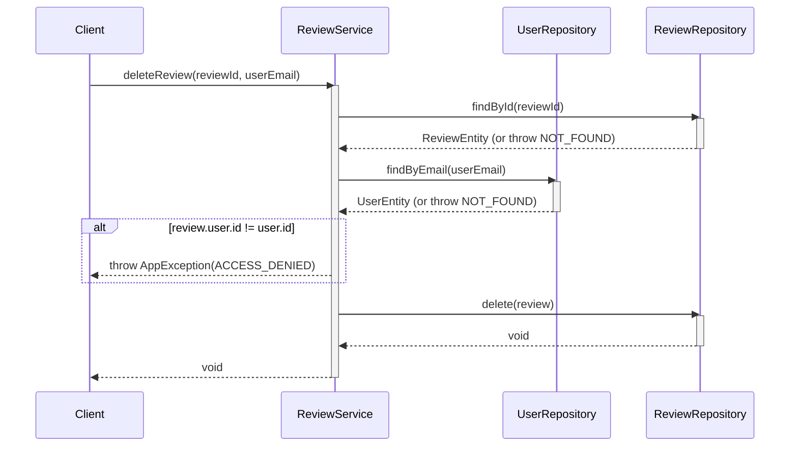

# Sequence Diagrams for Review Service

This document contains the sequence diagrams for operations within `ReviewServiceImpl`.

## 1. Create Review (`createReview`)

## 2. Get Product Reviews (`getProductReviews`)

## 3. Get Product Review Summary (`getProductReviewSummary`)

## 4. Get My Reviews (`getMyReviews`)

## 5. Update Review Status - Admin (`updateReviewStatus`)

## 6. Delete Review (`deleteReview`)

