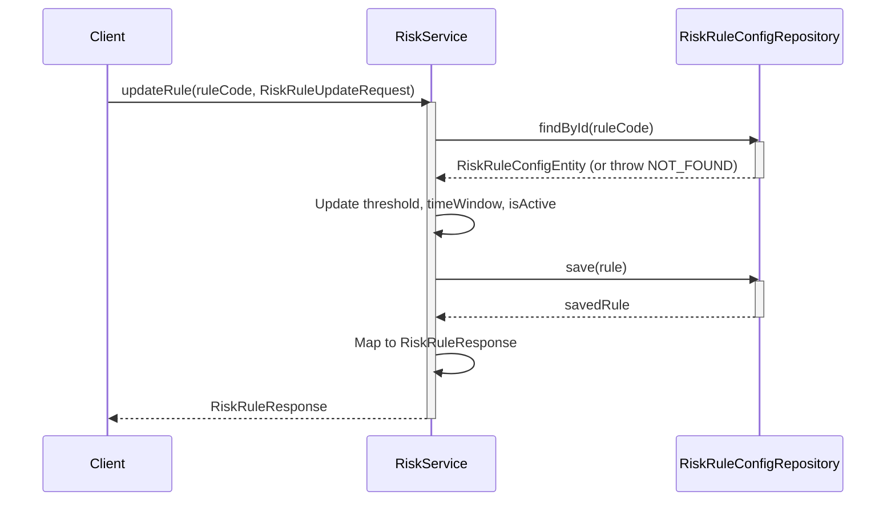
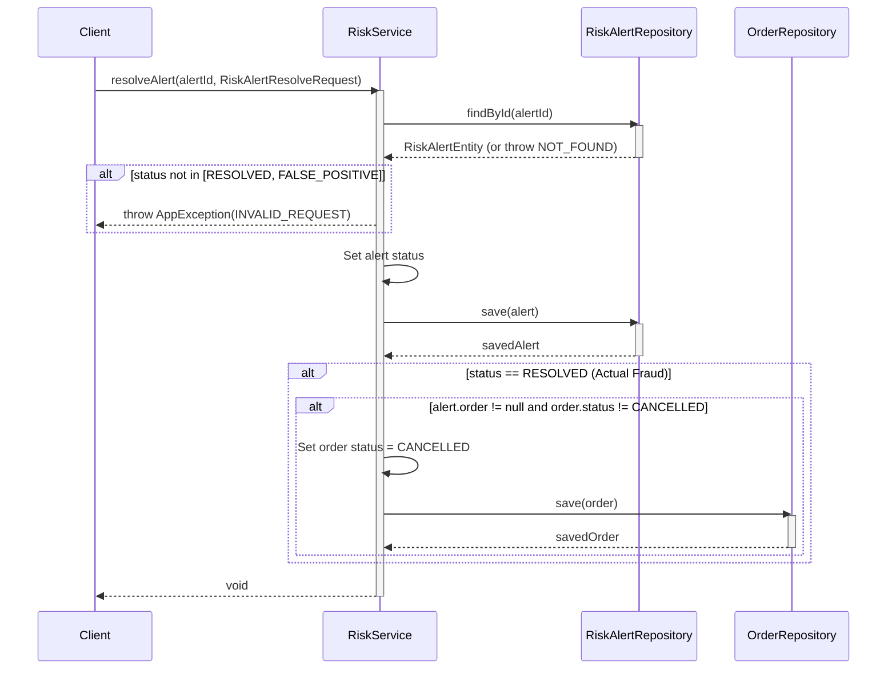
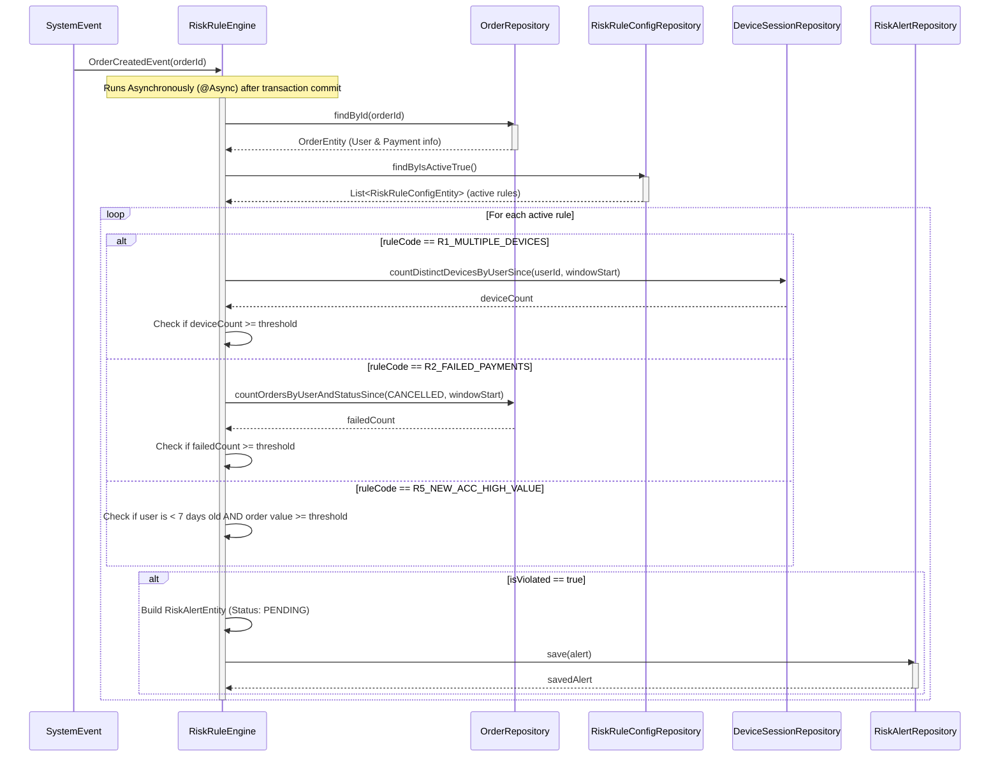

# Sequence Diagrams for Risk Alert Service

This document contains the sequence diagrams for operations within `RiskServiceImpl` and the asynchronous `RiskRuleEngine`.

## 1. Rule Management (`getAllRules`, `updateRule`)

This flow illustrates how the admin updates a Risk Rule.

## 2. Alert Management (`getAlerts`, `resolveAlert`)

This flow shows how the admin resolves a fraud alert (e.g., confirming it's fraud or marking it as a false positive).

## 3. Risk Evaluation Engine (`evaluateOrderRisk`)

This flow describes the automatic, asynchronous background job that evaluates orders against active risk rules immediately after they are created.

