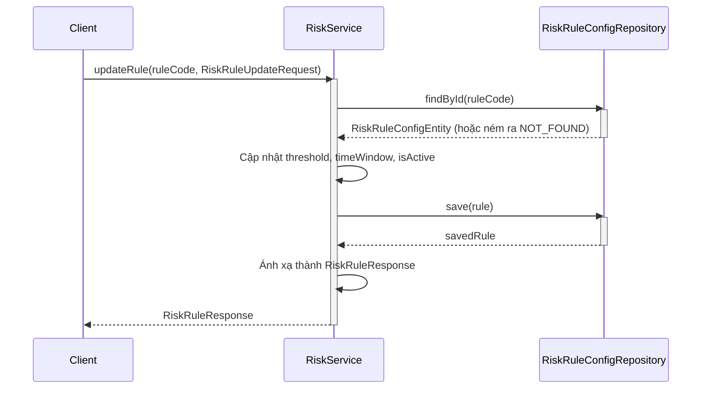
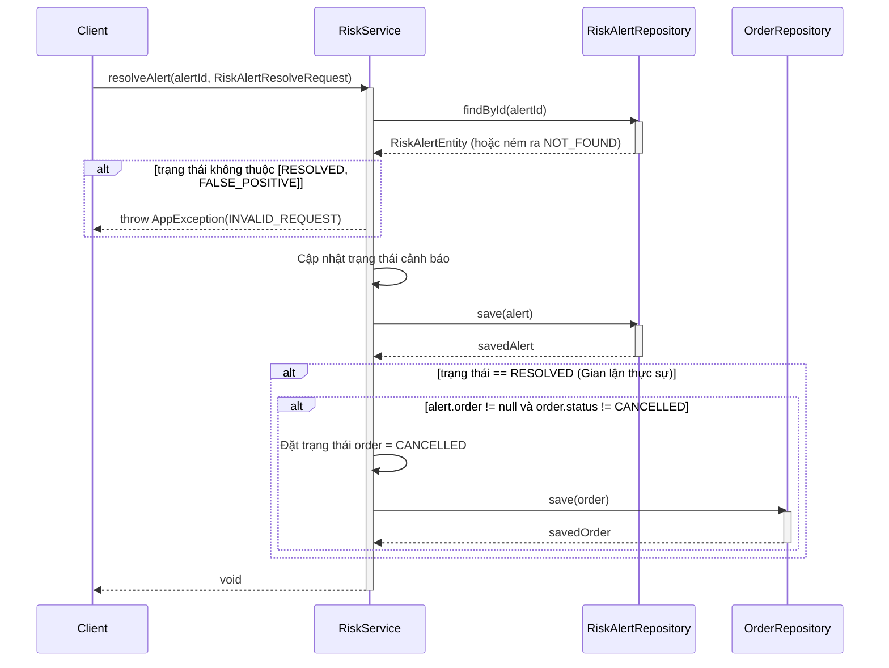
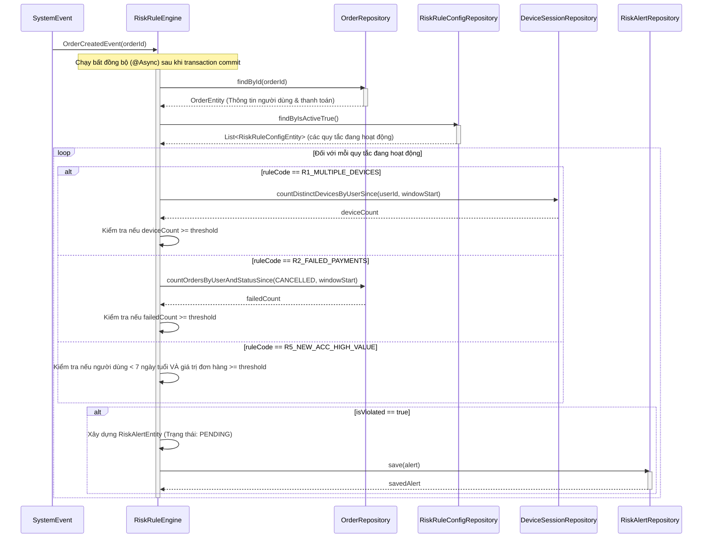

# Sequence Diagrams for Risk Alert Service

Tài liệu này chứa các sơ đồ tuần tự cho các hoạt động trong `RiskServiceImpl` và `RiskRuleEngine` bất đồng bộ.

## 1. Quản lý Quy tắc (`getAllRules`, `updateRule`)

Luồng này minh họa cách admin cập nhật một Quy tắc Rủi ro (Risk Rule).

## 2. Quản lý Cảnh báo (`getAlerts`, `resolveAlert`)

Luồng này cho thấy cách admin giải quyết một cảnh báo gian lận (ví dụ: xác nhận đó là gian lận hoặc đánh dấu nó là dương tính giả).

## 3. Công cụ đánh giá rủi ro (`evaluateOrderRisk`)

Luồng này mô tả công việc ngầm bất đồng bộ tự động đánh giá các đơn hàng dựa trên các quy tắc rủi ro đang hoạt động ngay sau khi chúng được tạo.

