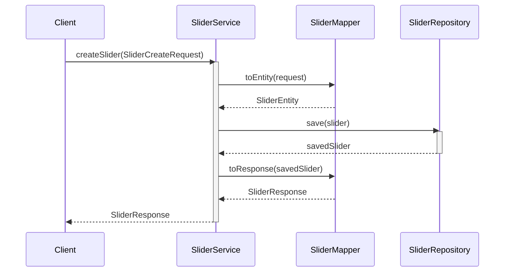
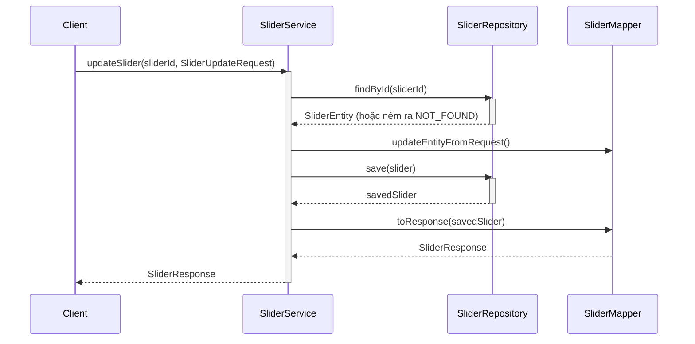
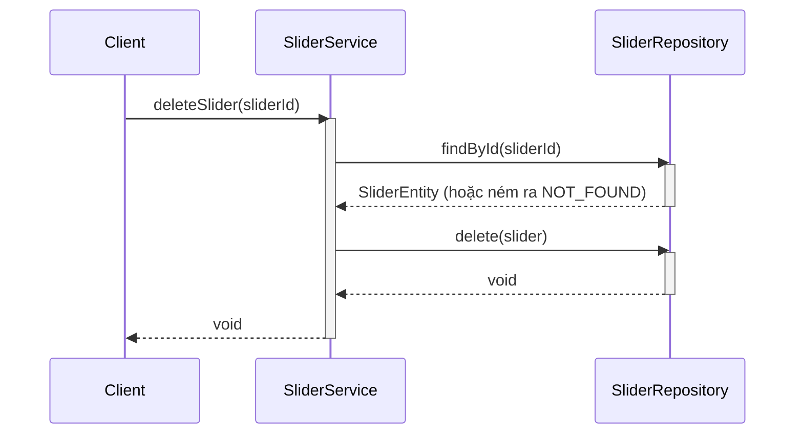
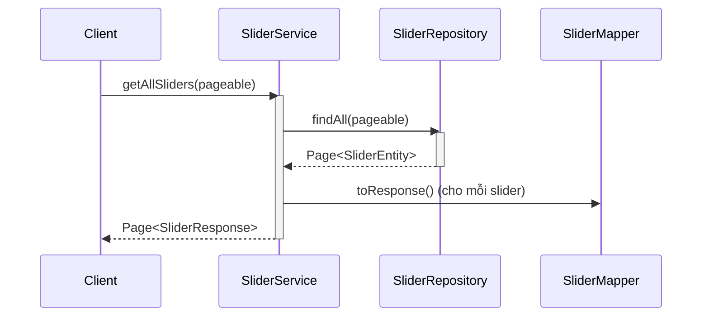
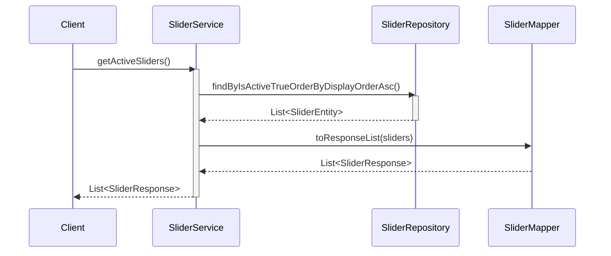

# Sequence Diagrams for Slider Service

Tài liệu này chứa các sơ đồ tuần tự cho các hoạt động trong `SliderServiceImpl`.

## 1. Tạo Slider (`createSlider`)

## 2. Cập nhật Slider (`updateSlider`)

## 3. Xóa Slider (`deleteSlider`)

## 4. Lấy tất cả Sliders (`getAllSliders`) - Dành cho Admin

## 5. Lấy các Sliders đang hoạt động (`getActiveSliders`) - Dành cho Public UI

