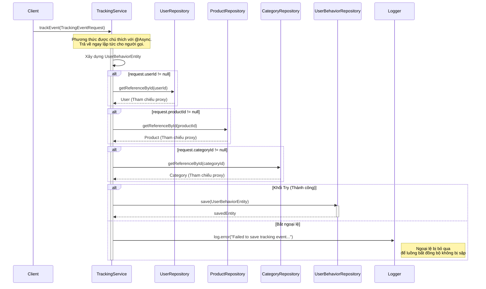

# Sequence Diagrams for Tracking Service

Tài liệu này chứa các sơ đồ tuần tự cho các hoạt động trong `TrackingServiceImpl`.

## 1. Theo dõi sự kiện (`trackEvent`)

Dịch vụ này ghi lại các hành vi của người dùng (lượt xem, nhấp chuột, tìm kiếm, v.v.) để phân tích và đề xuất. Nó hoạt động bất đồng bộ để ngăn chặn việc chặn các luồng ứng dụng chính.

