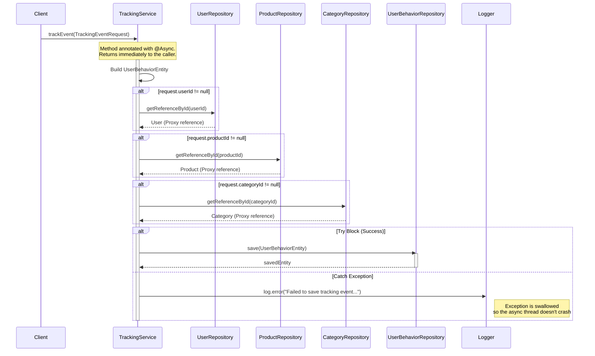

# Sequence Diagrams for Tracking Service

This document contains the sequence diagrams for operations within `TrackingServiceImpl`.

## 1. Track Event (`trackEvent`)

This service records user behaviors (views, clicks, search, etc.) for analytics and recommendations. It operates asynchronously to prevent blocking the main application threads.

