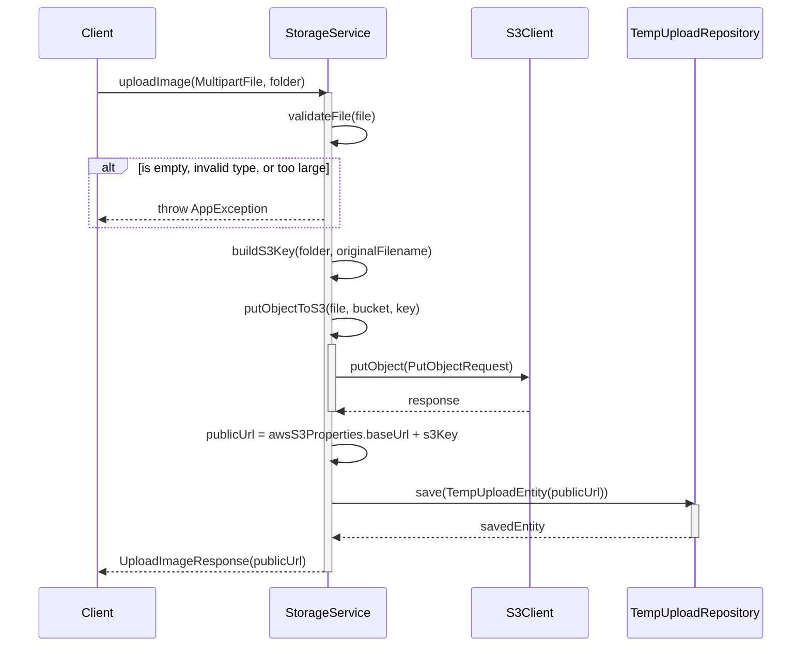
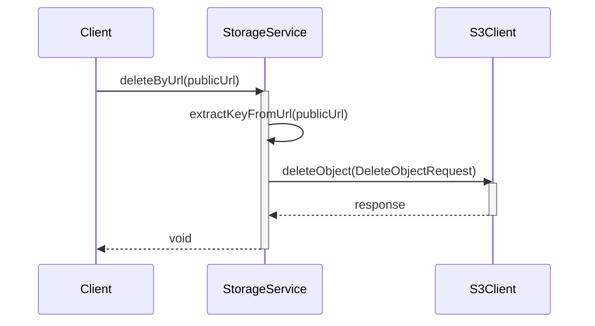
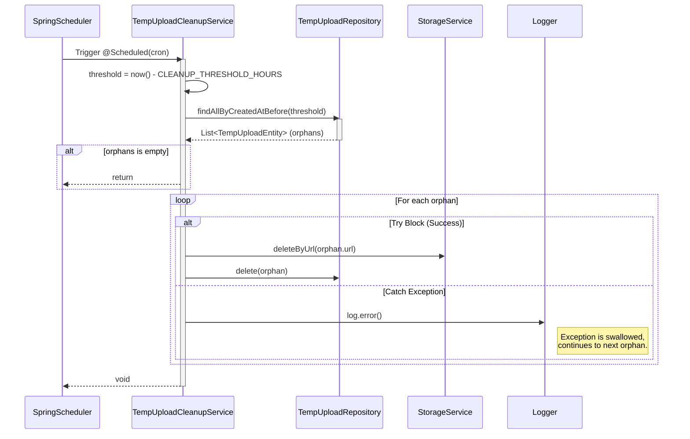

# Sequence Diagrams for Upload Service

This document contains the sequence diagrams for operations within `S3StorageServiceImpl` and `TempUploadCleanupService`.

## 1. Upload Image (`uploadImage`)

This flow handles uploading an image file to Amazon S3 and recording it in a temporary database table to prevent "orphan" files.

## 2. Delete File by URL (`deleteByUrl`)

This flow deletes a physical file directly from Amazon S3 using its public URL.

## 3. Temporary Upload Cleanup Cron Job (`cleanupOrphanUploads`)

This flow is a background scheduled task (Cron Job). It scans the `temp_uploads` table for images that were uploaded but never linked to any business entity (e.g. User didn't click "Save" after uploading) and deletes them to save storage space.

