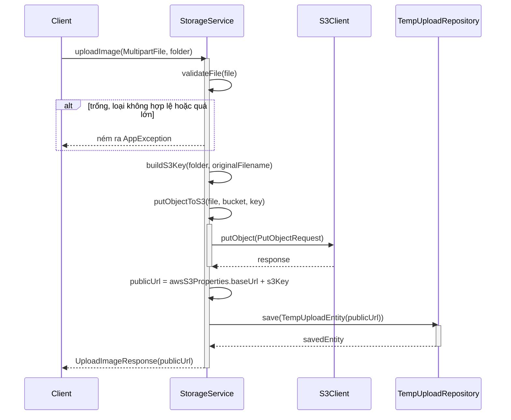
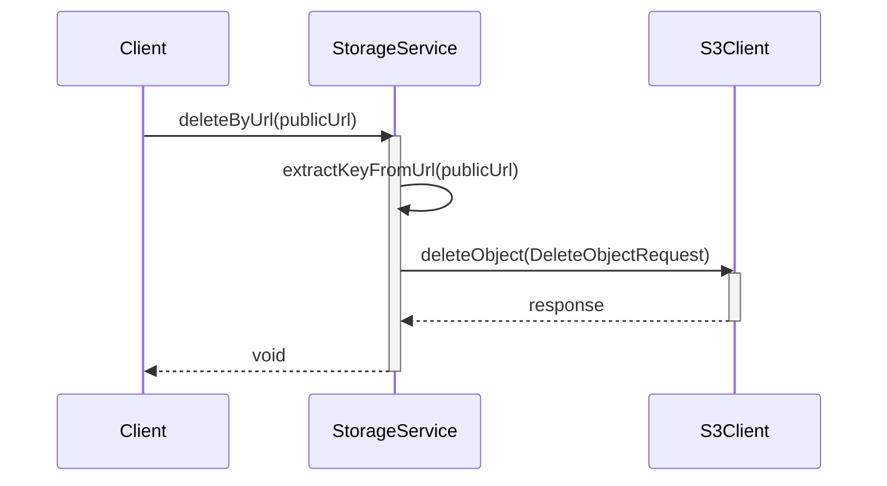
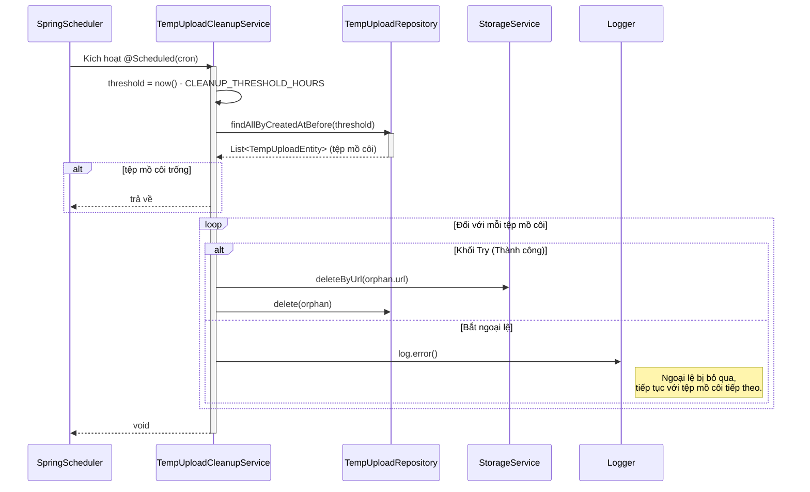

# Sequence Diagrams for Upload Service

Tài liệu này chứa các sơ đồ tuần tự cho các hoạt động trong `S3StorageServiceImpl` và `TempUploadCleanupService`.

## 1. Tải ảnh lên (`uploadImage`)

Luồng này xử lý việc tải một tệp hình ảnh lên Amazon S3 và ghi nhận nó vào một bảng cơ sở dữ liệu tạm thời để ngăn chặn các tệp "mồ côi".

## 2. Xóa tệp theo URL (`deleteByUrl`)

Luồng này xóa một tệp vật lý trực tiếp từ Amazon S3 bằng URL công khai của nó.

## 3. Cron Job dọn dẹp các tệp tải lên tạm thời (`cleanupOrphanUploads`)

Luồng này là một tác vụ chạy ngầm theo lịch (Cron Job). Nó quét bảng `temp_uploads` để tìm các hình ảnh đã được tải lên nhưng chưa bao giờ được liên kết với bất kỳ thực thể nghiệp vụ nào (ví dụ: Người dùng không nhấp vào "Lưu" sau khi tải lên) và xóa chúng để tiết kiệm không gian lưu trữ.

