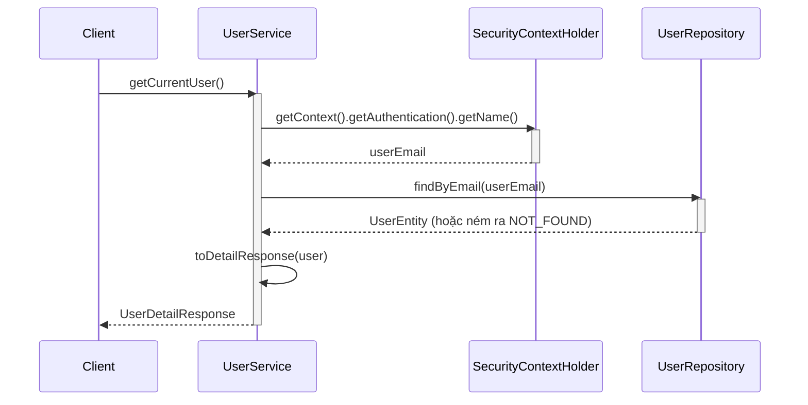
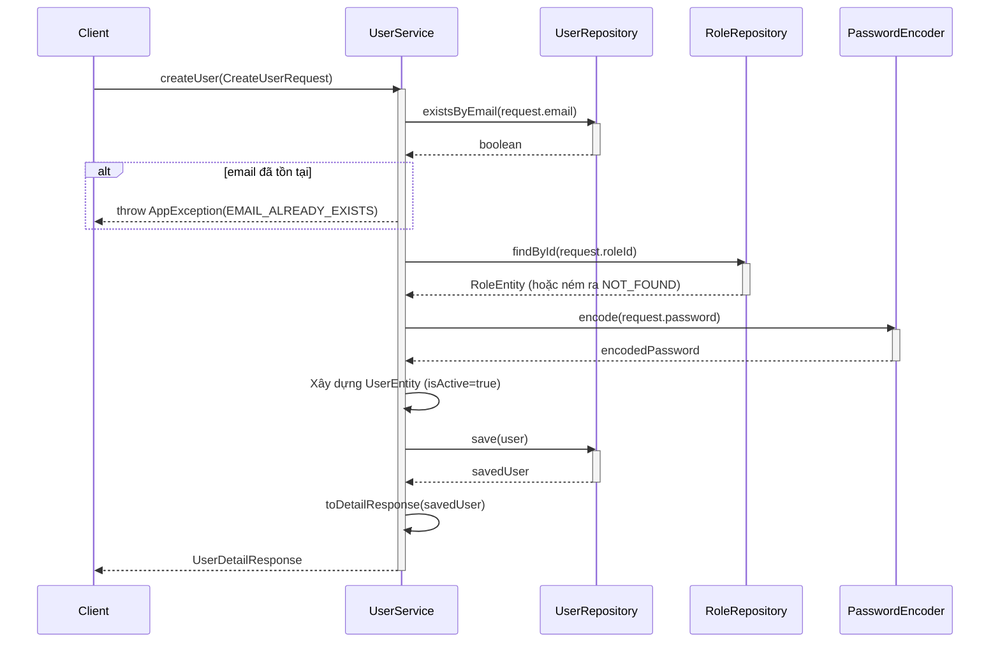
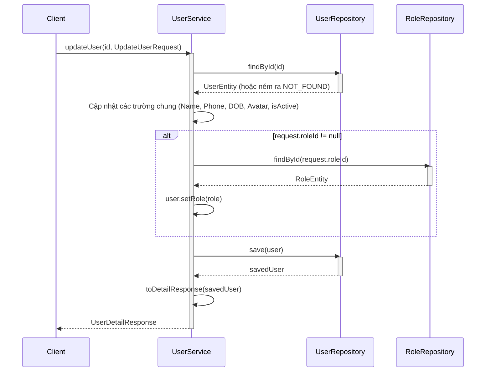
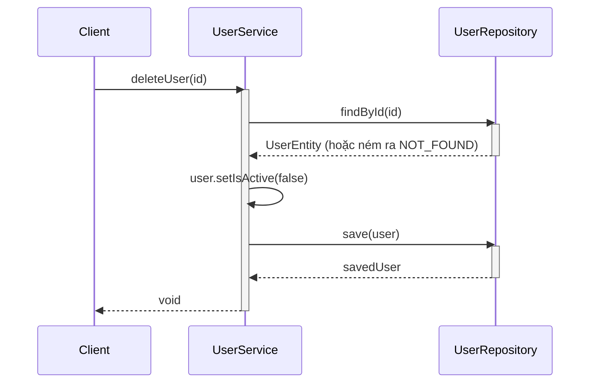
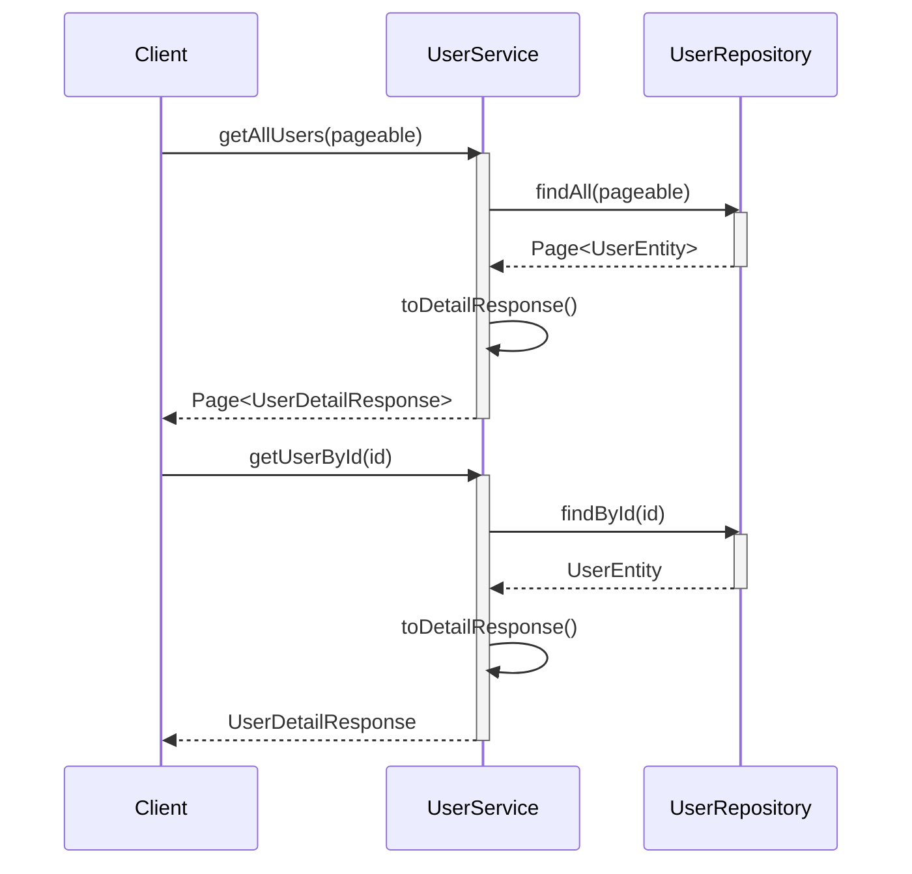

# Sequence Diagrams for User Service

Tài liệu này chứa các sơ đồ tuần tự cho các hoạt động trong `UserServiceImpl`.

## 1. Lấy người dùng hiện tại (`getCurrentUser`)

Lấy hồ sơ của người dùng đã xác thực hiện tại dựa trên JWT token.

## 2. Tạo người dùng (`createUser`) - Dành cho Admin

## 3. Cập nhật người dùng (`updateUser`) - Dành cho Admin

## 4. Xóa người dùng (`deleteUser`) - Xóa mềm (Soft Delete)

## 5. Đọc danh sách người dùng (`getAllUsers`, `getUserById`)

