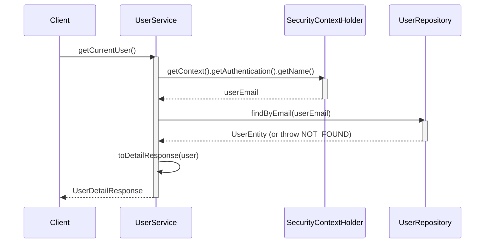
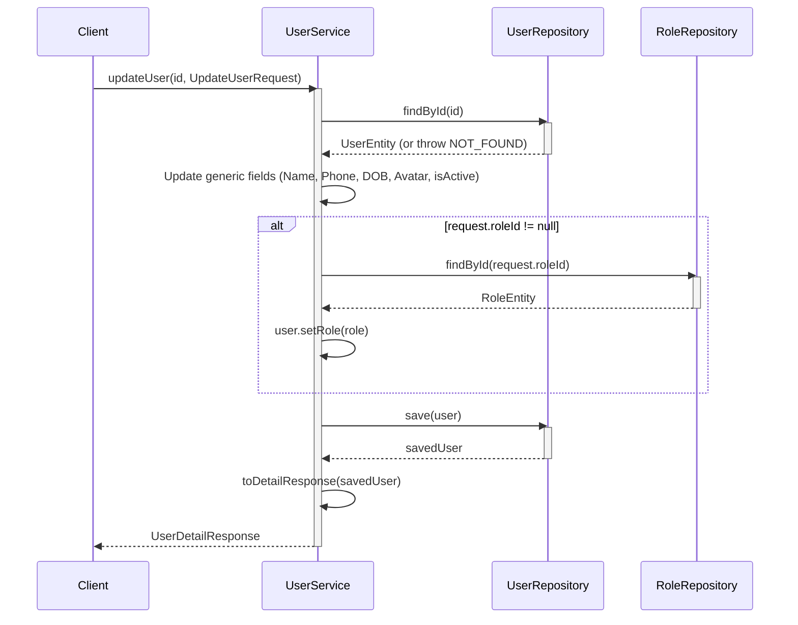
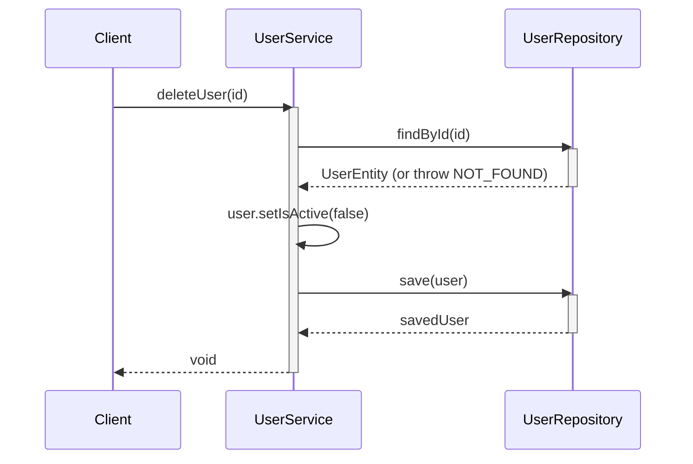
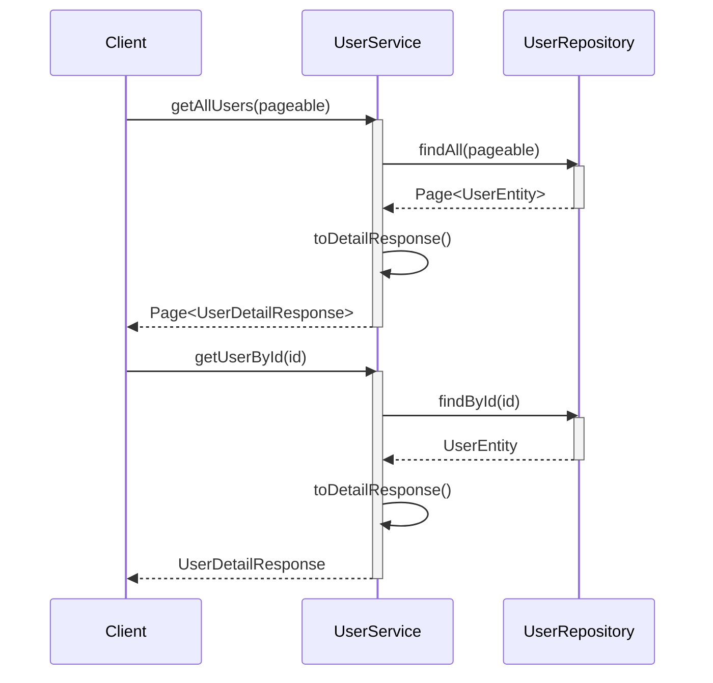

# Sequence Diagrams for User Service

This document contains the sequence diagrams for operations within `UserServiceImpl`.

## 1. Get Current User (`getCurrentUser`)

Retrieves the profile of the currently authenticated user based on the JWT token.

## 2. Create User (`createUser`) - Admin

## 3. Update User (`updateUser`) - Admin

## 4. Delete User (`deleteUser`) - Soft Delete

## 5. Read Users (`getAllUsers`, `getUserById`)

