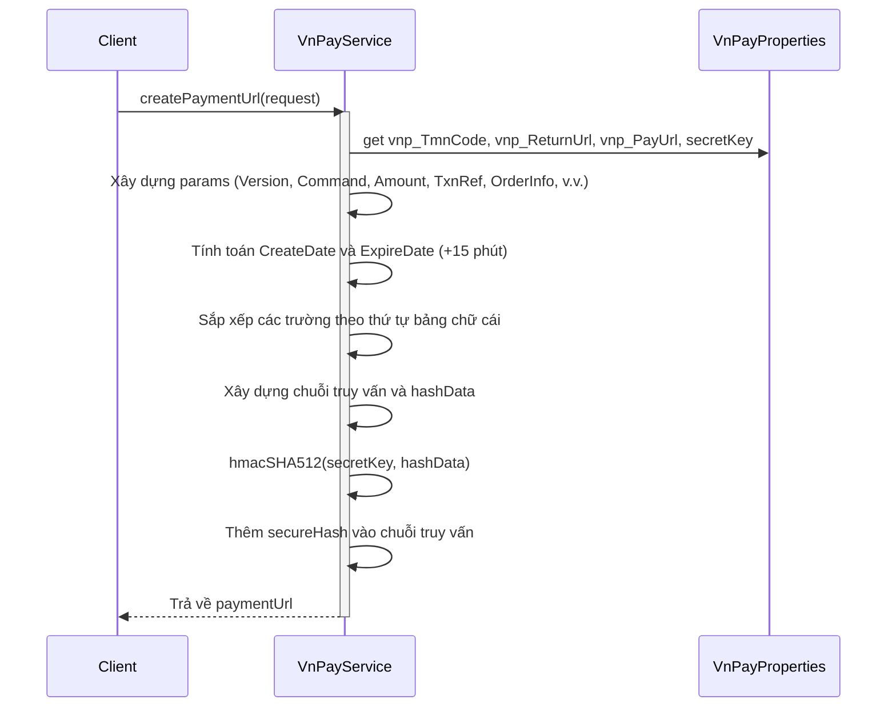
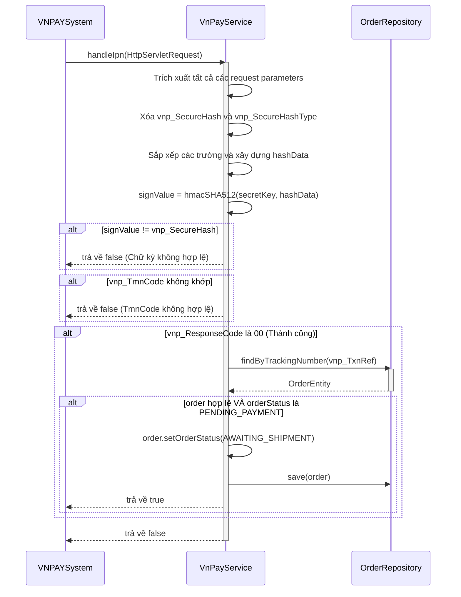

# Sequence Diagrams for VNPAY Payment Service

Tài liệu này chứa các sơ đồ tuần tự cho các hoạt động trong `VnPayServiceImpl`.

## 1. Tạo URL thanh toán (`createPaymentUrl`)

## 2. Xử lý IPN Webhook (`handleIpn`)

