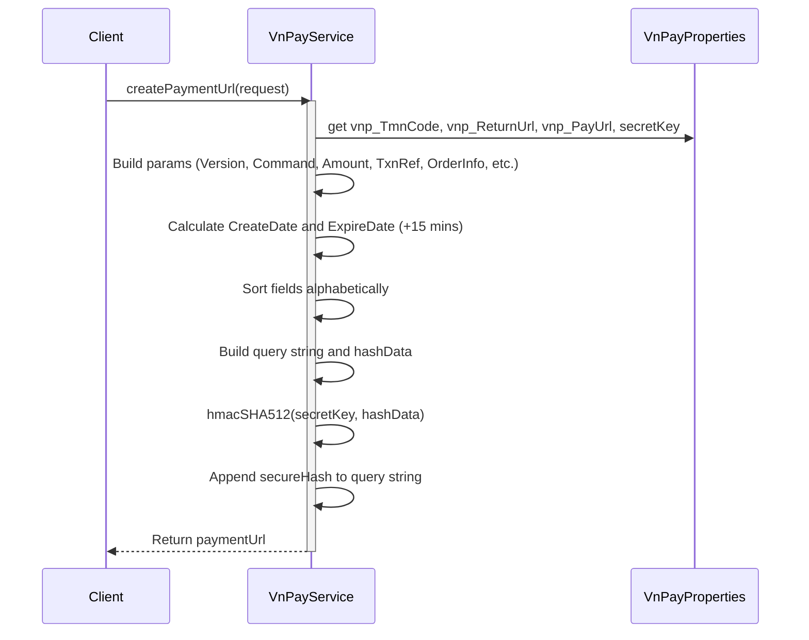
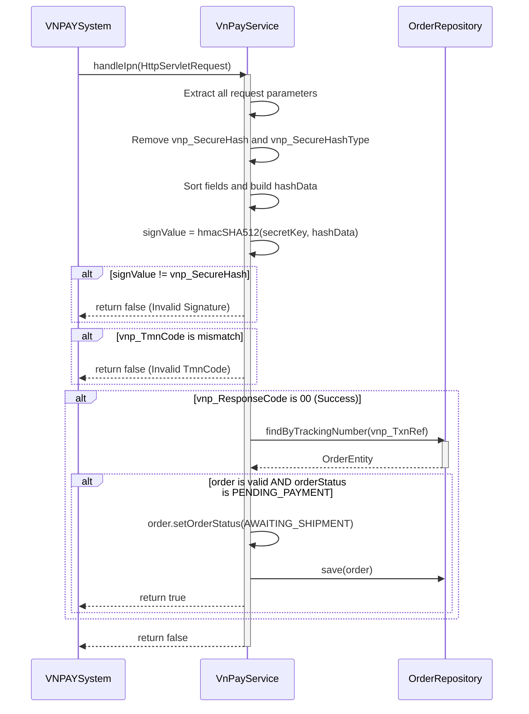

# Sequence Diagrams for VNPAY Payment Service

This document contains the sequence diagrams for operations within `VnPayServiceImpl`.

## 1. Create Payment URL (`createPaymentUrl`)

## 2. Handle IPN Webhook (`handleIpn`)

